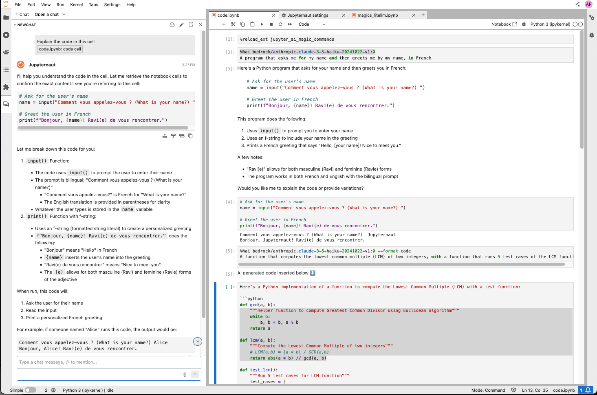
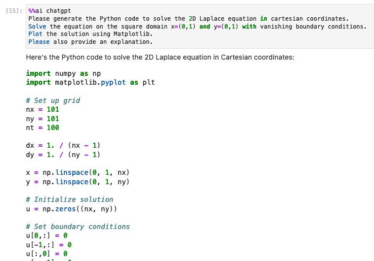
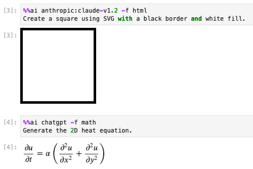

# Jupyter AI

Jupyter AI connects generative AI with Jupyter notebooks. Jupyter AI provides a user-friendly
and powerful way to explore generative AI models in notebooks and improve your productivity
in JupyterLab and the Jupyter Notebook. More specifically, Jupyter AI offers:

* An `%%ai` magic that turns the Jupyter notebook into a reproducible generative AI playground.
  This works anywhere the IPython kernel runs (JupyterLab, Jupyter Notebook, Google Colab, VSCode, etc.).
* A native chat UI in JupyterLab that enables you to work with generative AI as a conversational assistant.
* Support for a wide range of generative model providers, including AI21, Anthropic, AWS, Cohere,
  Hugging Face, and OpenAI.

Documentation is available on [ReadTheDocs](https://jupyter-ai.readthedocs.io/en/latest/).



## Requirements

You will need to have installed the following software to use Jupyter AI:

- Python 3.8 - 3.11
- JupyterLab 4

In addition, you will need access to at least one model provider.

## Setting Up Model Providers in a Notebook

To use any AI model provider within this notebook, you'll need the appropriate credentials, such as API keys.

Obtain the necessary credentials (e.g., API keys) from your model provider's platform.

You can set your keys using environment variables or in a code cell in your notebook.
In a code cell, you can use the %env magic command to set the credentials as follows:

```python
# NOTE: Replace 'PROVIDER_API_KEY' with the credential key's name,
# and replace 'YOUR_API_KEY_HERE' with the key.
%env PROVIDER_API_KEY=YOUR_API_KEY_HERE
```

For more specific instructions for each model provider, refer to [the model providers documentation](https://jupyter-ai.readthedocs.io/en/latest/users/index.html#model-providers).

## Installation

Below is a simplified overview of the installation and usage process.
See [our official documentation](https://jupyter-ai.readthedocs.io/en/latest/users/index.html)
for details on installing and using Jupyter AI.

### With pip

If you want to install both the `%%ai` magic and the JupyterLab extension, you can run:

    $ pip install jupyter_ai

If you are not using JupyterLab and you only want to install the Jupyter AI `%%ai` magic, you can run:

    $ pip install jupyter_ai_magics


### With conda

First, install
[conda](https://conda.io/projects/conda/en/latest/user-guide/install/index.html)
and create an environment that uses Python 3.11:

    $ conda create -n jupyter-ai python=3.11
    $ conda activate jupyter-ai
    $ pip install jupyter_ai

## The `%%ai` magic command

The `%%ai` magic works anywhere the IPython kernel runs, including JupyterLab, Jupyter Notebook, Google Colab, and Visual Studio Code.

Once you have installed the `%%ai` magic, you can enable it in any notebook or the IPython shell by running:

    %load_ext jupyter_ai_magics

or:

    %load_ext jupyter_ai

The screenshots below are from notebooks in the `examples/` directory of this package.

Then, you can use the `%%ai` magic command to specify a model and natural language prompt:



Jupyter AI can also generate HTML and math to be rendered as cell output.



Jupyter AI can interpolate IPython expressions, allowing you to run prompts
that include variable values.


## JupyterLab extension

The Jupyter AI extension for JupyterLab offers a native UI that enables multiple users
to chat with the Jupyter AI conversational assistant. If you have JupyterLab installed,
this should be installed and activated when you install the `jupyter_ai` package.

## Using

For help with installing and using Jupyter AI, please see our
[user documentation on ReadTheDocs](https://jupyter-ai.readthedocs.io/en/latest/users/index.html).

## Contributing

If you would like to contribute to Jupyter AI, see our
[contributor documentation on ReadTheDocs](https://jupyter-ai.readthedocs.io/en/latest/contributors/index.html).
