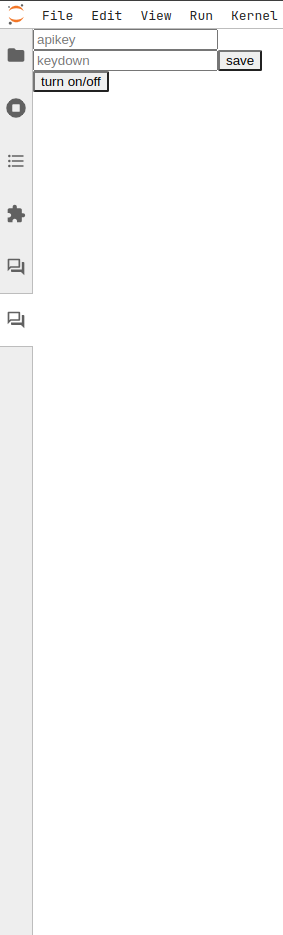

# 整合bigcode续写逻辑说明


## 代码逻辑（以下内容与现有的代码完全兼容）
1. 制作侧边栏并将实例化对象注入到 extension 的容器中

- 在这个侧边栏中，提供一些选项，如 huggingface token，是否打开此功能等

- 实现逻辑如下方 [制作则边栏配置页面](#制作则边栏配置页面) 和 此项目中 jupyter-ai 的做法

2. 构造键盘监听器

- 实现逻辑如下方 [配置键盘处理程序](#配置键盘处理程序)（在这里也展示了我们如何拿到 codemirror 实例以及获取所有的 cell ）

3. 构造键盘监听器的处理程序

- 续写（ctrl+space）
  
    1. 获取所有 cell（不包含输出）

    2. 将所有 cell 的代码拼接作为 prompt（在这一步中需要限制 token ）

    3. 将 prompt 发送到 bigcode

    4. 解析bigcode的返回值（可能存在 stop-token 等无用字符）

    5. 将解析好的返回值（下述: return-code）在请求时的 activeCell 中作为展示

        1. 通过 codemirror 获取 cell 中的代码

        2. 将 return-code 变成灰色 + cell 中的代码写入到cell中

    6. 将 return-code 保存到 globalstate 中（ globalstate 是 react 的一个全局状态管理，被称为 "Context API"）

    7. 将这次是"续写"的状态保存到 globalstate

- 错误修正（ctrl+`）

    1. 获取当前 cell（包含输出）

    2. 将当前 cell 的代码进行格式化作为 prompt，并将 cell 中的代码保存到 globalstate

    3. 将 prompt 发送到 bigcode

    4. 解析 bigcode 的返回值（可能存在 stop-token 等无用字符）

    5. 使用 diff 库制作不同颜色的字符串作为展示

    6. 将解析好的返回值保存到 globalstate 中

    7. 将这次是"修改错误"的状态保存到 globalstate

- 填入正在展示的代码（ctrl）

    1. 获取当前 cell

    2. 在 globalstate 拿到缓存的续写代码片段和请求的状态（"续写"|"修改错误"）

    3. 如果状态合法，将缓存的续写代码片段通过 codemirror 写入到 cell 中
    
        1. 获取焦点的 cell 的 codemirror 实例

        2. codemirror 存在回溯的一个函数（历史API），我们拿到请求时的代码，加上 return-code 作为新的代码，通过codemirror 写入到 cell中（这个举例是"续写"，如果是"修改错误"，直接将 return-code 作为新的代码，写入即可）

    4. 如果状态等信息不合法或者用户没有按下ctrl键，那么我们取消展示

        1. 获取焦点的 cell 的 codemirror 实例

        2. 通过 codemirror 的回溯函数找到请求时的代码片段进行写入


## 用户使用逻辑线

### 简易使用逻辑
- 续写：按下键盘事件 -> 请求到bigcode -> 解析返回值 -> 通过上文中获取的"codemirror"实例进行展示（实际是使用不同颜色的字进行写入）-> 用户按下写入键 -> 使用codemirror的回溯功能找到上一次编辑的代码（类似于：ctrl+z），使用回溯找到展示之前的代码加上bigcode返回的代码（如果按下别的键，则我们直接回溯即可）

- 修复bug：同理，只是在展示的时候需要调用diff库

##  制作则边栏配置页面

### 图片说明
|  |  |
|:-------------------------------------------:|:-------------------------------------------:|


在上述两个图片中，左图是jupyter-ai的配置页面，我们可以在它的下边制作一个新的点击框，如右图

### 具体实现方式

#### 代码说明
```typescript
// src/widgets/bigcode.tsx
// 侧边栏构造方法
export function buildBigcodeSidebar(): ReactWidget {
  const BigCodeWidget = ReactWidget.create(
    // dom 结构... 这个dom结构是点击之后展示的dom，如上方右图中 options 的页面（填写apikey，save按钮等）
  );
  BigCodeWidget.id = 'jupyter-ai::bigcode';
  BigCodeWidget.title.icon = chatIcon;
  BigCodeWidget.title.caption = 'bigcode continuation';
  return BigCodeWidget;
}
```

```typescript
// src/index.ts
// labextension 前端入口点
const plugin: JupyterFrontEndPlugin<void> = {
  id: 'jupyter_ai:plugin',
  autoStart: true,
  optional: [IGlobalAwareness, ILayoutRestorer],
  activate: async (
    app: JupyterFrontEnd,
    restorer: ILayoutRestorer | null
  ) => {
    // 构造侧边栏实例
    const bigcodeWidget = buildBigcodeSidebar();
    // 将则边栏添加到jupyterlab中
    app.shell.add(bigcodeWidget, 'left', { rank: 2401 });

    if (restorer) {
      // 添加到 JupyterLab 的布局恢复管理器中，以便在用户关闭并重新打开 JupyterLab 时，可以恢复之前的部件布局状态。
      restorer.add(bigcodeWidget, 'bigcode-continuation-write');
    }
  }
};

export default plugin;
```

#### 文字说明

1. 定义Widget构造器方法 ```export function buildBigcodeSidebar(): ReactWidget {}```
2. 在构造器中构造Widget ```const BigCodeWidget = ReactWidget.create( dom结构... );```
3. 配置如id，图标，标题等基本信息 ```BigCodeWidget.xxx = xxx```
4. return BigCodeWidget
5. labextension 前端入口点添加这个侧边栏到jupyterlab中 ```app.shell.add(bigcodeWidget, 'left', { rank: 2401 })```

## 配置键盘处理程序

### 具体实现方式

#### 代码说明

```typescript
// src/handler/handleKeyDown.ts
// 监听键盘事件处理程序
export const handleKeyDown = (app: JupyterFrontEnd) => {
  /*
  在这个说明版本中我们添加监听器到全局中，
  实际开发中我们应该换成在 jupyterlab 的右侧代码填写区dom中，
  并且我们需要根据配置页面是否打开此功能来动态启动此处理程序
  */   
  document.addEventListener('keydown', event => {
    // 检测到 Ctrl 键被按下，此处可以进行进一步处理
    if (event.ctrlKey) {
      // 获取当前活动的文档窗口
      const currentWidget = app.shell.currentWidget;
      if (!(widget instanceof DocumentWidget)) {
          return null;
      }
      const { content } = widget
      // 当前操作的单元格
      const activeCell = content.activeCell;
      // 当前操作的单元格的 codemirror 实例对象
      const editor = activeCell.editor as CodeMirrorEditor;
      // 所有的单元格  
      const allCell = content.cellsArray
    }
  });
};
```
```typescript
// src/index.ts
// 引入上方ts文件的函数
import { handleKeyDown } from './handler/onKeyDown';
// labextension 前端入口点
const plugin: JupyterFrontEndPlugin<void> = {
  id: 'jupyter_ai:plugin',
  autoStart: true,
  optional: [IGlobalAwareness, ILayoutRestorer],
  activate: async (
    app: JupyterFrontEnd
  ) => {
    // 启动此处理程序
    handleKeyDown(app);
  }
};

export default plugin;
```

#### 文字说明

1. 构造handler处理程序，如"src/handler/handleKeyDown.ts"
2. 在app加载此处理程序，如"src/index.ts"


