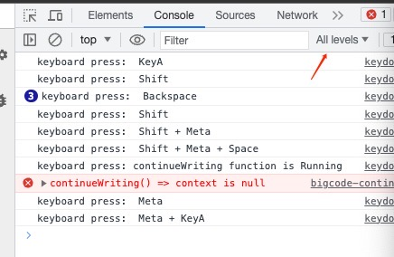

# 整合bigcode续写逻辑说明

## 依赖项
- "mobx" and "mobx-react": react的一个全局变量管理库
- "typescript": ~4.1.3 -> 5.1.6，之前的ts版本会打包失败，原因为ts语法检查依赖项中的代码不通过

## 项目结构
此结构是在原有的 jupyter-ai 上新增的

```
packages/jupyter-ai
├── src  # Source code root
│   ├── bigcode  # Bigcode related functionality
│   │   └── bigcode-code-completion.ts  # Code continuation logic
│   ├── components  # UI components
│   │   └── bigcode-settings.tsx  # Settings related to bigcode
|   ├── types
|   |   └── cell.ts # Used to call the cell structure in the link
│   ├── contexts
│   │   └── code-completion-context-store.ts  # Context for the continue writing feature
│   ├── keydown-handler.ts  # Global keydown handlers
│   ├── utils  # Utility functions for bigcode feature
│   │   ├── bigcode-request.ts  # Bigcode API requests
│   │   ├── cell-modification.ts  # Cell modification
│   │   ├── cell-context.ts  # Cell context
│   │   ├── instance.ts  # Instance related utilities
│   │   └── keyboard.ts # Tool method to monitor the keyboard
│   └── widgets 
│       └── bigcode-sidebar.tsx  # Sidebar for bigcode features

```

## Develop and preview

### install
```shell
./scripts/install.sh
```

### run
```shell
npm run dev

# If you want to compile when you modify the code, run the following command with the above command
npm run watch
```
### debug 
Check all the options in the log level in F12 (Developer Tools)



## 逻辑梳理
我们目前的做法是基于现有的 jupyter-ai 代码做的扩展（属于 jupyter-ai 的一部分）

### 前端

#### 侧边栏
1. 定义Widget构造器方法
2. 配置如id，图标，标题等基本信息（暂时没有图标，使用的是jupyter-ai的）
3. labextension 前端入口点添加这个侧边栏（Widget）到jupyterlab中，参考[labextension 前端入口点](./packages/jupyter-ai/src/index.ts)

[代码](./packages/jupyter-ai/src/widgets/bigcode-sidebar.tsx)

#### 键盘处理事件


1. 创建 codemirror 的 extension（键盘事件）,此 extension 在下述流程中被绑定到 codemirror 的实例
2. 当 notebook 发生变化时，将 notebbok 默认选中的 cell 添加此 extension
3. 在 notebook 中挂载 cell 变化事件，如果 cell 发生变化，则将 extension 添加至 cell 的 codemirror 实例中
4. 在app加载此处理程序

[代码](./packages/jupyter-ai/src/keydown-handler.ts)


#### 续写

1. 获取前面所有单元格的代码（鼠标指针之前的）
2. 格式化后发送给 bigcode
3. 开始请求动画 [代码](./packages/jupyter-ai/src/utils/animation.ts)
4. 展示在单元格中（以写入状态保存到单元格）[1.2.4步代码：continueWriting 函数](./packages/jupyter-ai/src/bigcode/bigcode-continue-writing.ts)
5. 当用户按下 Enter 后，取消代码的灰色状态 [代码：removeColor 函数](./packages/jupyter-ai/src/bigcode/bigcode-continue-writing.ts)
6. 当用户按下其他键后，删除灰色的代码 [代码：handleAnyKeyPress 函数](./packages/jupyter-ai/src/bigcode/bigcode-continue-writing.ts)


### 后端（最后做）

在 jupyter-ai 中，用户填写的信息后，会进行请求到后端[handlers](./packages/jupyter-ai/jupyter_ai/handlers.py)，由后端保存到"~/.loacl"目录中。

我们延伸此架构，使原先的接口可以新增 bigcode 的配置。并且在请求 bigcode 时，由后端做请求转发

