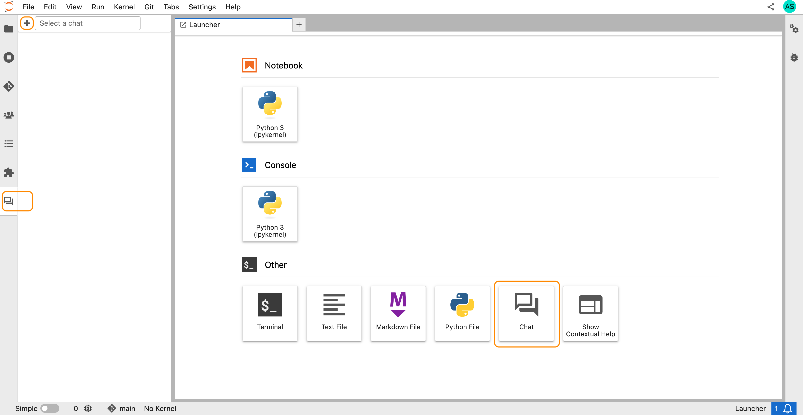
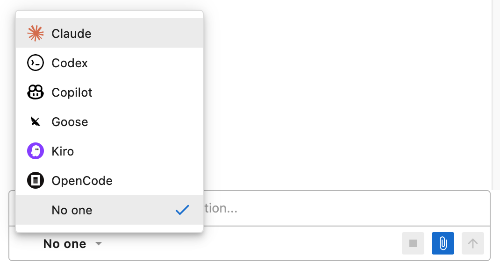
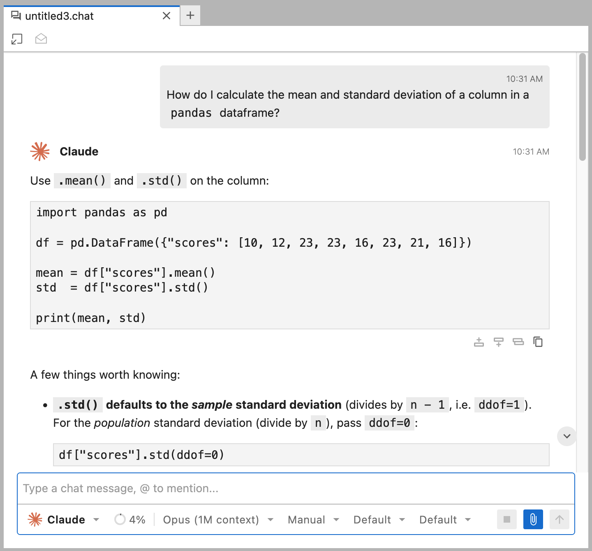
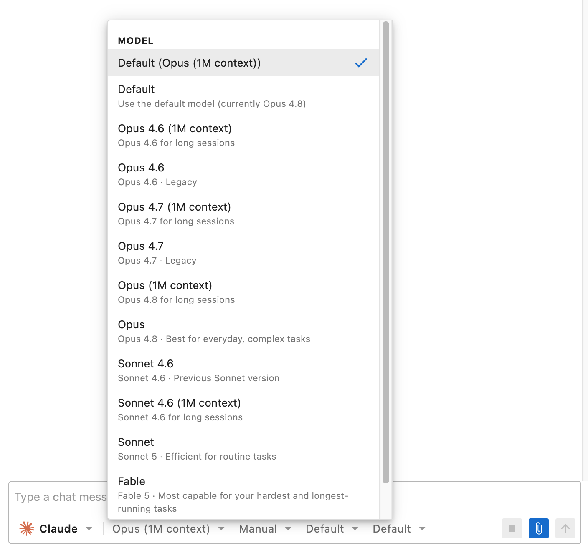
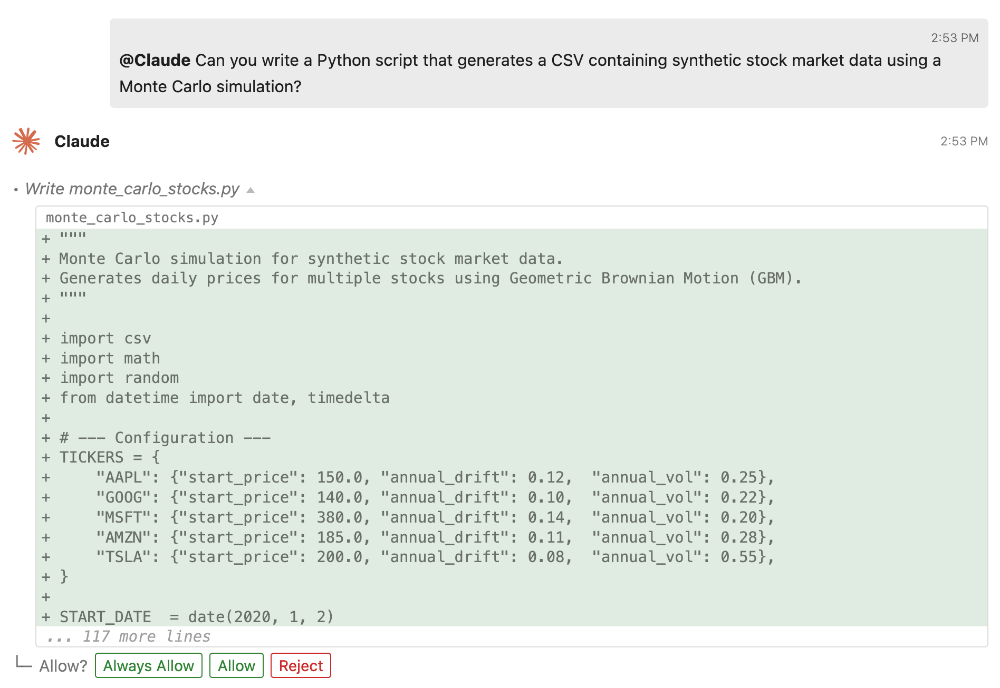

# Getting Started

To help you get started with Jupyter AI, we'll walk through:

- Installing Jupyter AI
- Installing agents
- Creating a chat in JupyterLab
- Collaborating with agents in JupyterLab

## Install Jupyter AI

Install Jupyter AI in your Python environment using `pip` or your favorite
environment manager. Jupyter AI is distributed on PyPI and Conda Forge.

````{tabs}

```{tab} pip

    pip install jupyter-ai

```

```{tab} uv

    uv pip install jupyter-ai

```

```{tab} conda

    conda install -c conda-forge jupyter-ai

```

```{tab} mamba

    mamba install -c conda-forge jupyter-ai

```

```{tab} micromamba

    micromamba install -c conda-forge jupyter-ai

```

```{tab} pixi

    pixi add jupyter-ai

```

````

## Install agents

To allow users to freely choose which agents they want inside of JupyterLab,
Jupyter AI does not ship with any agent by default. You will need to install at
least one agent to get started:

To install agents, follow the official documentation for the agents you wish to
use:

- [Claude Code](https://docs.anthropic.com/en/docs/claude-code/quickstart)
- [Codex CLI](https://developers.openai.com/codex/cli)
- [GitHub Copilot CLI](https://docs.github.com/en/copilot/how-tos/copilot-cli/set-up-copilot-cli/install-copilot-cli)
- [Goose](https://block.github.io/goose/docs/getting-started/installation)
- [Kilo CLI](https://kilo.ai/cli)
- [Kiro CLI](https://kiro.dev/docs/cli/installation/)
- [Mistral Vibe](https://docs.mistral.ai/mistral-vibe/introduction/install)
- [OpenCode](https://opencode.ai/docs/#install)

Some agents also require an additional ACP adapter or package to become
available in Jupyter AI. If your agent is listed below, you will also need to
install the corresponding package:

````{tabs}

```{tab} Claude Code

    npm install -g @agentclientprotocol/claude-agent-acp

```

```{tab} Codex

    npm install -g @zed-industries/codex-acp

```

```{tab} Mistral Vibe

    uv tool install mistral-vibe
    # or
    pip install mistral-vibe

```

````

:::{tip}
If you use a Conda environment manager, we recommend installing the ACP agent
adapter inside your environment. Use the package manager required by the
adapter:

````{tabs}

```{tab} conda

    conda activate <env-name>
    conda install nodejs  # for npm-based adapters such as Claude Code or Codex
    npm install -g <npm-package-name>

    # or, for Python-based adapters such as Mistral Vibe
    pip install <python-package-name>

```

```{tab} mamba

    mamba activate <env-name>
    mamba install nodejs  # for npm-based adapters such as Claude Code or Codex
    npm install -g <npm-package-name>

    # or, for Python-based adapters such as Mistral Vibe
    pip install <python-package-name>

```

```{tab} micromamba

    micromamba activate <env-name>
    micromamba install nodejs  # for npm-based adapters such as Claude Code or Codex
    npm install -g <npm-package-name>

    # or, for Python-based adapters available on Conda Forge
    micromamba install -c conda-forge <conda-package-name>

```

```{tab} pixi

    pixi shell
    pixi add nodejs  # for npm-based adapters such as Claude Code or Codex
    npm install -g <npm-package-name>

    # or, for Python-based adapters available on Conda Forge, such as Mistral Vibe
    pixi add <conda-package-name>

```

````
:::

## Create a chat

Jupyter AI will automatically detect which agents are available from the
environment. You can now use Jupyter AI just by starting JupyterLab:

```
jupyter lab
```

Next, create a chat by clicking the **Chat** card in the launcher page, or the
**+** button in the chat sidebar panel:



:::{tip}
In Jupyter AI, chats are simply files that live in your workspace. You can
resume a chat by re-opening it as you would for any other document. You can also
create and use multiple chats simultaneously to manage different threads of
work.
:::

## Collaborate with an agent

You should now see a chat open in JupyterLab. Agents appear as **AI personas**
in every chat. You can pick an AI persona to chat with by clicking the menu in
the input toolbar and selecting an AI persona.



:::{tip}
If you're not logged in with an agent already, the agent will not respond to
your request and instead prompt you to login.

The agent installation and authentication process will be simplified and
improved in future versions. For now, you may need to log in via the agent's
dedicated CLI in a separate terminal (opened automatically when possible), or
pass additional environment variables and restart the server. 
:::

Whichever persona is selected is the one that will respond to your message.
Simply type a prompt and send a message.



After a brief delay, additional menus will appear after the AI persona has fully
initialized and reported its available settings. Each agent provides different
available settings, but generally these will allow you to control the model,
permission mode, effort level, and various other settings.



Of course, agents can read files, write files, run shell commands, and even
interact with notebooks through the Jupyter MCP Server. Agents will also request
permission when invoking tools, unless explicitly allowed by the controls in the
input toolbar.



## Next Steps

- See the full {doc}`User Guide </users/index>` for detailed documentation on all features.
- See the {doc}`Contributor Guide </contributors/index>` if you want to help build Jupyter AI.
- See the {doc}`Developer Guide </developers/index>` if you want to extend Jupyter AI with custom agents or MCP servers.
