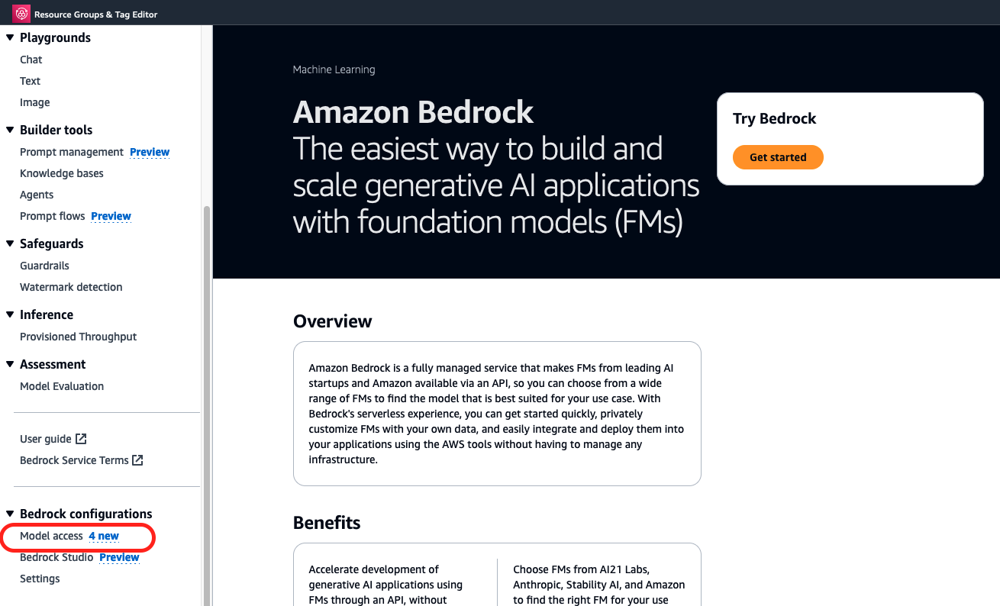
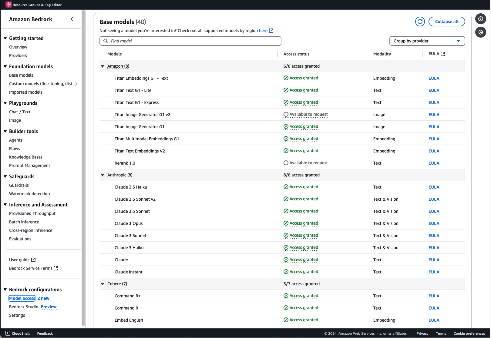
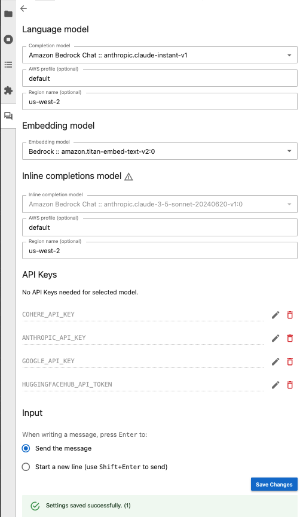
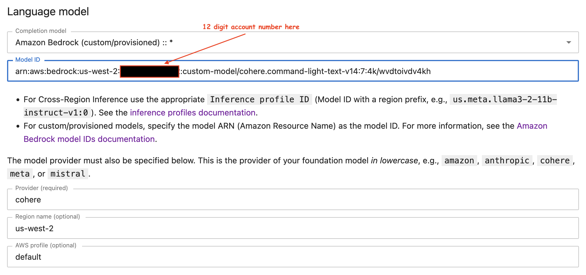
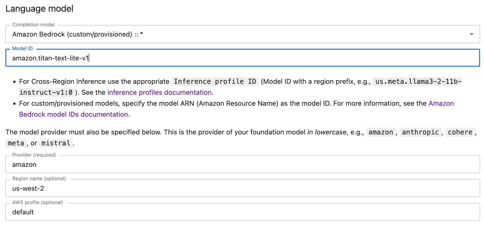

# Using Amazon Bedrock with Jupyter AI

[(Return to the Chat Interface page)](index.md#amazon-bedrock-usage)

Bedrock supports many language model providers such as AI21 Labs, Amazon, Anthropic, Cohere, Meta, and Mistral AI. To use the base models from any supported provider make sure to enable them in Amazon Bedrock by using the AWS console. You should also select embedding models in Bedrock in addition to language completion models if you intend to use retrieval augmented generation (RAG) on your documents.

Go to Amazon Bedrock and select `Model Access` as shown here:

Click through on `Model Access` and follow the instructions to grant access to the models you wish to use, as shown below. Make sure to accept the end user license (EULA) as required by each model. You may need your system administrator to grant access to your account if you do not have authority to do so.

You should also select embedding models in addition to language completion models if you intend to use retrieval augmented generation (RAG) on your documents.

You may now select a chosen Bedrock model from the drop-down menu box title `Completion model` in the chat interface. If RAG is going to be used then pick an embedding model that you chose from the Bedrock models as well. An example of these selections is shown below:

If your provider requires an API key, please enter it in the box that will show for that provider. Make sure to click on `Save Changes` to ensure that the inputs have been saved.

Bedrock also allows custom models to be trained from scratch or fine-tuned from a base model. Jupyter AI enables a custom model to be called in the chat panel using its `arn` (Amazon Resource Name). A fine-tuned model will have your 12-digit customer number in the ARN:

As with custom models, you can also call a base model by its `model id` or its `arn`. An example of using a base model with its `model id` through the custom model interface is shown below:

An example of using a base model using its `arn` through the custom model interface is shown below:

## Fine-tuning in Bedrock

To train a custom model in Amazon Bedrock, select `Custom models` in the Bedrock console as shown below, and then you may customize a base model by fine-tuning it or continuing to pre-train it:

For details on fine-tuning a base model from Bedrock, see this [reference](https://aws.amazon.com/blogs/aws/customize-models-in-amazon-bedrock-with-your-own-data-using-fine-tuning-and-continued-pre-training/); with related [documentation](https://docs.aws.amazon.com/bedrock/latest/userguide/custom-models.html).

Once the model is fine-tuned, it will have its own `arn`, as shown below:

As seen above, you may click on `Purchase provisioned throughput` to buy inference units with which to call the custom model's API. Enter the model's `arn` in Jupyter AI's Language model user interface to use the provisioned model.

## Cross-Region Inference

Amazon Bedrock now permits cross-region inference, where a model hosted in a different region than that of the user may be specified, see the [inference profiles documentation](https://docs.aws.amazon.com/bedrock/latest/userguide/inference-profiles-support.html). Such models have IDs prefixed by a region identifier such as `us.meta.llama3-2-1b-instruct-v1:0`, for example. To use this feature, simply enter the Inference profile ID for the cross-region model instead of the ARN.

## Summary

1. Bedrock Base models: All available models will already be available in the drop down model list. The above interface also allows use of base model IDs or ARNs, though this is unnecessary as they are in the dropdown list.
2. Bedrock Custom models: If you have fine-tuned a Bedrock base model you may use the ARN for this custom model. Make sure to enter the correct provider information, such as `amazon`, `anthropic`, `cohere`, `meta`, `mistral` (always in lower case).
3. Provisioned Models: These are models that run on dedicated endpoints. Users can purchase Provisioned Throughput Model Units to get faster throughput. These may be base or custom models. Enter the ARN for these models in the Model ID field.
4. Cross-region Inference: Use the Inference profile ID for the cross-region model instead of the ARN.

[(Return to the Chat Interface page)](index.md#amazon-bedrock-usage)
