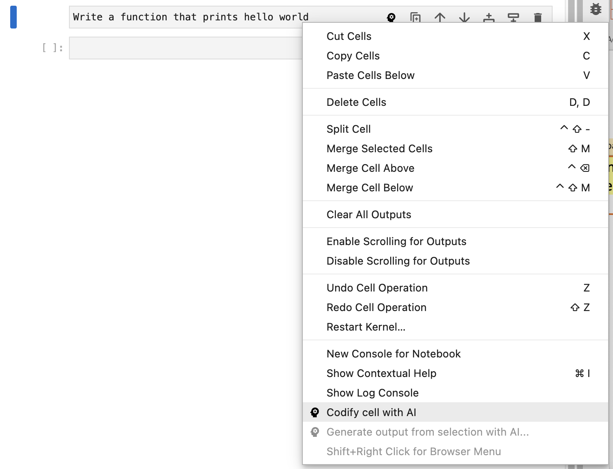
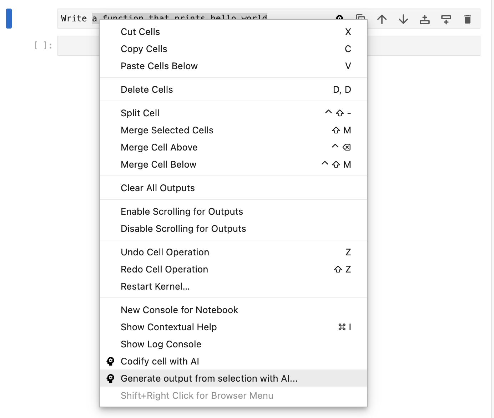
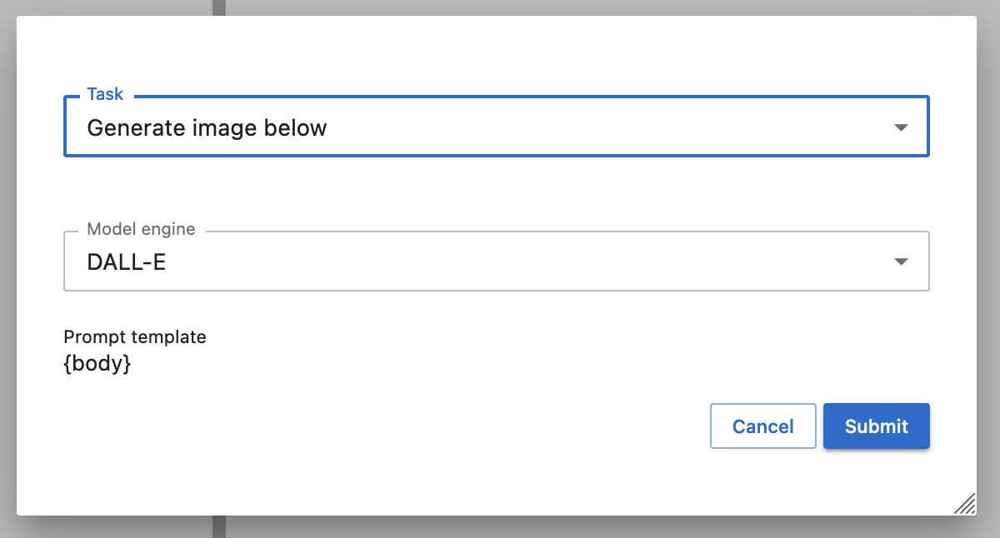
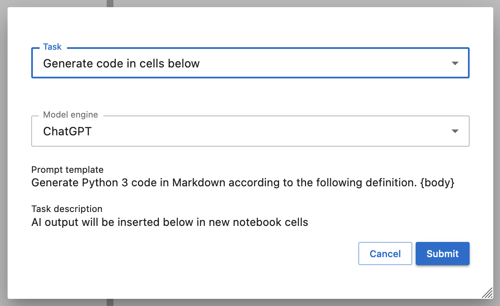

# Users

This page is intended for people interested in installing and using Jupyter AI. If you are interested in contributing a new or modified feature in JupyterLab, please see our {doc}`contributor's guide </contributors/index>`.

## Prerequisites

To use Jupyter AI, you will need to have JupyterLab ≥ 3.5 (*not* JupyterLab 4) installed.

To use Jupyter AI with OpenAI APIs, such as GPT-3 and ChatGPT, you will need
an OpenAI account and API key. You can generate an API key at
[https://platform.openai.com/account/api-keys](https://platform.openai.com/account/api-keys).

:::{attention}
:name: open-ai-cost
OpenAI may charge users for API usage. Jupyter AI users are responsible for all charges
they incur when they make API requests. See [OpenAI's pricing page](https://openai.com/pricing)
for details.
:::

## Installing

To install the extension, execute:

```bash
pip install jupyter_ai
```

The command above should install two extensions: a server extension and a frontend extension.

You can also install a particular AI module by running `pip install`. For example, to install the ChatGPT AI module, run:

```bash
pip install jupyter_ai_chatgpt
```

You can check that the Jupyter AI server extension is enabled by running:

```bash
jupyter server extension list
```

To verify that the frontend extension is installed, run:

```bash
jupyter labextension list
```

## Configuring with OpenAI

The Jupyter AI package includes AI modules that work with OpenAI's ChatGPT and GPT-3 models.
To use these models, you will need to create an OpenAI account and create API keys.
You can generate an API key at [https://platform.openai.com/account/api-keys](https://platform.openai.com/account/api-keys).
Please note that [OpenAI may charge for API usage](#open-ai-cost).

### Configuring GPT-3

To use the `GPT3ModelEngine` in `jupyter_ai`, you will need an OpenAI API key.
Copy the API key and then create a Jupyter config file locally at `config.py` to
store the API key.

```python
c.GPT3ModelEngine.api_key = "<your-api-key>"
```

Finally, start a new JupyterLab instance pointing to this configuration file.

```bash
jupyter lab --config=config.py
```

If you are doing this in a Git repository, you can ensure you never commit this
file by accident by adding it to `.git/info/exclude`.

Alternatively, you can also specify your API key while launching JupyterLab.

```bash
jupyter lab --GPT3ModelEngine.api_key=<api-key>
```

### Configuring ChatGPT

To use the `ChatGptModelEngine` in `jupyter_ai`, add your ChatGPT API key to `config.py`.

```python
c.ChatGptModelEngine.api_key = "<your-api-key>"
```

Then, start a new JupyterLab instance pointing to this configuration file.

```bash
jupyter lab --config=config.py
```

If you would prefer not to use a configuration file, you can specify your API key
while launching JupyterLab.

```bash
jupyter lab --ChatGptModelEngine.api_key=<api-key>
```

## Using the extension in JupyterLab

### Basic usage

In JupyterLab, once the Jupyter AI extension is installed and configured, you should see a Jupyter AI button in the cell toolbar:


If you click the button on a markdown cell, it will run the "generate code" task, and it will create new cells with markdown and code.

If you click the button on a code cell, it will run the "explain code" tasks, and it will create a new cell with a markdown explanation of what this code does.

You can also run the "generate code" or "explain code" task by right-clicking on a cell and clicking "Codify cell with AI".



### Advanced usage

You can highlight all or some of the text in a cell, and select "Generate output from selection with AI…", to bring up a dialog with more AI options.



This dialog will show all available tasks and it shows a preview of what the prompt will look like. The special string `{body}` in the prompt template will be replaced with the selected text.



If the selected task has a description, the dialog will show that as well.



## Uninstalling

To remove the extension, execute:

```bash
pip uninstall jupyter_ai
```
