# Users

Welcome to the user documentation for Jupyter AI.

If you are interested in contributing to Jupyter AI,
please see our {doc}`contributor's guide </contributors/index>`.

## Prerequisites

You can run Jupyter AI on any system that can run a supported Python version from 3.8 to 3.11, including recent Windows, macOS, and Linux versions.

If you use `conda`, you can install Python 3.11 in your environment by running:

```
conda install python=3.11
```

To use the `jupyter_ai` package, you will also need to have a currently-maintained version of JupyterLab 3 installed. We do not yet support JupyterLab 4. If you use `conda`, you can install JupyterLab in your environment by running:

```
conda install jupyterlab
```

You should have Jupyter Server 2.x (not 1.x) installed. A fresh install of JupyterLab 3.6.x should come with Server 2.x. You can find your current Server version by running `jupyter --version` and checking for a line beginning with `jupyter_server`. To upgrade your version of Jupyter Server, run:

```
pip install jupyter_server --upgrade
```

You can use the `jupyter_ai_magics` package without JupyterLab, but you will need a compatible interface, such as [IPython](https://ipython.org/).

## Model providers

Jupyter AI supports a wide range of model providers and models. To use Jupyter AI with a particular provider, you must install its Python packages and set its API key (or other credentials) in your environment or in the chat interface.

Jupyter AI supports the following model providers:

| Provider            | Provider ID          | Environment variable       | Python package(s)               |
|---------------------|----------------------|----------------------------|---------------------------------|
| AI21                | `ai21`               | `AI21_API_KEY`             | `ai21`                          |
| Anthropic           | `anthropic`          | `ANTHROPIC_API_KEY`        | `anthropic`                     |
| Bedrock             | `amazon-bedrock`     | N/A                        | `boto3`                         |
| Cohere              | `cohere`             | `COHERE_API_KEY`           | `cohere`                        |
| Hugging Face Hub    | `huggingface_hub`    | `HUGGINGFACEHUB_API_TOKEN` | `huggingface_hub`, `ipywidgets`, `pillow` |
| OpenAI              | `openai`             | `OPENAI_API_KEY`           | `openai`                        |
| OpenAI (chat)       | `openai-chat`        | `OPENAI_API_KEY`           | `openai`                        |
| SageMaker           | `sagemaker-endpoint` | N/A                        | `boto3`                         |

The environment variable names shown above are also the names of the settings keys used when setting up the chat interface.

To use the Bedrock models, you need access to the Bedrock service. For more information, see the
[Amazon Bedrock Homepage](https://aws.amazon.com/bedrock/).

To use Bedrock models, you will need to authenticate via
[boto3](https://github.com/boto/boto3).

You need the `pillow` Python package to use Hugging Face Hub's text-to-image models.

You can find a list of Hugging Face's models at https://huggingface.co/models.

SageMaker endpoint names are created when you deploy a model. For more information, see
["Create your endpoint and deploy your model"](https://docs.aws.amazon.com/sagemaker/latest/dg/realtime-endpoints-deployment.html)
in the SageMaker documentation.

To use SageMaker's models, you will need to authenticate via
[boto3](https://github.com/boto/boto3).

For example, to use OpenAI models, install the necessary package, and set an environment
variable when you start JupyterLab from a terminal:

```bash
pip install openai
OPENAI_API_KEY=your-api-key-here jupyter lab
```

:::{attention}
:name: open-ai-cost
Model providers may charge users for API usage. Jupyter AI users are
responsible for all charges they incur when they make API requests. Review your model
provider's pricing information before submitting requests via Jupyter AI.
:::

## Installing

You can use `conda` or `pip` to install Jupyter AI. If you're using macOS on an Apple Silicon-based Mac (M1, M1 Pro, M2, etc.), we strongly recommend using `conda`.

Python 3.8 or newer is required; older versions of Python do not support the
`typing` module we use, and as of June 30, 2023, have reached end of life.

Before you can use Jupyter AI, you will need to install any packages and set environment variables with API keys for the model providers that you will use. See [our documentation](https://jupyter-ai.readthedocs.io/en/latest/users/index.html) for details about what you'll need.

### With pip

If you want to install both the `%%ai` magic and the JupyterLab extension, you can run:

    $ pip install jupyter_ai

If you are not using JupyterLab and you only want to install the Jupyter AI `%%ai` magic, you can run:

    $ pip install jupyter_ai_magics


### With conda

First, install [conda](https://conda.io/projects/conda/en/latest/user-guide/install/index.html) and create an environment that uses Python 3.11:

    $ conda create -n jupyter-ai python=3.11
    $ conda activate jupyter-ai
    $ pip install jupyter_ai

If you are not using JupyterLab and you only want to install the Jupyter AI `%%ai` magic, you can run:

    $ pip install jupyter_ai_magics

The `%%ai` magic will work anywhere the IPython kernel runs (JupyterLab, Jupyter Notebook, Google Colab, VSCode, etc.).

You can check that the Jupyter AI server extension is enabled by running:

    $ jupyter server extension list

To verify that the frontend extension is installed, run:

    $ jupyter labextension list

To remove the extension, run:

    $ pip uninstall jupyter_ai

or

    $ pip uninstall jupyter_ai_magics

## The chat interface

The easiest way to get started with Jupyter AI is to use the chat interface.

:::{attention}
:name: open-ai-privacy-cost
The chat interface sends data to generative AI models hosted by third parties. Please review your model provider's privacy policy to understand how it may use the data you send to it. Review its pricing model so that you understand your payment obligations when using the chat interface.
:::

Once you have started JupyterLab, click the new "chat" icon in the left side panel to open the chat interface. You can right-click on the panel icon and move it to the other side, if you prefer.

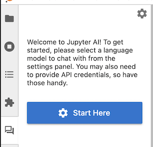

The first time you open the chat interface, Jupyter AI will ask you which models you want to use as a language model and as an embedding model. Once you have made your selections, the UI may display text boxes for one or more settings keys.

:::{admonition} Language models and embedding models
:class: tip
:name: language-models-and-embedding-models
Users may select a language model and, optionally, an embedding model. You should select one of each so that you can use the full functionality of the chat interface.

A **language model** responds to users' messages in the chat panel. It accepts a prompt and produces a response. Language models are typically *pre-trained*; they are ready to use, but their training sets are biased and incomplete, and users need to be aware of their biases when they use the chat interface.

An **embedding model** is used when [learning and asking about local data](#learning-about-local-data). These models can transform your data, including documents and source code files, into vectors that can help Jupyter AI compose prompts to language models.

Your language model and your embedding model do not need to be provided by the same vendor, but you will need authentication credentials for each model provider that you use.
:::


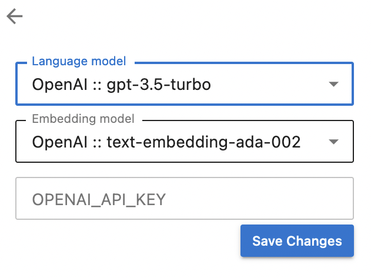

Before you can use the chat interface, you need to provide your API keys for the model providers that you have selected. Paste or type your keys into the boxes provided.

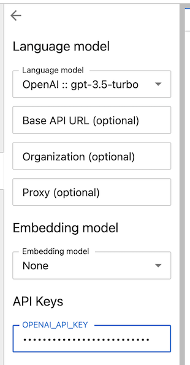

Once you have set all the necessary keys, click the "back" (left arrow) button in the upper-left corner of the Jupyter AI side panel. The chat interface now appears, and you can ask a question using the message box at the bottom.


To compose a message, type it in the text box at the bottom of the chat interface and press <kbd>ENTER</kbd> to send it. You can press <kbd>SHIFT</kbd>+<kbd>ENTER</kbd> to add a new line. (These are the default keybindings; you can change them in the chat settings pane.) Once you have sent a message, you should see a response from Jupyternaut, the Jupyter AI chatbot.


The chat backend remembers the last two exchanges in your conversation and passes them to the language model. You can ask follow up questions without repeating information from your previous conversations. Here is an example of a chat conversation with a follow up question:

#### Initial question
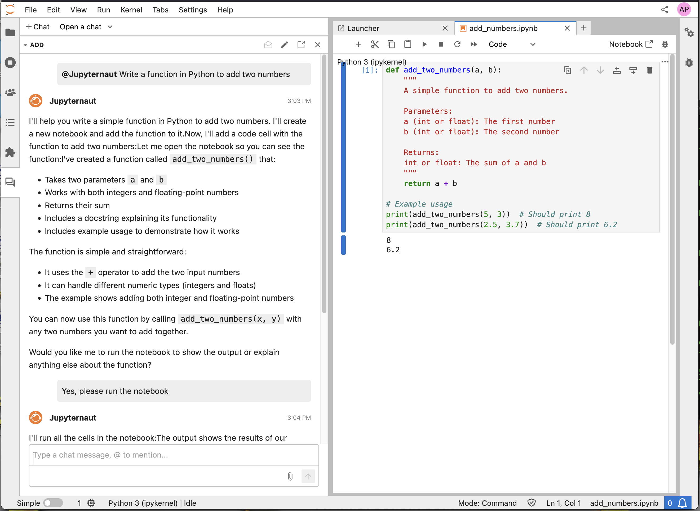

#### Follow-up question


### Using the chat interface with SageMaker endpoints

Jupyter AI supports language models hosted on SageMaker endpoints that use JSON
schemas. The first step is to authenticate with AWS via the `boto3` SDK and have
the credentials stored in the `default` profile.  Guidance on how to do this can
be found in the
[`boto3` documentation](https://boto3.amazonaws.com/v1/documentation/api/latest/guide/credentials.html).

When selecting the SageMaker provider in the settings panel, you will
see the following interface:

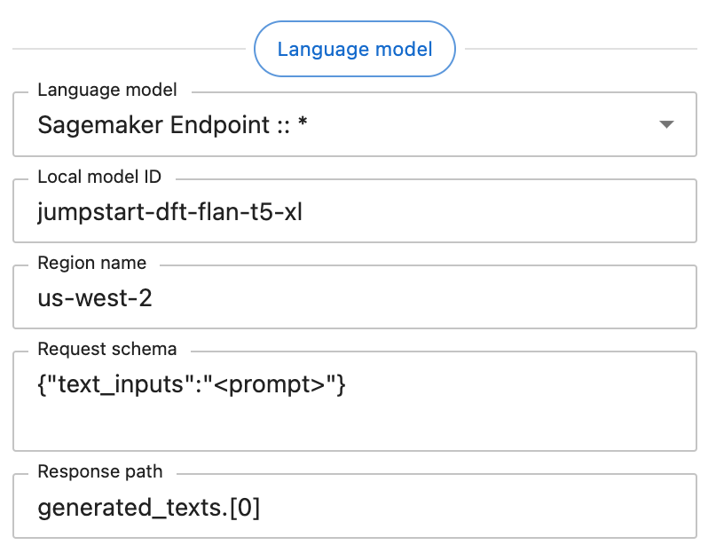

Each of the additional fields under "Language model" is required. These fields
should contain the following data:

- **Local model ID**: The name of your endpoint. This can be retrieved from the
AWS Console at the URL
`https://<region>.console.aws.amazon.com/sagemaker/home?region=<region>#/endpoints`.

- **Region name**: The AWS region your SageMaker endpoint is hosted in, e.g. `us-west-2`.

- **Request schema**: The JSON object the endpoint expects, with the prompt
being substituted into any value that matches the string literal `"<prompt>"`.
In this example, the request schema `{"text_inputs":"<prompt>"}` generates a JSON
object with the prompt stored under the `text_inputs` key.

- **Response path**: A [JSONPath](https://goessner.net/articles/JsonPath/index.html)
string that retrieves the language model's output from the endpoint's JSON
response.  In this example, the endpoint returns an object with the schema
`{"generated_texts":["<output>"]}`, hence the response path is
`generated_texts.[0]`.

### Asking about something in your notebook

Jupyter AI's chat interface can include a portion of your notebook in your prompt.

:::{warning}
:name: include-selection-cost
When you choose to include the selection with your message, this may increase the
number of tokens in your request, which may cause your request to cost more money.
Review your model provider's cost policy before making large requests.
:::

After highlighting a portion of your notebook, check "Include selection" in the chat panel, type your message, and then send your message. Your outgoing message will include your selection.

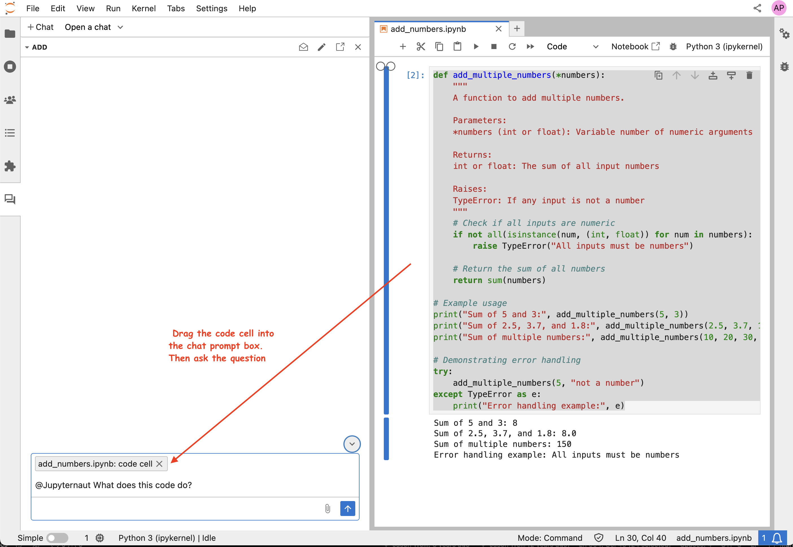

Below your message, you will see Jupyternaut's response.

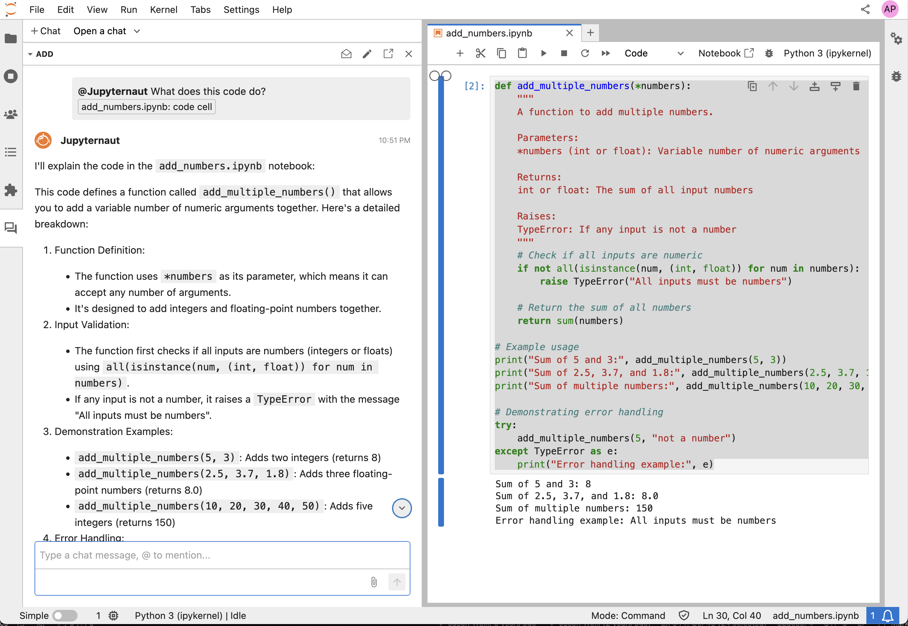

You can copy Jupyternaut's response to the clipboard so that you can paste it into your notebook, or into any other application. You can also choose to replace the selection with Jupyternaut's response by clicking "Replace selection" before you send your message.

:::{warning}
:name: replace-selection
When you replace your selection, data is written immediately after Jupyter AI
sends its response to your message. Review any generated code carefully before
you run it.
:::

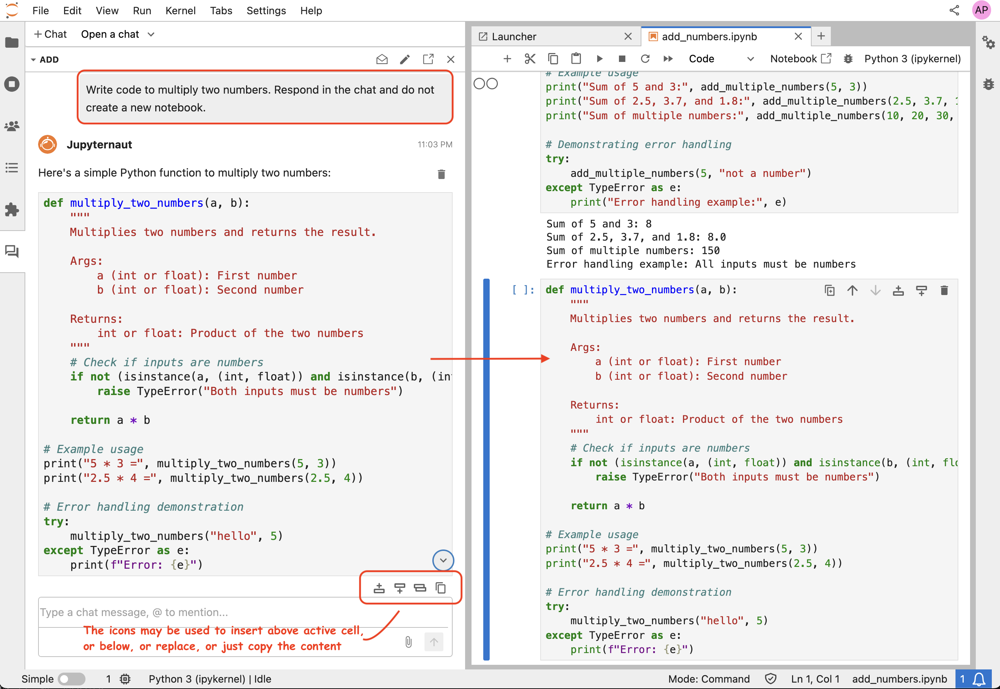

After Jupyternaut sends a response, your notebook will be updated immediately with the response replacing the selection. You can also see the response in the chat panel.

### Generating a new notebook

You can use Jupyter AI to generate an entire notebook from a text prompt. To get started, open the chat panel, and send it a message starting with `/generate`.


Generating a notebook can take a substantial amount of time, so Jupyter AI will respond to your message immediately while it works. You can continue to ask it other questions in the meantime.

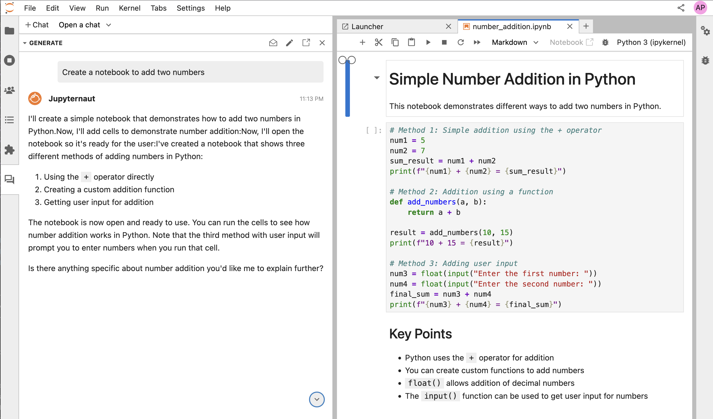

:::{note}
:name: generate-progress
Especially if your prompt is detailed, it may take several minutes to generate
your notebook. During this time, you can still use JupyterLab and Jupyter AI
as you would normally. Do not shut your JupyterLab instance down while
Jupyter AI is working.
:::

When Jupyter AI is done generating your notebook, it will send you another message with the filename that it generated. You can then open this file using the file browser.

:::{warning}
:name: generated-notebook
Generated notebooks may contain errors and may have unintended side effects when
you run the code contained in them. Please review all generated code carefully
before you run it.
:::

### Learning about local data

Using the `/learn` command, you can teach Jupyter AI about local data so that Jupyternaut can include it when answering your questions. This local data is embedded using the embedding model you selected in the settings panel.

:::{warning}
:name: learning-embedding-model
If you are using an embedding model hosted by a third party, please review your
model provider's policies before sending any confidential, sensitive, or
privileged data to your embedding model.
:::

To teach Jupyter AI about a folder full of documentation, for example, run `/learn docs/`. You will receive a response when Jupyter AI has indexed this documentation in a local vector database.

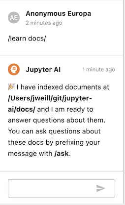

You can then use `/ask` to ask a question specifically about the data that you taught Jupyter AI with `/learn`.

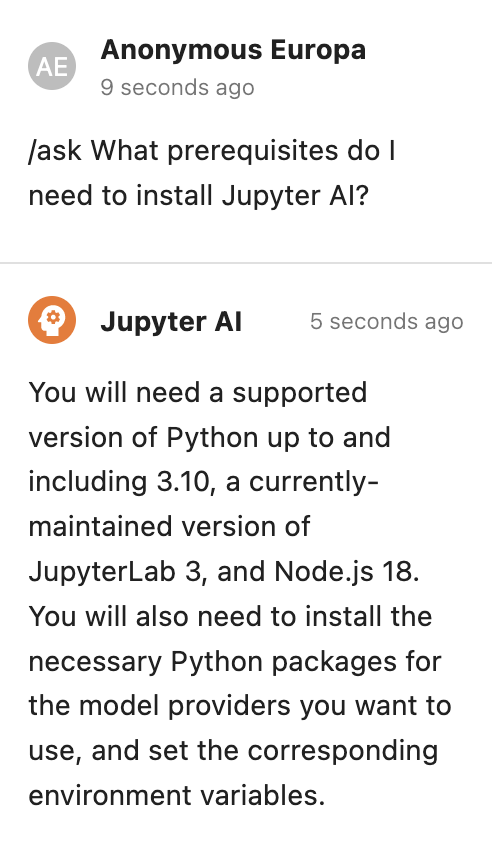

To clear the local vector database, you can run `/learn -d` and Jupyter AI will forget all information that it learned from your `/learn` commands.

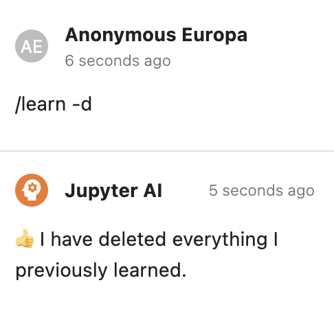

With the `/learn` command, some models work better with custom chunk sizes and chunk overlaps. To override the defaults,
use the `-c` or `--chunk-size` option and the `-o` or `--chunk-overlap` option.

```
# default chunk size and chunk overlap
/learn <directory>

# chunk size of 500, and chunk overlap of 50
/learn -c 500 -o 50 <directory>

# chunk size of 1000, and chunk overlap of 200
/learn --chunk-size 1000 --chunk-overlap 200 <directory>
```

### Additional chat commands

To clear the chat panel, use the `/clear` command. This does not reset the AI model; the model may still remember previous messages that you sent it, and it may use them to inform its responses.

## The `%ai` and `%%ai` magic commands

Jupyter AI can also be used in notebooks via Jupyter AI magics. This section
provides guidance on how to use Jupyter AI magics effectively. The examples in
this section are based on the [Jupyter AI example notebooks](https://github.com/jupyterlab/jupyter-ai/blob/main/examples/).

If you already have `jupyter_ai` installed, the magics package
`jupyter_ai_magics` is installed automatically. Otherwise, run

    pip install jupyter_ai_magics

in your terminal to install the magics package.

Before you send your first prompt to an AI model, load the IPython extension by
running the following code in a notebook cell or IPython shell:

```
%load_ext jupyter_ai_magics
```

This command should not produce any output.

:::{note}
If you are using remote kernels (e.g.  Amazon SageMaker Studio), the above
command will throw an error. This means that need to install the magics package
on your remote kernel separately, even if you already have `jupyter_ai_magics`
installed in your server's environment. In a notebook, run

```
%pip install jupyter_ai_magics
```

and re-run `%load_ext jupyter_ai_magics`.
:::

Once the extension has loaded, you can run `%%ai` cell magic commands and
`%ai` line magic commands. Run `%%ai help` or `%ai help` for help with syntax.
You can also pass `--help` as an argument to any line magic command (for example,
`%ai list --help`) to learn about what the command does and how to use it.

### Choosing a provider and model

The `%%ai` cell magic allows you to invoke a language model of your choice with
a given prompt. The model is identified with a **global model ID**, which is a string with the
syntax `<provider-id>:<local-model-id>`, where `<provider-id>` is the ID of the
provider and `<local-model-id>` is the ID of the model scoped to that provider.
The prompt begins on the second line of the cell.

For example, to send a text prompt to the provider `anthropic` and the model ID
`claude-v1.2`, enter the following code into a cell and run it:

```
%%ai anthropic:claude-v1.2
Write a poem about C++.
```

We currently support the following language model providers:

- `ai21`
- `anthropic`
- `cohere`
- `huggingface_hub`
- `openai`
- `openai-chat`
- `sagemaker-endpoint`

:::{warning}
As of v0.8.0, only the `%%ai` *cell* magic may be used to invoke a language
model, while the `%ai` *line* magic is reserved for invoking subcommands.
:::

### Listing available models

Jupyter AI also includes multiple subcommands, which may be invoked via the
`%ai` *line* magic. Jupyter AI uses subcommands to provide additional utilities
in notebooks while keeping the same concise syntax for invoking a language model.

The `%ai list` subcommand prints a list of available providers and models. Some
providers explicitly define a list of supported models in their API. However,
other providers, like Hugging Face Hub, lack a well-defined list of available
models. In such cases, it's best to consult the provider's upstream
documentation. The [Hugging Face website](https://huggingface.co/) includes a
list of models, for example.

Optionally, you can specify a provider ID as a positional argument to `%ai list`
to get all models provided by one provider. For example, `%ai list openai` will
display only models provided by the `openai` provider.

### Abbreviated syntax

If your model ID is associated with only one provider, you can omit the `provider-id` and
the colon from the first line. For example, because `ai21` is the only provider of the
`j2-jumbo-instruct` model, you can either give the full provider and model,

```
%%ai ai21:j2-jumbo-instruct
Write some JavaScript code that prints "hello world" to the console.
```

or just the model,

```
%%ai j2-jumbo-instruct # infers AI21 provider
Write some JavaScript code that prints "hello world" to the console.
```

### Formatting the output

By default, Jupyter AI assumes that a model will output markdown, so the output of
an `%%ai` command will be formatted as markdown by default. You can override this
using the `-f` or `--format` argument to your magic command. Valid formats include:

- `code`
- `image` (for Hugging Face Hub's text-to-image models only)
- `markdown`
- `math`
- `html`
- `json`
- `text`

For example, to force the output of a command to be interpreted as HTML, you can run:

```
%%ai anthropic:claude-v1.2 -f html
Create a square using SVG with a black border and white fill.
```

The following cell will produce output in IPython's `Math` format, which in a web browser
will look like properly typeset equations.

```
%%ai chatgpt -f math
Generate the 2D heat equation in LaTeX surrounded by `$$`. Do not include an explanation.
```

This prompt will produce output as a code cell below the input cell.

:::{warning}
:name: run-code
**Please review any code that a generative AI model produces before you run it
or distribute it.**
The code that you get in response to a prompt may have negative side effects and may
include calls to nonexistent (hallucinated) APIs.
:::

```
%%ai chatgpt -f code
A function that computes the lowest common multiples of two integers, and
a function that runs 5 test cases of the lowest common multiple function
```

### Clearing the OpenAI chat history

With the `openai-chat` provider *only*, you can run a cell magic command using the `-r` or
`--reset` option to clear the chat history. After you do this, previous magic commands you've
run with the `openai-chat` provider will no longer be added as context in
requests to this provider.

Because the `%%ai` command is a cell magic, you must provide a prompt on the second line.
This prompt will not be sent to the provider. A reset command will not generate any output.

```
%%ai openai-chat:gpt-3.5-turbo -r
reset the chat history
```

### Interpolating in prompts

Using curly brace syntax, you can include variables and other Python expressions in your
prompt. This lets you execute a prompt using code that the IPython kernel knows about,
but that is not in the current cell.

For example, we can set a variable in one notebook cell:

```python
poet = "Walt Whitman"
```

Then, we can use this same variable in an `%%ai` command in a later cell:

```
%%ai chatgpt
Write a poem in the style of {poet}
```

When this cell runs, `{poet}` is interpolated as `Walt Whitman`, or as whatever `poet`
is assigned to at that time.

You can use the special `In` and `Out` list with interpolation syntax to explain code
located elsewhere in a Jupyter notebook. For example, if you run the following code in
a cell, and its input is assigned to `In[11]`:

```python
for i in range(0, 5):
  print(i)
```

You can then refer to `In[11]` in an `%%ai` magic command, and it will be replaced
with the code in question:

```
%%ai cohere:command-xlarge-nightly
Please explain the code below:
--
{In[11]}
```

You can also refer to the cell's output using the special `Out` list, with the same index.

```
%%ai cohere:command-xlarge-nightly
Write code that would produce the following output:
--
{Out[11]}
```

Jupyter AI also adds the special `Err` list, which uses the same indexes as `In` and `Out`.
For example, if you run code in `In[3]` that produces an error, that error is captured in
`Err[3]` so that you can request an explanation using a prompt such as:

```
%%ai chatgpt
Explain the following Python error:
--
{Err[3]}
```

The AI model that you use will then attempt to explain the error. You could also write a
prompt that uses both `In` and `Err` to attempt to get an AI model to correct your code:

```
%%ai chatgpt --format code
The following Python code:
--
{In[3]}
--
produced the following Python error:
--
{Err[3]}
--
Write a new version of this code that does not produce that error.
```

As a shortcut for explaining errors, you can use the `%ai error` command, which will explain the most recent error using the model of your choice.

```
%ai error anthropic:claude-v1.2
```

### Creating and managing aliases

You can create an alias for a model using the `%ai register` command. For example, the command:

```
%ai register claude anthropic:claude-v1.2
```

will register the alias `claude` as pointing to the `anthropic` provider's `claude-v1.2` model. You can then use this alias as you would use any other model name:

```
%%ai claude
Write a poem about C++.
```

You can also define a custom LangChain chain:

```
from langchain.chains import LLMChain
from langchain.prompts import PromptTemplate
from langchain.llms import OpenAI

llm = OpenAI(temperature=0.9)
prompt = PromptTemplate(
    input_variables=["product"],
    template="What is a good name for a company that makes {product}?",
)
chain = LLMChain(llm=llm, prompt=prompt)
```

… and then use `%ai register` to give it a name:

```
%ai register companyname chain
```

You can change an alias's target using the `%ai update` command:

```
%ai update claude anthropic:claude-instant-v1.0
```

You can delete an alias using the `%ai delete` command:

```
%ai delete claude
```

You can see a list of all aliases by running the `%ai list` command.

Aliases' names can contain ASCII letters (uppercase and lowercase), numbers, hyphens, underscores, and periods. They may not contain colons. They may also not override built-in commands — run `%ai help` for a list of these commands.

Aliases must refer to models or `LLMChain` objects; they cannot refer to other aliases.

### Using magic commands with SageMaker endpoints

You can use magic commands with models hosted using Amazon SageMaker.

First, make sure that you've set your `AWS_ACCESS_KEY_ID` and `AWS_SECRET_ACCESS_KEY` environment variables either before starting JupyterLab or using the `%env` magic command within JupyterLab. For more information about environment variables, see [Environment variables to configure the AWS CLI](https://docs.aws.amazon.com/cli/latest/userguide/cli-configure-envvars.html) in AWS's documentation.

Jupyter AI supports language models hosted on SageMaker endpoints that use JSON schemas. Authenticate with AWS via the `boto3` SDK and have the credentials stored in the `default` profile.  Guidance on how to do this can be found in the [`boto3` documentation](https://boto3.amazonaws.com/v1/documentation/api/latest/guide/credentials.html).

You will need to deploy a model in SageMaker, then provide it as the model name (as `sagemaker-endpoint:my-model-name`). See the [documentation on how to deploy a JumpStart model](https://docs.aws.amazon.com/sagemaker/latest/dg/jumpstart-deploy.html).

All SageMaker endpoint requests require you to specify the `--region-name`, `--request-schema`, and `--response-path` options. The example below presumes that you have deployed a model called `jumpstart-dft-hf-text2text-flan-t5-xl`.

```
%%ai sagemaker-endpoint:jumpstart-dft-hf-text2text-flan-t5-xl --region-name=us-east-1 --request-schema={"text_inputs":"<prompt>"} --response-path=generated_texts.[0] -f code
Write Python code to print "Hello world"
```

The `--region-name` parameter is set to the [AWS region code](https://docs.aws.amazon.com/AWSEC2/latest/UserGuide/using-regions-availability-zones.html) where the model is deployed, which in this case is `us-east-1`.

The `--request-schema` parameter is the JSON object the endpoint expects as input, with the prompt being substituted into any value that matches the string literal `"<prompt>"`. For example, the request schema `{"text_inputs":"<prompt>"}` will submit a JSON object with the prompt stored under the `text_inputs` key.

The `--response-path` option is a [JSONPath](https://goessner.net/articles/JsonPath/index.html) string that retrieves the language model's output from the endpoint's JSON response. For example, if your endpoint returns an object with the schema `{"generated_texts":["<output>"]}`, its response path is `generated_texts.[0]`.
