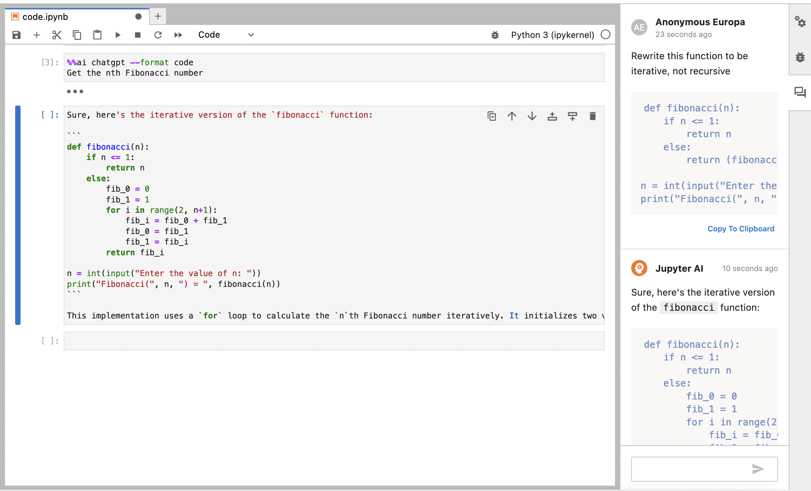
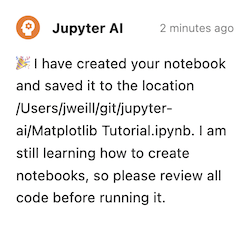
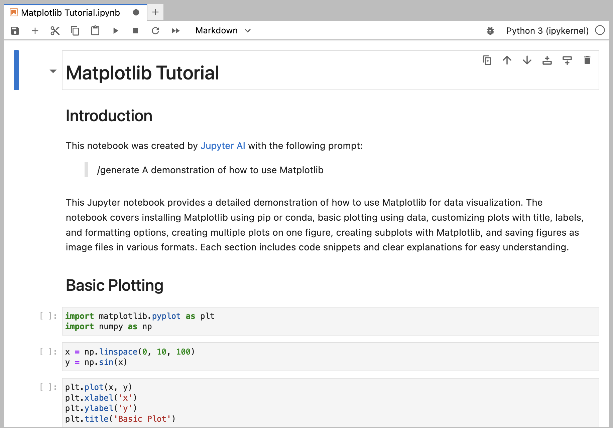

# Users

Welcome to the user documentation for Jupyter AI.

If you are interested in contributing to Jupyter AI, 
please see our {doc}`contributor's guide </contributors/index>`.

## Prerequisites

You can run Jupyter AI on any system that can run a supported Python version up to and including 3.10, including recent Windows, macOS, and Linux versions.

:::{important}
:name: python-3-11-not-supported
Because the [ray](https://pypi.org/project/ray/) library that Jupyter AI uses is not compatible with Python 3.11, please use a supported version of Python up to and including Python 3.10.
:::

If you use `conda`, you can install Python 3.10 in your environment by running:

```
conda install python=3.10
```

To use the `jupyter_ai` package, you will also need to have a currently-maintained version of JupyterLab 3 installed. We do not yet support JupyterLab 4. If you use `conda`, you can install JupyterLab in your environment by running:

```
conda install jupyterlab
```

You can use the `jupyter_ai_magics` package without JupyterLab, but you will need a compatible interface, such as [IPython](https://ipython.org/).

## Model providers

Jupyter AI supports a wide range of model providers and models. To use Jupyter AI, you will need to 
install the corresponding Python package and configure the API key (or other authenication credentials) for the provider. 
You can find the environment variables you need to set, and the Python packages you need, in
[`packages/jupyter-ai/jupyter_ai/providers.py`](https://github.com/jupyterlab/jupyter-ai/blob/main/packages/jupyter-ai/jupyter_ai/providers.py).

Jupyter AI supports the following model providers:

| Provider            | Provider ID          | Environment variable       | Python package(s)               |
|---------------------|----------------------|----------------------------|---------------------------------|
| AI21                | `ai21`               | `AI21_API_KEY`             | `ai21`                          |
| Anthropic           | `anthropic`          | `ANTHROPIC_API_KEY`        | `anthropic`                     |
| Cohere              | `cohere`             | `COHERE_API_KEY`           | `cohere`                        |
| HuggingFace Hub     | `huggingface_hub`, `huggingface_image` | `HUGGINGFACEHUB_API_TOKEN` | `huggingface_hub`, `ipywidgets` |
| OpenAI              | `openai`             | `OPENAI_API_KEY`           | `openai`                        |
| OpenAI (chat)       | `openai-chat`        | `OPENAI_API_KEY`           | `openai`                        |
| SageMaker Endpoints | `sagemaker-endpoint` | N/A                        | `boto3`                         |

The `huggingface_hub` provider is for models that output text. The `huggingface_image`
provider is for models such as Stable Diffusion that output images.

To use SageMaker's models, you will need to authenticate via
[boto3](https://github.com/boto/boto3).

For example, to use OpenAI models, install the necessary package, and set an environment
variable when you start JupyterLab from a terminal:

```bash
pip install openai
OPENAI_API_KEY=your-api-key-here jupyter lab
```

:::{attention}
:name: open-ai-cost
Model providers may charge users for API usage. Jupyter AI users are
responsible for all charges they incur when they make API requests. Review your model
provider's pricing information before submitting requests via Jupyter AI.
:::

## Installing

You can use `conda` or `pip` to install Jupyter AI. If you're using macOS on an Apple Silicon-based Mac (M1, M1 Pro, M2, etc.), we strongly recommend using `conda`.

Because of Ray's incompatibility with Python 3.11, you must use Python 3.9, or 3.10 with Jupyter AI. The instructions below presume that you are using Python 3.10.

Before you can use Jupyter AI, you will need to install any packages and set environment variables with API keys for the model providers that you will use. See [our documentation](https://jupyter-ai.readthedocs.io/en/latest/users/index.html) for details about what you'll need.

### With pip

If you want to install both the `%%ai` magic and the JupyterLab extension, you can run:

    $ pip install jupyter_ai

If you are not using JupyterLab and you only want to install the Jupyter AI `%%ai` magic, you can run:

    $ pip install jupyter_ai_magics


### With conda

First, install [conda](https://conda.io/projects/conda/en/latest/user-guide/install/index.html) and create an environment that uses Python 3.10:

    $ conda create -n jupyter-ai python=3.10
    $ conda activate jupyter-ai
    $ pip install jupyter_ai

If you are using an Apple Silicon-based Mac (M1, M1 Pro, M2, etc.), you need to uninstall the `pip` provided version of `grpcio` and install the version provided by `conda` instead.

    $ pip uninstall grpcio; conda install grpcio 

If you are not using JupyterLab and you only want to install the Jupyter AI `%%ai` magic, you can run:

    $ pip install jupyter_ai_magics

The `%%ai` magic will work anywhere the IPython kernel runs (JupyterLab, Jupyter Notebook, Google Colab, VSCode, etc.).

You can check that the Jupyter AI server extension is enabled by running:

    $ jupyter server extension list

To verify that the frontend extension is installed, run:

    $ jupyter labextension list

To remove the extension, run:

    $ pip uninstall jupyter_ai

or

    $ pip uninstall jupyter_ai_magics

## The chat interface

The easiest way to get started with Jupyter AI is to use the chat interface. The chat interface uses OpenAI's gpt-3.5-turbo model, the same model used by default in the ChatGPT web interface. To get started, you will need to set up an OpenAI account, obtain an API key, set the `OPENAI_API_KEY` environment variable to contain your key, and then start JupyterLab. 

:::{attention}
:name: open-ai-privacy-cost
The chat interface sends data to generative AI models hosted by third parties. Please review your model provider's privacy policy to understand how it may use the data you send to it. Review its pricing model so that you understand your payment obligations when using the chat interface.
:::

Once you have started JupyterLab, click the new "chat" icon in the left side panel to open the chat interface. You can right-click on the panel icon and move it to the other side, if you prefer.


To compose a message, type it in the text box at the bottom of the chat interface and press <kbd>SHIFT</kbd>+<kbd>ENTER</kbd> to send. You can press <kbd>ENTER</kbd> to add a new line. Once you have sent a message, you should see a response from Jupyter AI.


### Asking about something in your notebook

Jupyter AI's chat interface can include a portion of your notebook in your prompt.

:::{warning}
:name: open-ai-selection-cost
When you choose to include the selection with your message, this may increase the
number of tokens in your request, which may cause your request to cost more money.
Review your model provider's cost policy before making large requests.
:::

After highlighting a portion of your notebook, check "Include selection" in the chat panel, type your message, and press <kbd>SHIFT</kbd>+<kbd>ENTER</kbd> to send your message. Your outgoing message will include your selection.


Below your message, you will see Jupyter AI's response.


You can copy Jupyter AI's response to the clipboard so that you can paste it into your notebook, or into any other application. You can also choose to replace the selection with Jupyter AI's response by clicking "Replace selection" before you send your message.

:::{warning}
:name: replace-selection
When you replace your selection, data is written immediately after Jupyter AI
sends its response to your message. Review any generated code carefully before
you run it.
:::


After Jupyter AI sends a response, your notebook will be updated immediately with the response replacing the selection. You can also see the response in the chat panel.



### Generating a new notebook

You can use Jupyter AI to generate an entire notebook from a text prompt. To get started, open the chat panel, and send it a message starting with `/generate`.


Generating a notebook can take a substantial amount of time, so Jupyter AI will respond to your message immediately while it works. You can continue to ask it other questions in the meantime.


:::{info}
:name: generate-progress
Especially if your prompt is detailed, it may take several minutes to generate
your notebook. During this time, you can still use JupyterLab and Jupyter AI
as you would normally. Do not shut your JupyterLab instance down while
Jupyter AI is working.
:::

When Jupyter AI is done generating your notebook, it will send you another message with the filename that it generated.



You can then open this file using the file browser.

:::{warning}
:name: generated-notebook
Generated notebooks may contain errors and may have unintended side effects when
you run the code contained in them. Please review all generated code carefully
before you run it.
:::



### Learning about local data

Using the `/learn` command, you can teach Jupyter AI about local data so that it can include it when answering your questions. This data is **not** sent to remote AI model providers.

To teach Jupyter AI about a folder full of documentation, for example, run `/learn docs/`. You will receive a response when Jupyter AI has indexed this documentation in a local vector database.


You can then use `/ask` to ask a question specifically about the data that you taught Jupyter AI with `/learn`.


To clear the local vector database, you can run `/learn -d` and Jupyter AI will forget all information that it learned from your `/learn` commands.


### Additional chat commands

To clear the chat panel, use the `/clear` command. This does not reset the AI model; the model may still remember previous messages that you sent it, and it may use them to inform its responses.

## The `%%ai` magic command

The examples in this section are based on the [Jupyter AI example notebooks](https://github.com/jupyterlab/jupyter-ai/blob/main/examples/).

Before you send your first prompt to an AI model, load the IPython extension by running 
the following code in a notebook cell or IPython shell:

```
%load_ext jupyter_ai_magics
```

This command should not produce any output.

The `%%ai` magic command is user-friendly and enables you to quickly pick which model you want to use
and specify natural language prompts.

### Choosing a provider and model

The `%%ai` magic command enables you to specify a model provider and model with the
syntax `<provider-id>:<model-id>`. The natural language prompt starts on the second line of the cell.

For example, to send a text prompt to the provider `anthropic` and the model ID
`claude-v1.2`, enter the following code into a cell and run it:

```
%%ai anthropic:claude-v1.2
Write a poem about C++.
```

We support the following providers, and all model IDs for each of these
providers, as defined in [`langchain.llms`](https://langchain.readthedocs.io/en/latest/reference/modules/llms.html#module-langchain.llms):

- `ai21`
- `anthropic`
- `cohere`
- `huggingface_hub`
- `openai`
- `openai-chat`
- `sagemaker-endpoint`

You can find a list of supported providers and models by running `%ai list`. Some providers
define a list of supported models. If a provider does not define a list of supported models,
consult the vendor's documentation. The [Hugging Face web site](https://huggingface.co/)
includes a list of models, for example.

Optionally, you can pass a provider ID as a parameter to `%ai list` to get all
models provided by one provider. For example, `%ai list openai` will display only models
provided by the `openai` provider.

If your model ID is associated with only one provider, you can omit the `provider-id` and
the colon from the first line. For example, because `ai21` is the only provider of the
`j2-jumbo-instruct` model, you can either give the full provider and model,

```
%%ai ai21:j2-jumbo-instruct
Write some JavaScript code that prints "hello world" to the console.
```

or just the model,

```
%%ai j2-jumbo-instruct # infers AI21 provider
Write some JavaScript code that prints "hello world" to the console.
```

### Formatting the output

By default, Jupyter AI assumes that a model will output markdown, so the output of
an `%%ai` command will be formatted as markdown by default. You can override this
using the `-f` or `--format` argument to your magic command. Valid formats include:

- `code`
- `markdown`
- `math`
- `html`
- `json`
- `text`

For example, to force the output of a command to be interpreted as HTML, you can run:

```
%%ai anthropic:claude-v1.2 -f html
Create a square using SVG with a black border and white fill.
```

The following cell will produce output in IPython's `Math` format, which in a web browser
will look like properly typeset equations.

```
%%ai chatgpt -f math
Generate the 2D heat equation in LaTeX surrounded by `$$`. Do not include an explanation.
```

This prompt will produce output as a code cell below the input cell. 

:::{warning}
:name: run-code
**Please review any code that a generative AI model produces before you run it
or distribute it.**
The code that you get in response to a prompt may have negative side effects and may
include calls to nonexistent (hallucinated) APIs.
:::

```
%%ai chatgpt -f code
A function that computes the lowest common multiples of two integers, and
a function that runs 5 test cases of the lowest common multiple function
```

### Interpolating in prompts

Using curly brace syntax, you can include variables and other Python expressions in your
prompt. This lets you execute a prompt using code that the IPython kernel knows about,
but that is not in the current cell.

For example, we can set a variable in one notebook cell:

```python
poet = "Walt Whitman"
```

Then, we can use this same variable in an `%%ai` command in a later cell:

```
%%ai chatgpt
Write a poem in the style of {poet}
```

When this cell runs, `{poet}` is interpolated as `Walt Whitman`, or as whatever `poet`
is assigned to at that time.

You can use the special `In` and `Out` list with interpolation syntax to explain code
located elsewhere in a Jupyter notebook. For example, if you run the following code in
a cell, and its input is assigned to `In[11]`:

```python
for i in range(0, 5):
  print(i)
```

You can then refer to `In[11]` in an `%%ai` magic command, and it will be replaced
with the code in question:

```
%%ai cohere:command-xlarge-nightly
Please explain the code below:
--
{In[11]}
```

You can also refer to the cell's output using the special `Out` list, with the same index.

```
%%ai cohere:command-xlarge-nightly
Write code that would produce the following output:
--
{Out[11]}
```

Jupyter AI also adds the special `Err` list, which uses the same indexes as `In` and `Out`.
For example, if you run code in `In[3]` that produces an error, that error is captured in
`Err[3]` so that you can request an explanation using a prompt such as:

```
%%ai chatgpt
Explain the following Python error:
--
{Err[3]}
```

The AI model that you use will then attempt to explain the error. You could also write a
prompt that uses both `In` and `Err` to attempt to get an AI model to correct your code:

```
%%ai chatgpt --format code
The following Python code:
--
{In[3]}
--
produced the following Python error:
--
{Err[3]}
--
Write a new version of this code that does not produce that error.
```

