# User Guide

Welcome to the user guide for Jupyter AI. Make sure to see our guide on
{doc}`Getting Started </getting-started>` if you haven't already, which covers
installation and setup.

## Model providers

Jupyter AI supports a wide range of model providers and models. Access to the various providers is undertaken using the [LiteLLM](https://docs.litellm.ai/) interface, which enables hundreds of models. You can select the model to be used in the chat interface from the `Settings` tab -> `Jupyternaut Settings`, where you can see the models by typing in a search string.


The LiteLLM interface does not show _all_ available models and you can see the [full list of providers and models](https://docs.litellm.ai/docs/providers) online.

To use Jupyter AI with a particular provider, you must set its API key (or other credentials) in the Jupyternaut settings, as needed. The names of the API keys are available from the LiteLLM documentation for each provider.


In the same interface it is also possible to set model parameters. This is a new feature in v3.


Here are some examples of additional packages that may be installed as needed:

- To use the Bedrock models, you need access to the Bedrock service, and you will need to authenticate via [boto3](https://github.com/boto/boto3), which also needs to be installed, as mentioned previously. For more information, see the [Amazon Bedrock Homepage](https://aws.amazon.com/bedrock/).

- You need the `pillow` Python package to use Hugging Face Hub's text-to-image models.

- You can find a list of Hugging Face's models at [https://huggingface.co/models](https://huggingface.co/models).

- To use NVIDIA models, create a free account with the [NVIDIA NGC service](https://catalog.ngc.nvidia.com/), which hosts AI solution catalogs, containers, models, and more. Navigate to Catalog > [AI Foundation Models](https://catalog.ngc.nvidia.com/ai-foundation-models), and select a model with an API endpoint. Click "API" on the model's detail page, and click "Generate Key". Save this key, and set it as the environment variable `NVIDIA_API_KEY` to access any of the model endpoints.

- SageMaker endpoint names are created when you deploy a model. For more information, see
  ["Create your endpoint and deploy your model"](https://docs.aws.amazon.com/sagemaker/latest/dg/realtime-endpoints-deployment.html)
  in the SageMaker documentation. To use SageMaker's models, you will also need to be authenticated via [boto3](https://github.com/boto/boto3).

:::{attention}
:name: open-ai-cost
Model providers may charge users for API usage. Jupyter AI users are
responsible for all charges they incur when they make API requests. Review your model
provider's pricing information before submitting requests via Jupyter AI.
:::

## The chat interface

The easiest way to get started with Jupyter AI is to use the chat interface.

:::{attention}
:name: open-ai-privacy-cost
The chat interface sends data to generative AI models hosted by third parties. Please review your model provider's privacy policy to understand how it may use the data you send to it. Review its pricing model so that you understand your payment obligations when using the chat interface.
:::

Once you have started JupyterLab, click the new "chat" icon in the left side panel to open the chat interface. You can right-click on the panel icon and move it to the other side, if you prefer.

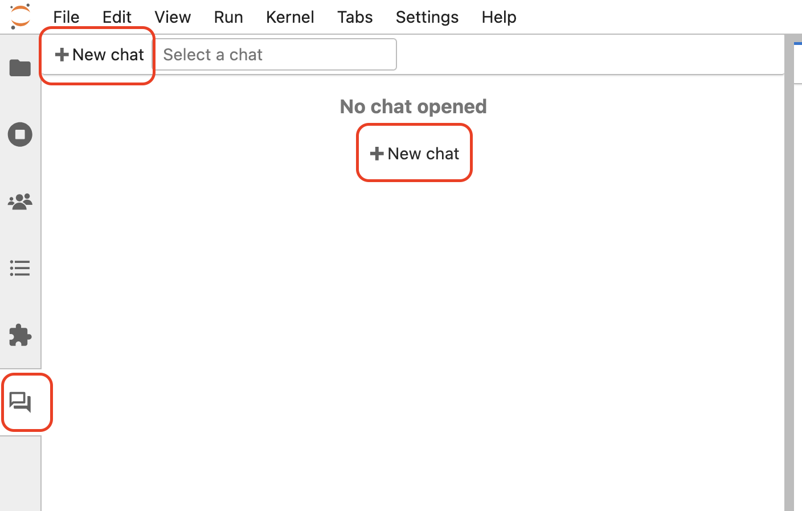

Make sure you have chosen a language model by going to `Settings` -> `Jupyternaut settings` as shown in the Model Providers section above. You can also enter the model paramaters as well as the related API keys if necessary.

A **language model** responds to users' messages in the chat panel using **Personas**. The default Persona is `Jupyternaut`. It accepts a prompt and produces a response. Language models are typically _pre-trained_; they are ready to use, but their training sets are biased and incomplete, and users need to be aware of their biases when they use the chat interface. Here is an example of a new chat. Click on `+Chat` at the top left of the chat panel and name a new chat in the following window that will pop up:

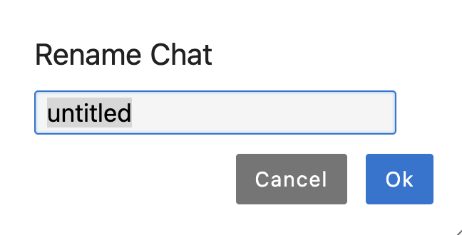

Enter the name of the chat and see the chat appear in the chat panel:

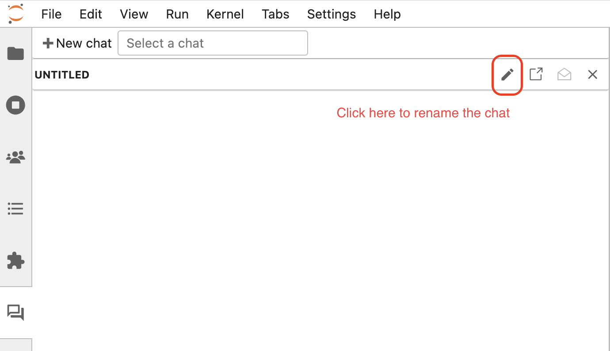

You can then @-mention the Persona in the chat prompt area as shown and issue a prompt to the persona.

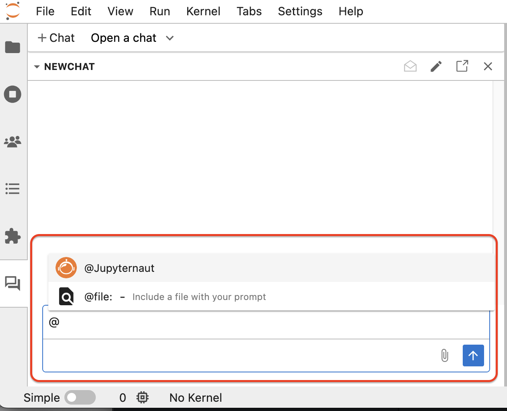

To compose a message, type it in the text box at the bottom of the chat interface and press <kbd>ENTER</kbd> to send it. You can press <kbd>SHIFT</kbd>+<kbd>ENTER</kbd> to add a new line. (These are the default keybindings; you can change them in the chat settings pane.) Once you have sent a message, you should see a response from Jupyternaut, the Jupyter AI chatbot persona.

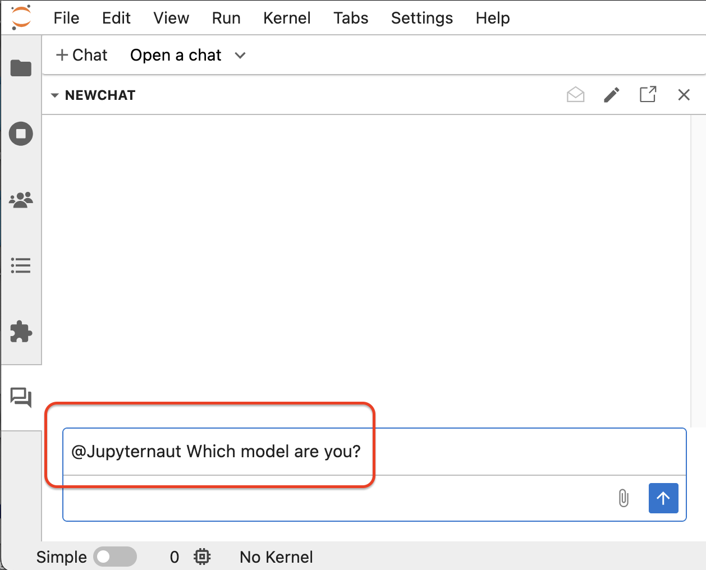

And then we get a response:

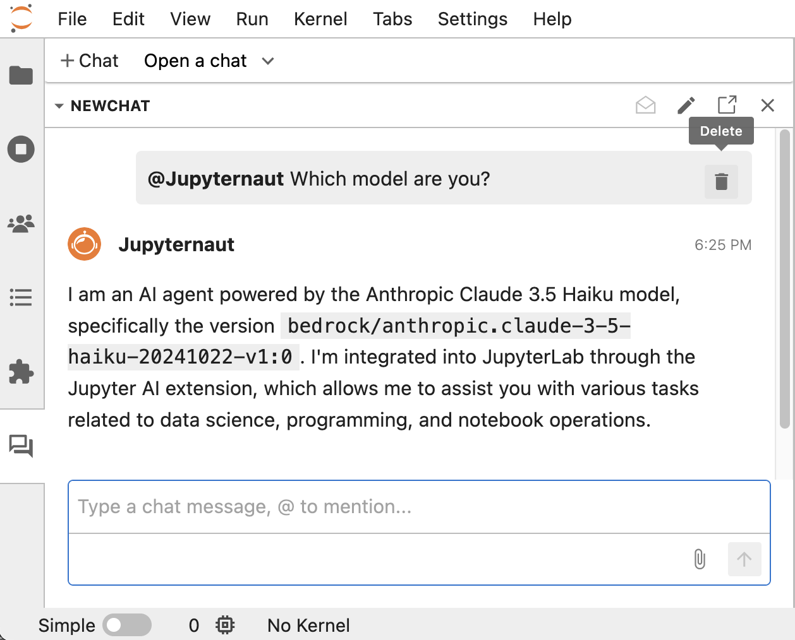

You can also see the `Delete` button shown alongside the prompt if you need to clear up the chat; there is a similar button in the response area as well.

All the chat content is stored in a file named `<chat_name>.chat` where an entire record of the chat is maintained as a Jupyter Server document. This persistent chat is also used as context memory when invoking the LLM from the chat. You can also open the chat file and see its contents as shown here.

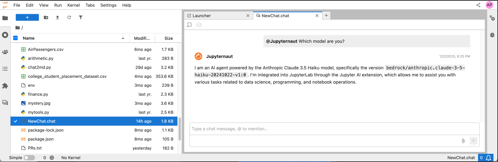

You can remove the chat by simply deleting its `.chat` file.

Additional chat streams may be started as well, mimicking chat channels in social media applications. For example, create a second chat using the `+ Chat` button:

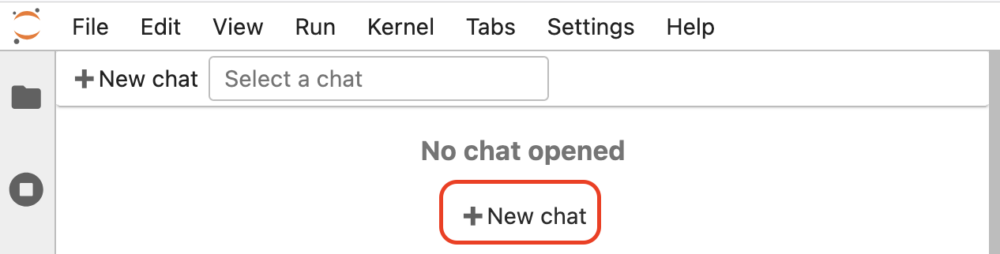

## Attaching context to the prompt

The chat panel also allows adding a flat file as context as shown. You can start a chat and then use the `@` mention to see the `@Jupyternaut` persona as well as the `@file` options. The latter allows you to choose a file as context and then ask questions about it, as shown in the following video:

<video controls width="800">
    <source src="../_static/chat-attach-file.mov" type="video/mp4">
</video>


## Additional details about the chat interface

<!-- ## Customize the chat interface

You may customize the template of the chat interface from the default one. The steps are as follows:

1. Create a new `config.py` file in your current directory with the contents you want to see in the help message, by editing the template below:

```
c.AiExtension.help_message_template = """
Sup. I'm {persona_name}. This is a sassy custom help message.

Here's the slash commands you can use. Use 'em or don't... I don't care.

{slash_commands_list}
""".strip()
```

2.  Start JupyterLab with the following command:

```
jupyter lab --config=config.py
```

The new help message will be used instead of the default, as shown below

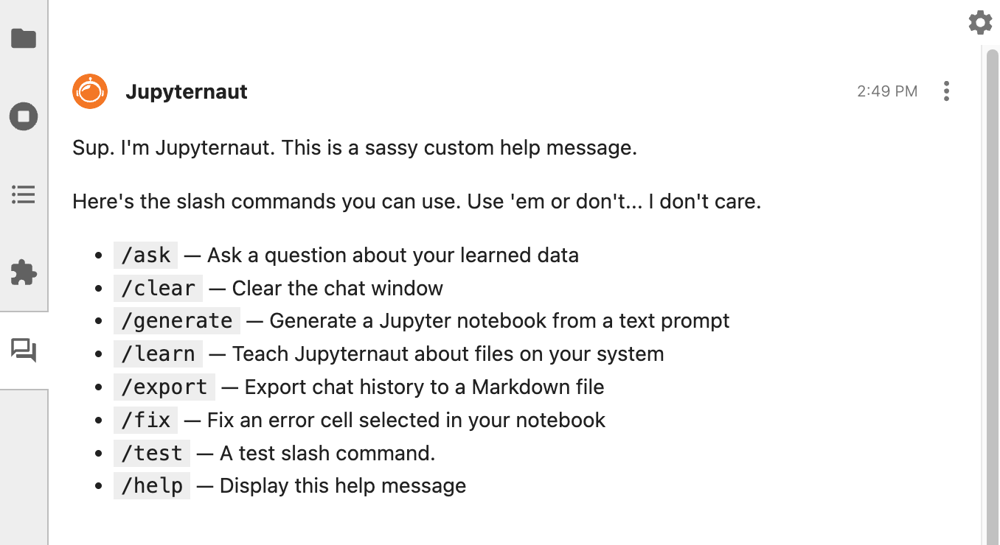 -->

<!-- 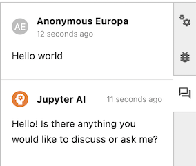 -->

The chat backend remembers the last two exchanges in your conversation and passes them to the language model. You can ask follow up questions without repeating information from your previous conversations. Here is an example of a chat conversation with a follow up question:

#### Initial question

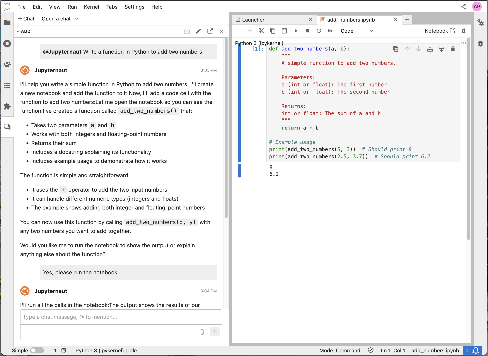

We see that Jupyter AI not only created the code, but it also added it to a notebook. Then, it asked if it would be allowed to run the code in the notebook, and when it was prompted to do so, it ran the code and returned the answers.

#### Follow-up question

Next, you can ask that the function be extended. The function is updated and executed as shown:

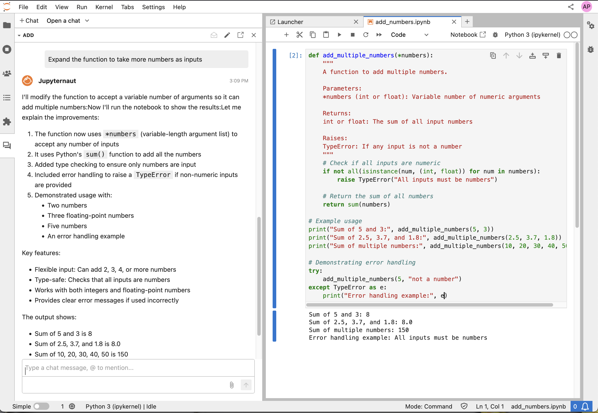

### Amazon Bedrock Usage

Jupyter AI enables use of language models hosted on [Amazon Bedrock](https://aws.amazon.com/bedrock/) on AWS. Ensure that you have authentication to use AWS using the `boto3` SDK with credentials stored in the `default` profile. Guidance on how to do this can be found in the [`boto3` documentation](https://boto3.amazonaws.com/v1/documentation/api/latest/guide/credentials.html).

For details on enabling model access in your AWS account, using cross-region inference, or invoking custom/provisioned models, please see our dedicated documentation page on [using Amazon Bedrock in Jupyter AI](bedrock.md).

### OpenRouter and OpenAI Interface Usage

Jupyter AI enables use of language models accessible through [OpenRouter](https://openrouter.ai)'s unified interface. Examples of models that may be accessed via OpenRouter are: [Deepseek](https://openrouter.ai/deepseek/deepseek-chat), [Qwen](https://openrouter.ai/qwen/), [Mistral](https://openrouter.ai/mistralai/), etc. OpenRouter enables usage of any model conforming to the OpenAI API. In the `Chat model` area in `Jupyternaut settings` choose `openrouter/` to see all the models from this provider.

Likewise, for many models, you may directly choose the OpenAI provider in Jupyter AI instead of OpenRouter in the same way. In the `Chat model` area in `Jupyternaut settings` choose `openai/` to see all the models from this provider.

<!-- For details on enabling model access via the AI Settings and using models via OpenRouter or OpenAI, please see the dedicated documentation page on using [OpenRouter and OpenAI providers in Jupyter AI](openrouter.md). -->

<!-- ### SageMaker endpoints usage

Jupyter AI supports language models hosted on SageMaker endpoints that use JSON
schemas. The first step is to authenticate with AWS via the `boto3` SDK and have
the credentials stored in the `default` profile. Guidance on how to do this can
be found in the
[`boto3` documentation](https://boto3.amazonaws.com/v1/documentation/api/latest/guide/credentials.html).

When selecting the SageMaker provider in the settings panel, you will
see the following interface:

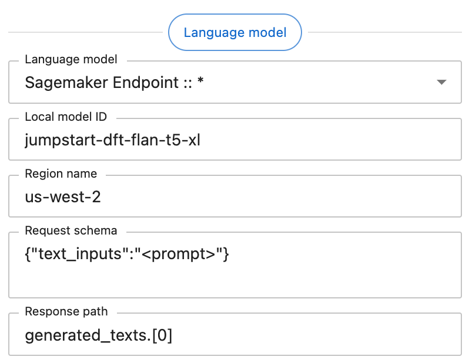

Each of the additional fields under "Language model" is required. These fields
should contain the following data:

- **Endpoint name**: The name of your endpoint. This can be retrieved from the
  AWS Console at the URL
  `https://<region>.console.aws.amazon.com/sagemaker/home?region=<region>#/endpoints`.

- **Region name**: The AWS region your SageMaker endpoint is hosted in, such as `us-west-2`.

- **Request schema**: The JSON object the endpoint expects, with the prompt
  being substituted into any value that matches the string literal `"<prompt>"`.
  In this example, the request schema `{"text_inputs":"<prompt>"}` generates a JSON
  object with the prompt stored under the `text_inputs` key.

- **Response path**: A [JSONPath](https://goessner.net/articles/JsonPath/index.html)
  string that retrieves the language model's output from the endpoint's JSON
  response. In this example, the endpoint returns an object with the schema
  `{"generated_texts":["<output>"]}`, hence the response path is
  `generated_texts.[0]`. -->

<!-- ### GPT4All usage (early-stage)

Currently, we offer experimental support for GPT4All. To get started, first
decide which models you will use. We currently offer the following models from GPT4All:

| Model name                      | Model size | Model bin URL                                                                                             |
| ------------------------------- | ---------- | --------------------------------------------------------------------------------------------------------- |
| `ggml-gpt4all-l13b-snoozy`      | 7.6 GB     | `http://gpt4all.io/models/ggml-gpt4all-l13b-snoozy.bin`                                                   |
| `ggml-gpt4all-j-v1.2-jazzy`     | 3.8 GB     | `https://gpt4all.io/models/ggml-gpt4all-j-v1.2-jazzy.bin`                                                 |
| `ggml-gpt4all-j-v1.3-groovy`    | 3.8 GB     | `https://gpt4all.io/models/ggml-gpt4all-j-v1.3-groovy.bin`                                                |
| `mistral-7b-openorca.Q4_0`      | 3.8 GB     | `https://gpt4all.io/models/gguf/mistral-7b-openorca.Q4_0.gguf`                                            |
| `mistral-7b-instruct-v0.1.Q4_0` | 3.8 GB     | `https://gpt4all.io/models/gguf/mistral-7b-instruct-v0.1.Q4_0.gguf`                                       |
| `gpt4all-falcon-q4_0`           | 3.9 GB     | `https://gpt4all.io/models/gguf/gpt4all-falcon-q4_0.gguf`                                                 |
| `wizardlm-13b-v1.2.Q4_0`        | 6.9 GB     | `https://gpt4all.io/models/gguf/wizardlm-13b-v1.2.Q4_0.gguf`                                              |
| `nous-hermes-llama2-13b.Q4_0`   | 6.9 GB     | `https://gpt4all.io/models/gguf/nous-hermes-llama2-13b.Q4_0.gguf`                                         |
| `gpt4all-13b-snoozy-q4_0`       | 6.9 GB     | `https://gpt4all.io/models/gguf/gpt4all-13b-snoozy-q4_0.gguf`                                             |
| `mpt-7b-chat-merges-q4_0`       | 3.5 GB     | `https://gpt4all.io/models/gguf/mpt-7b-chat-merges-q4_0.gguf`                                             |
| `orca-mini-3b-gguf2-q4_0`       | 1.8 GB     | `https://gpt4all.io/models/gguf/orca-mini-3b-gguf2-q4_0.gguf`                                             |
| `starcoder-q4_0`                | 8.4 GB     | `https://gpt4all.io/models/gguf/starcoder-q4_0.gguf`                                                      |
| `rift-coder-v0-7b-q4_0`         | 3.6 GB     | `https://gpt4all.io/models/gguf/rift-coder-v0-7b-q4_0.gguf`                                               |
| `all-MiniLM-L6-v2-f16`          | 44 MB      | `https://gpt4all.io/models/gguf/all-MiniLM-L6-v2-f16.gguf`                                                |
| `em_german_mistral_v01.Q4_0`    | 3.8 GB     | `https://huggingface.co/TheBloke/em_german_mistral_v01-GGUF/resolve/main/em_german_mistral_v01.Q4_0.gguf` |

Note that each model comes with its own license, and that users are themselves
responsible for verifying that their usage complies with the license. You can
find licensing details on the [GPT4All official site](https://gpt4all.io/index.html).

First, create a folder to store the model files.

```
mkdir ~/.cache/gpt4all
```

For each model you use, you will have to run the command

```
curl -LO --output-dir ~/.cache/gpt4all "<model-bin-url>"
```

, where `<model-bin-url>` should be substituted with the corresponding URL
hosting the model binary (within the double quotes). After restarting the
server, the GPT4All models installed in the previous step should be available to
use in the chat interface.

GPT4All support is still an early-stage feature, so some bugs may be encountered
during usage. Our team is still actively improving support for locally-hosted
models. -->

### Ollama usage

To get started, follow the instructions on the [Ollama website](https://ollama.com/) to set up `ollama` and download the models locally. To select a model, enter the model name in the settings panel, for example `deepseek-coder-v2`. You can see all locally available models with `ollama list`.

For the Ollama models to be available to JupyterLab-AI, your Ollama server _must_ be running. You can check that this is the case by calling `ollama serve` at the terminal, and should see something like:

```
$ ollama serve
Error: listen tcp 127.0.0.1:11434: bind: address already in use
```

This indicates that Ollama is running on its default port number, 11434.

In some platforms (e.g. macOS or Windows), there may also be a graphical user interface or application that lets you start/stop the Ollama server from a menu.

<!-- :::{tip}
If you don't see Ollama listed as a model provider in the Jupyter-AI configuration box, despite confirming that your Ollama server is active, you may be missing the [`langchain-ollama` python package](https://pypi.org/project/langchain-ollama/) that is necessary for Jupyter-AI to interface with Ollama, as indicated in the [model providers](#model-providers) section above.

You can install it with `pip install langchain-ollama` (as of Feb'2025 it is not available on conda-forge).
::: -->

By default, Ollama is served on `127.0.0.1:11434` (locally on port `11434`), so Jupyter AI expects this by default. If you wish to use a remote Ollama server with a different IP address or a local Ollama server on a different port number, you have to configure this in advance.

To configure this in Jupyternaut settings, set the `api_base` paremeter field in the Model parameters section to your Ollama server's custom IP address and port number:


To configure this in the magic commands, you should set the `OLLAMA_HOST` environment variable to the your Ollama server's custom IP address and port number (assuming you chose 10000) in a new code cell:

```
%load_ext jupyter_ai_magics
os.environ["OLLAMA_HOST"] = "http://localhost:10000"
```

After running that cell, the AI magic command can then be used like so:

```
%%ai ollama:llama3.2
What is a transformer?
```

### vLLM usage

`vLLM` is a fast and easy-to-use library for LLM inference and serving. The [vLLM website](https://docs.vllm.ai/en/latest/) explains installation and usage. To use `vLLM` in Jupyter AI, please see the dedicated documentation page on using [vLLM in Jupyter AI](vllm.md).

### Asking about something in your notebook

Jupyter AI's chat interface can include a portion of your notebook in your prompt.

:::{warning}
:name: include-selection-cost
When you choose to include the selection with your message, this may increase the
number of tokens in your request, which may cause your request to cost more money.
Review your model provider's cost policy before making large requests.
:::

After highlighting a portion of your notebook, check "Include selection" in the chat panel, type your message, and then send your message. Your outgoing message will include your selection.

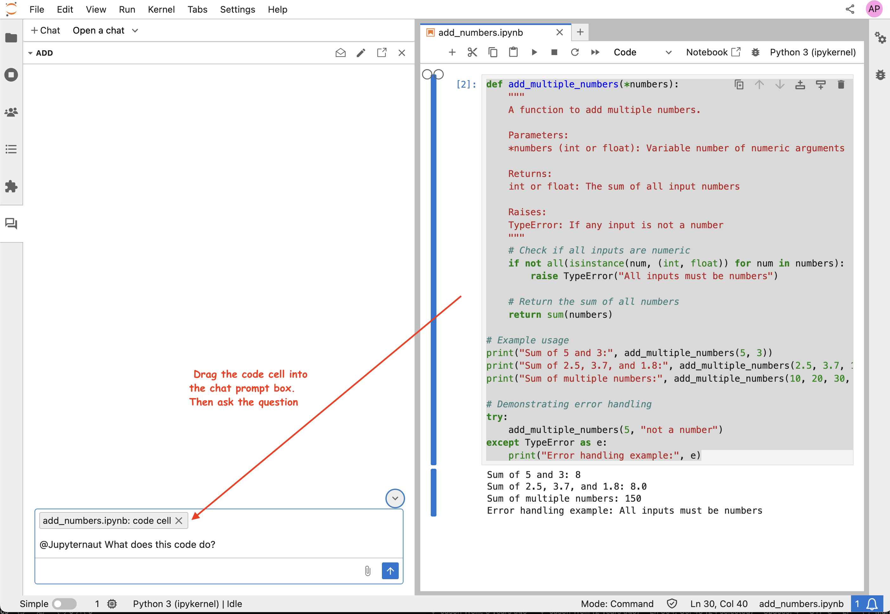

Below your message, you will see Jupyternaut's response.

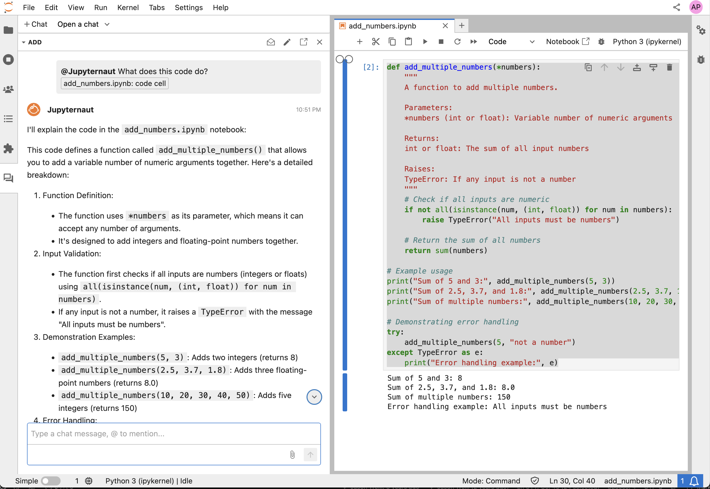

You can copy Jupyternaut's response to the clipboard so that you can paste it into your notebook, or into any other application. You can also choose to replace the selection with Jupyternaut's response by clicking "Replace selection" before you send your message. The generated response can also be copied to a cell above or below the active cell. This is is shown below.

:::{warning}
:name: replace-selection
When you replace your selection, data is written immediately after Jupyter AI
sends its response to your message. Review any generated code carefully before
you run it.
:::

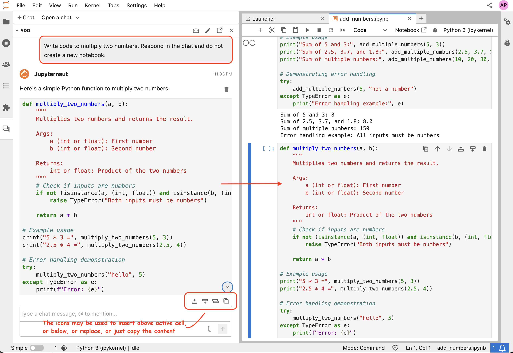

After Jupyternaut sends a response, your notebook will be updated immediately with the response replacing the selection. You can also see the response in the chat panel.

### Generating a new notebook

You can use Jupyter AI to generate an entire notebook from a text prompt. To get started, open the chat panel, and send it a message asking it to generate a new notebook to do what you request.


Generating a notebook can take a substantial amount of time, so Jupyter AI will respond to your message immediately while it works. You can continue to ask it other questions in the meantime.

When Jupyter AI is done generating your notebook, it will open the notebook in JupyterLab and ask you to link it with the kernel to run it. Here is the response to the prompt above:

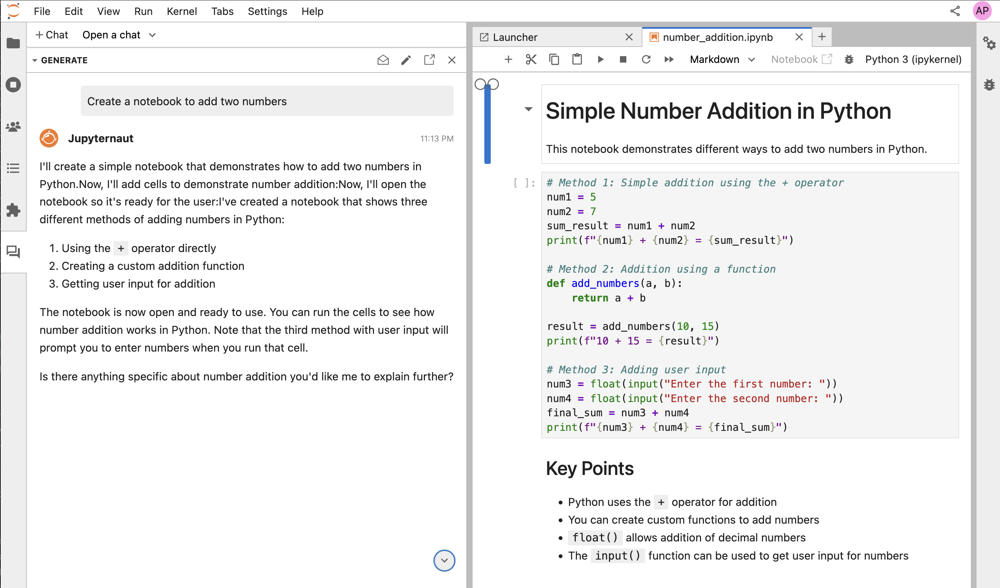

:::{note}
:name: generate-progress
Especially if your prompt is detailed, it may take several minutes to generate
your notebook. During this time, you can still use JupyterLab and Jupyter AI
as you would normally. Do not shut your JupyterLab instance down while
Jupyter AI is working.
:::

:::{warning}
:name: generated-notebook
Generated notebooks may contain errors and may have unintended side effects when
you run the code contained in them. Please review all generated code carefully
before you run it.
:::

### Fixing a code cell with an error

You can drag a cell with an error into the chat box and ask Jupyternaut to fix it.

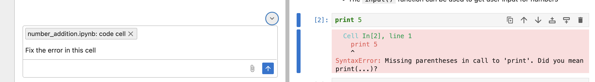

After this, the Send button to the right of the chat input will be enabled, and you can use your mouse or keyboard to send this to Jupyternaut. The code cell and its associated error output are included in the message automatically. When complete, Jupyternaut will update the notebook with the corrected code.


### Additional chat commands

To start a new conversation, simply use the `+ Chat` button at the top left of the chat panel.

To delete elements of the chat you can use the "trash" icon on the right of the chat prompt or the chat response in the chat panel. The "trash" icon will appear when you mouse over any prompt or response. You may delete either the prompt or the response, or both. These will be removed from the chat panel as well as the underlying `.chat` Jupyter server document. If you want to delete the entire chat, you can just delete the relevant `.chat` file in your folder.

## Configuration

You can specify an allowlist, to only allow only a certain list of providers, or
a blocklist, to block some providers.

### Configuring default models and API keys

This configuration allows for setting a default language and embedding models, and their corresponding API keys.
These values are offered as a starting point for users, so they don't have to select the models and API keys, however,
the selections they make in the settings panel will take precedence over these values.

Specify default language model

```bash
jupyter lab --AiExtension.initial_language_model=bedrock/anthropic.claude-3-5-haiku-20241022-v1:0
```

<!-- Specify default embedding model

```bash
jupyter lab --AiExtension.default_embeddings_model=bedrock:amazon.titan-embed-text-v1
```

Specify default completions model

```bash
jupyter lab --AiExtension.default_completions_model=bedrock-chat:anthropic.claude-v2
``` -->

Specify default API keys

```bash
jupyter lab --AiExtension.default_api_keys={'OPENAI_API_KEY': 'sk-abcd'}
```

### Blocklisting providers

This configuration allows for blocking specific providers in the settings panel.
This list takes precedence over the allowlist in the next section.

```
jupyter lab --AiExtension.blocked_providers=openai
```

To block more than one provider in the block-list, repeat the runtime
configuration.

```
jupyter lab --AiExtension.blocked_providers=openai --AiExtension.blocked_providers=ai21
```

### Allowlisting providers

This configuration allows for filtering the list of providers in the settings
panel to only an allowlisted set of providers.

```
jupyter lab --AiExtension.allowed_providers=openai
```

To allow more than one provider in the allowlist, repeat the runtime
configuration.

```
jupyter lab --AiExtension.allowed_providers=openai --AiExtension.allowed_providers=ai21
```

### Chat memory size

This configuration allows for setting the number of chat exchanges the model
uses as context when generating a response.

One chat exchange corresponds to a user query message and its AI response, which counts as two messages.
k denotes one chat exchange, i.e., two messages.
The default value of k is 2, which corresponds to 4 messages.

For example, if we want the default memory to be 4 exchanges, then use the following command line invocation when starting Jupyter Lab:

```
jupyter lab --AiExtension.default_max_chat_history=4
```

### Model parameters

This configuration allows specifying arbitrary parameters that are unpacked and
passed to the provider class. This is useful for passing parameters such as
model tuning that affect the response generation by the model. This is also an
appropriate place to pass in custom attributes required by certain
providers/models.

The accepted value is a dictionary, with top level keys as the model id
(provider:model_id), and value should be any arbitrary dictionary which is
unpacked and passed as-is to the provider class.

#### Configuring as a startup option

In this sample, the `bedrock` provider will be created with the value for
`model_kwargs` when `bedrock/anthropic.claude-3-5-haiku-20241022-v1:0` model is selected.

```bash
jupyter lab --AiExtension.model_parameters bedrock/anthropic.claude-3-5-haiku-20241022-v1:0='{"model_kwargs":{"maxTokens":200}}'
```

Note the usage of single quotes surrounding the dictionary to escape the double
quotes. This is required in some shells. The above will result in the following
LLM class to be generated.

```python
BedrockProvider(model_kwargs={"maxTokens":200}, ...)
```

Here is another example, where `anthropic` provider will be created with the
values for `max_tokens` and `temperature`, when `bedrock/anthropic.claude-3-5-haiku-20241022-v1:0` model is selected.

```bash
jupyter lab --AiExtension.model_parameters bedrock/anthropic.claude-3-5-haiku-20241022-v1:0='{"max_tokens":1024,"temperature":0.9}'
```

The above will result in the following LLM class to be generated.

```python
AnthropicProvider(max_tokens=1024, temperature=0.9, ...)
```

To pass multiple sets of model parameters for multiple models in the
command-line, you can append them as additional arguments to
`--AiExtension.model_parameters`, as shown below.

```bash
jupyter lab \
--AiExtension.model_parameters bedrock/anthropic.claude-3-5-haiku-20241022-v1:0='{"model_kwargs":{"maxTokens":200}}' \
--AiExtension.model_parameters openai/gpt-4.1='{"max_tokens":1024,"temperature":0.9}'
```

However, for more complex configuration, we highly recommend that you specify
this in a dedicated configuration file. We will describe how to do so in the
following section.

#### Configuring as a config file

This configuration can also be specified in a config file in json format.

Here is an example for configuring the `bedrock` provider for `bedrock/anthropic.claude-3-5-haiku-20241022-v1:0`
model.

```json
{
  "AiExtension": {
    "model_parameters": {
      "bedrock/anthropic.claude-3-5-haiku-20241022-v1:0": {
        "model_kwargs": {
          "maxTokens": 200
        }
      }
    }
  }
}
```

There are several ways to specify JupyterLab to pick this config.

The first option is to save this config in a file and specifying the filepath at startup using the `--config` or `-c` option.

```bash
jupyter lab --config <config-file-path>
```

The second option is to drop it in a location that JupyterLab scans for configuration files.
The file should be named `jupyter_jupyter_ai_config.json` in this case. You can find these paths by running `jupyter --paths`
command, and picking one of the paths from the `config` section.

Here is an example of running the `jupyter --paths` command.

```bash
(jupyter-ai-lab4) ➜ jupyter --paths
config:
    /opt/anaconda3/envs/jupyter-ai-lab4/etc/jupyter
    /Users/3coins/.jupyter
    /Users/3coins/.local/etc/jupyter
    /usr/3coins/etc/jupyter
    /etc/jupyter
data:
    /opt/anaconda3/envs/jupyter-ai-lab4/share/jupyter
    /Users/3coins/Library/Jupyter
    /Users/3coins/.local/share/jupyter
    /usr/local/share/jupyter
    /usr/share/jupyter
runtime:
    /Users/3coins/Library/Jupyter/runtime
```

```{toctree}
:hidden:

magic_commands/index
```
