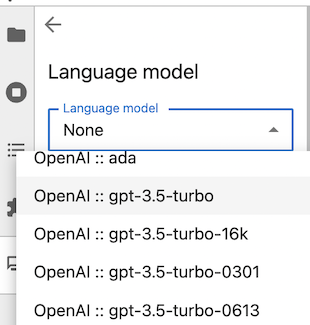
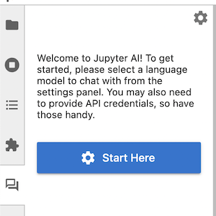
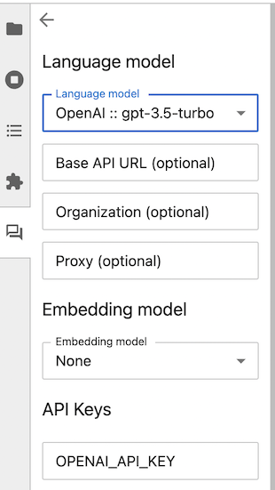
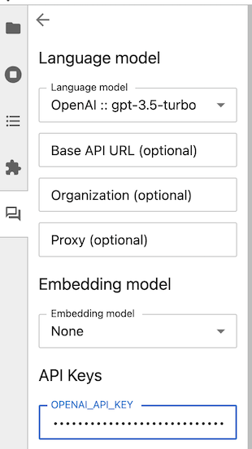
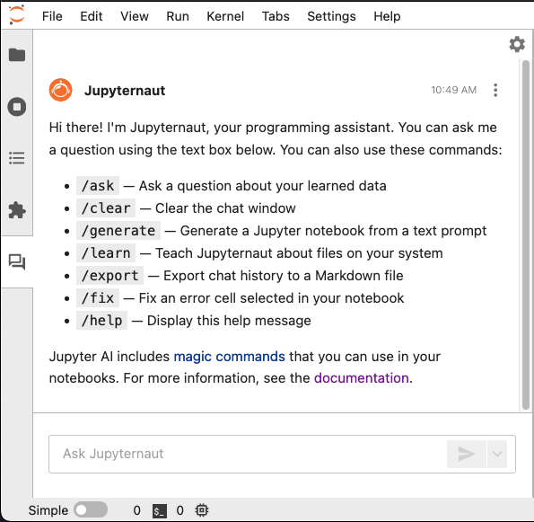

# Users

Welcome to the user documentation for Jupyter AI.

If you are interested in contributing to Jupyter AI,
please see our {doc}`contributor's guide </contributors/index>`.

If you would like to build applications that enhance Jupyter AI,
please see the {doc}`developer's guide </developers/index>`.

## Prerequisites

You can run Jupyter AI on any system that can run a supported Python version
from 3.9 to 3.12, including recent Windows, macOS, and Linux versions. Python
3.8 support is also available in Jupyter AI v2.29.1 and below.

If you use `conda`, you can install Python 3.12 in your environment by running:

```
conda install python=3.12
```

The `jupyter_ai` package, which provides the lab extension and user interface in
JupyterLab, depends on JupyterLab 4. If upgrading to JupyterLab 4 is not
possible in your environment, you should install `jupyter_ai` v1.x instead.
See "Installation" for more details.

:::{attention}
:name: jupyter-lab-3-end-of-maintenance
JupyterLab 3 reached its end of maintenance date on May 15, 2024. As a result, we will not backport new features to the v1 branch supporting JupyterLab 3. Fixes for critical issues will still be backported until December 31, 2024. If you are still using JupyterLab 3, we strongly encourage you to **upgrade to JupyterLab 4 as soon as possible**. For more information, see [JupyterLab 3 end of maintenance](https://blog.jupyter.org/jupyterlab-3-end-of-maintenance-879778927db2) on the Jupyter Blog.
:::

You can install JupyterLab using `pip` or `conda`.

1. via `pip`:

```
# change 4.0 to 3.0 if you need JupyterLab 3
pip install jupyterlab~=4.0
```

2. via `conda`:

```
# change 4.0 to 3.0 if you need JupyterLab 3
conda config --add channels conda-forge
conda config --set channel_priority strict
conda install jupyterlab~=4.0
```

You can also use Jupyter AI in Jupyter Notebook 7.2+. To install Jupyter Notebook 7.2:

1. via `pip`:

```
pip install notebook~=7.2
```

2. via `conda`:
```
conda install notebook~=7.2
```

:::{note}
To activate the chat interface in Jupyter Notebook, click on "View > Left sidebar > Show Jupyter AI Chat".
:::

The `jupyter_ai_magics` package, which provides exclusively the IPython magics,
does not depend on JupyterLab or `jupyter_ai`. You can install
`jupyter_ai_magics` without installing `jupyterlab` or `jupyter_ai`.
If you have both `jupyter_ai_magics` and `jupyter_ai` installed, you should
have the same version of each, to avoid errors.

Jupyter AI internally uses Pydantic v1 and should work with either Pydantic
version 1 or version 2. For compatibility, developers using Pydantic V2
should import classes using the `pydantic.v1` package. See the
[LangChain Pydantic migration plan](https://python.langchain.com/docs/guides/pydantic_compatibility)
for advice about how developers should use `v1` to avoid mixing v1 and v2
classes in their code.

## Installation

### Setup: creating a Jupyter AI environment (recommended)

Before installing Jupyter AI, we highly recommend first creating a separate
Conda environment for Jupyter AI. This prevents the installation process from
clobbering Python packages in your existing Python environment.

To do so, install
[conda](https://conda.io/projects/conda/en/latest/user-guide/install/index.html)
and create an environment that uses Python 3.12 and the latest version of
JupyterLab:

    $ conda create -n jupyter-ai python=3.12 jupyterlab
    $ conda activate jupyter-ai

You can now choose how to install Jupyter AI.

We offer 3 different ways to install Jupyter AI. You can read through each
section to pick the installation method that works best for you.

1. Quick installation via `pip` (recommended)
2. Minimal installation via `pip`
3. Minimal installation via `conda`

### Quick installation via `pip` (recommended)

If you want to install both the `%%ai` magic and the JupyterLab extension, you can run:

    $ pip install 'jupyter-ai[all]'

Then, restart JupyterLab. This will install every optional dependency, which
provides access to all models currently supported by `jupyter-ai`.

If you are not using JupyterLab and you only want to install the Jupyter AI
`%%ai` magic, you can run:

    $ pip install 'jupyter-ai-magics[all]'

`jupyter-ai` depends on `jupyter-ai-magics`, so installing `jupyter-ai`
automatically installs `jupyter-ai-magics`.

:::{warning}
:name: quoting-cli-arguments
If running the above commands result in an error like `zsh: no matches found: jupyter-ai[all]`, this is because the `jupyter-ai[all]` argument must be surrounded by single or double quotes. Some shells reserve square brackets for pattern matching, so arguments containing square brackets must be quoted.
:::


### Minimal installation via `pip`

Most model providers in Jupyter AI require a specific dependency to be installed
before they are available for use. These are called _provider dependencies_.
Provider dependencies are optional to Jupyter AI, meaning that Jupyter AI can be
installed with or without any provider dependencies installed. If a provider
requires a dependency that is not installed, its models are not listed in the
user interface which allows you to select a language model.

To perform a minimal installation via `pip` without any provider dependencies,
omit the `[all]` optional dependency group from the package name:

```
pip install jupyter-ai
```

By selectively installing provider dependencies, you can control which models
are available in your Jupyter AI environment.

For example, to install Jupyter AI with only added support for Anthropic models, run:

```
pip install jupyter-ai langchain-anthropic
```

For more information on model providers and which dependencies they require, see
[the model provider table](https://jupyter-ai.readthedocs.io/en/latest/users/index.html#model-providers).

### Minimal installation via `conda`

As an alternative to using `pip`, you can install `jupyter-ai` using
[Conda](https://conda.io/projects/conda/en/latest/user-guide/install/index.html)
from the `conda-forge` channel:

    $ conda install conda-forge::jupyter-ai

Most model providers in Jupyter AI require a specific _provider dependency_ to
be installed before they are available for use. Provider dependencies are
not installed when installing `jupyter-ai` from Conda Forge, and should be
installed separately as needed.

For example, to install Jupyter AI with only added support for OpenAI models, run:

```
conda install conda-forge::jupyter-ai conda-forge::langchain-openai
```

For more information on model providers and which dependencies they require, see
[the model provider table](https://jupyter-ai.readthedocs.io/en/latest/users/index.html#model-providers).

## Uninstallation

If you installed Jupyter AI using `pip`, to remove the extension, run:

    $ pip uninstall jupyter-ai

or

    $ pip uninstall jupyter-ai-magics

If you installed Jupyter AI using `conda`, you can remove it by running:

    $ conda remove jupyter-ai

or

    $ conda remove jupyter-ai-magics

## Model providers

Jupyter AI supports a wide range of model providers and models. To use Jupyter AI with a particular provider, you must install its Python packages and set its API key (or other credentials) in your environment or in the chat interface.

Jupyter AI supports the following model providers:

| Provider                     | Provider ID          | Environment variable(s)    | Python package(s)                         |
|------------------------------|----------------------|----------------------------|-------------------------------------------|
| AI21                         | `ai21`               | `AI21_API_KEY`             | `ai21`                                    |
| Anthropic                    | `anthropic`          | `ANTHROPIC_API_KEY`        | `langchain-anthropic`                     |
| Anthropic (chat)             | `anthropic-chat`     | `ANTHROPIC_API_KEY`        | `langchain-anthropic`                     |
| Bedrock                      | `bedrock`            | N/A                        | `langchain-aws`                           |
| Bedrock (chat)               | `bedrock-chat`       | N/A                        | `langchain-aws`                           |
| Bedrock (custom/provisioned) | `bedrock-custom`     | N/A                        | `langchain-aws`                           |
| Cohere                       | `cohere`             | `COHERE_API_KEY`           | `langchain-cohere`                        |
| ERNIE-Bot                    | `qianfan`            | `QIANFAN_AK`, `QIANFAN_SK` | `qianfan`                                 |
| Gemini                       | `gemini`             | `GOOGLE_API_KEY`           | `langchain-google-genai`                  |
| GPT4All                      | `gpt4all`            | N/A                        | `gpt4all`                                 |
| Hugging Face Hub             | `huggingface_hub`    | `HUGGINGFACEHUB_API_TOKEN` | `huggingface_hub`, `ipywidgets`, `pillow` |
| MistralAI                    | `mistralai`          | `MISTRAL_API_KEY`          | `langchain-mistralai`                     |
| NVIDIA                       | `nvidia-chat`        | `NVIDIA_API_KEY`           | `langchain_nvidia_ai_endpoints`           |
| Ollama                       | `ollama`             | N/A                        | `langchain-ollama`                        |
| OpenAI                       | `openai`             | `OPENAI_API_KEY`           | `langchain-openai`                        |
| OpenAI (chat)                | `openai-chat`        | `OPENAI_API_KEY`           | `langchain-openai`                        |
| SageMaker endpoint           | `sagemaker-endpoint` | N/A                        | `langchain-aws`                           |

The environment variable names shown above are also the names of the settings keys used when setting up the chat interface.
If multiple variables are listed for a provider, **all** must be specified.

To use the Bedrock models, you need access to the Bedrock service, and you will need to authenticate via [boto3](https://github.com/boto/boto3). For more information, see the [Amazon Bedrock Homepage](https://aws.amazon.com/bedrock/).

You need the `pillow` Python package to use Hugging Face Hub's text-to-image models.

You can find a list of Hugging Face's models at [https://huggingface.co/models](https://huggingface.co/models).

To use NVIDIA models, create a free account with the [NVIDIA NGC service](https://catalog.ngc.nvidia.com/), which hosts AI solution catalogs, containers, models, and more. Navigate to Catalog > [AI Foundation Models](https://catalog.ngc.nvidia.com/ai-foundation-models), and select a model with an API endpoint. Click "API" on the model's detail page, and click "Generate Key". Save this key, and set it as the environment variable `NVIDIA_API_KEY` to access any of the model endpoints.

SageMaker endpoint names are created when you deploy a model. For more information, see
["Create your endpoint and deploy your model"](https://docs.aws.amazon.com/sagemaker/latest/dg/realtime-endpoints-deployment.html)
in the SageMaker documentation.

To use SageMaker's models, you will need to authenticate via
[boto3](https://github.com/boto/boto3).

For example, to use OpenAI models, use the chat interface settings panel to choose the OpenAI language model:



Then, enter your API key in the 'API Keys' section.

:::{attention}
:name: open-ai-cost
Model providers may charge users for API usage. Jupyter AI users are
responsible for all charges they incur when they make API requests. Review your model
provider's pricing information before submitting requests via Jupyter AI.
:::

## The chat interface

The easiest way to get started with Jupyter AI is to use the chat interface.

:::{attention}
:name: open-ai-privacy-cost
The chat interface sends data to generative AI models hosted by third parties. Please review your model provider's privacy policy to understand how it may use the data you send to it. Review its pricing model so that you understand your payment obligations when using the chat interface.
:::

Once you have started JupyterLab, click the new "chat" icon in the left side panel to open the chat interface. You can right-click on the panel icon and move it to the other side, if you prefer.



The first time you open the chat interface, Jupyter AI will ask you which models you want to use as a language model and as an embedding model. Once you have made your selections, the UI may display text boxes for one or more settings keys.

:::{admonition} Language models and embedding models
:class: tip
:name: language-models-and-embedding-models
Users may select a language model and, optionally, an embedding model. You should select one of each so that you can use the full functionality of the chat interface.

A **language model** responds to users' messages in the chat panel. It accepts a prompt and produces a response. Language models are typically *pre-trained*; they are ready to use, but their training sets are biased and incomplete, and users need to be aware of their biases when they use the chat interface.

An **embedding model** is used when [learning and asking about local data](#learning-about-local-data). These models can transform your data, including documents and source code files, into vectors that can help Jupyter AI compose prompts to language models.

Your language model and your embedding model do not need to be provided by the same vendor, but you will need authentication credentials for each model provider that you use.
:::




Before you can use the chat interface, you need to provide your API keys for the model providers that you have selected. Paste or type your keys into the boxes provided.



Once you have set all the necessary keys, click the "back" (left arrow) button in the upper-left corner of the Jupyter AI side panel. The chat interface now appears, with a help menu of available `/` (slash) commands, and you can ask a question using the message box at the bottom.



You may customize the template of the chat interface from the default one. The steps are as follows:
1. Create a new `config.py` file in your current directory with the contents you want to see in the help message, by editing the template below:
```
c.AiExtension.help_message_template = """
Sup. I'm {persona_name}. This is a sassy custom help message.

Here's the slash commands you can use. Use 'em or don't... I don't care.

{slash_commands_list}
""".strip()
```
2.  Start JupyterLab with the following command:
```
jupyter lab --config=config.py
```
The new help message will be used instead of the default, as shown below


To compose a message, type it in the text box at the bottom of the chat interface and press <kbd>ENTER</kbd> to send it. You can press <kbd>SHIFT</kbd>+<kbd>ENTER</kbd> to add a new line. (These are the default keybindings; you can change them in the chat settings pane.) Once you have sent a message, you should see a response from Jupyternaut, the Jupyter AI chatbot.


The chat backend remembers the last two exchanges in your conversation and passes them to the language model. You can ask follow up questions without repeating information from your previous conversations. Here is an example of a chat conversation with a follow up question:

#### Initial question


#### Follow-up question


### Amazon Bedrock Usage

Jupyter AI enables use of language models hosted on [Amazon Bedrock](https://aws.amazon.com/bedrock/) on AWS. Ensure that you have authentication to use AWS using the `boto3` SDK with credentials stored in the `default` profile. Guidance on how to do this can be found in the [`boto3` documentation](https://boto3.amazonaws.com/v1/documentation/api/latest/guide/credentials.html).

For details on enabling model access in your AWS account, using cross-region inference, or invoking custom/provisioned models, please see our dedicated documentation page on [using Amazon Bedrock in Jupyter AI](bedrock.md).


### OpenRouter and OpenAI Interface Usage

Jupyter AI enables use of language models accessible through [OpenRouter](https://openrouter.ai)'s unified interface. Examples of models that may be accessed via OpenRouter are: [Deepseek](https://openrouter.ai/deepseek/deepseek-chat), [Qwen](https://openrouter.ai/qwen/), [mistral](https://openrouter.ai/mistralai/), etc. OpenRouter enables usage of any model conforming to the OpenAI API.

Likewise, for many models, you may directly choose the OpenAI provider in Jupyter AI instead of OpenRouter in the same way.

For details on enabling model access via the AI Settings and using models via OpenRouter or OpenAI, please see the dedicated documentation page on using [OpenRouter and OpenAI providers in Jupyter AI](openrouter.md).


### SageMaker endpoints usage

Jupyter AI supports language models hosted on SageMaker endpoints that use JSON
schemas. The first step is to authenticate with AWS via the `boto3` SDK and have
the credentials stored in the `default` profile.  Guidance on how to do this can
be found in the
[`boto3` documentation](https://boto3.amazonaws.com/v1/documentation/api/latest/guide/credentials.html).

When selecting the SageMaker provider in the settings panel, you will
see the following interface:


Each of the additional fields under "Language model" is required. These fields
should contain the following data:

- **Endpoint name**: The name of your endpoint. This can be retrieved from the
AWS Console at the URL
`https://<region>.console.aws.amazon.com/sagemaker/home?region=<region>#/endpoints`.

- **Region name**: The AWS region your SageMaker endpoint is hosted in, such as `us-west-2`.

- **Request schema**: The JSON object the endpoint expects, with the prompt
being substituted into any value that matches the string literal `"<prompt>"`.
In this example, the request schema `{"text_inputs":"<prompt>"}` generates a JSON
object with the prompt stored under the `text_inputs` key.

- **Response path**: A [JSONPath](https://goessner.net/articles/JsonPath/index.html)
string that retrieves the language model's output from the endpoint's JSON
response.  In this example, the endpoint returns an object with the schema
`{"generated_texts":["<output>"]}`, hence the response path is
`generated_texts.[0]`.

### GPT4All usage (early-stage)

Currently, we offer experimental support for GPT4All. To get started, first
decide which models you will use. We currently offer the following models from GPT4All:

| Model name                   | Model size | Model bin URL                                              |
|---------------------------------|------------|------------------------------------------------------------|
| `ggml-gpt4all-l13b-snoozy`      | 7.6 GB     | `http://gpt4all.io/models/ggml-gpt4all-l13b-snoozy.bin`    |
| `ggml-gpt4all-j-v1.2-jazzy`     | 3.8 GB     | `https://gpt4all.io/models/ggml-gpt4all-j-v1.2-jazzy.bin`  |
| `ggml-gpt4all-j-v1.3-groovy`    | 3.8 GB     | `https://gpt4all.io/models/ggml-gpt4all-j-v1.3-groovy.bin` |
| `mistral-7b-openorca.Q4_0`      | 3.8 GB     | `https://gpt4all.io/models/gguf/mistral-7b-openorca.Q4_0.gguf` |
| `mistral-7b-instruct-v0.1.Q4_0` | 3.8 GB     | `https://gpt4all.io/models/gguf/mistral-7b-instruct-v0.1.Q4_0.gguf` |
| `gpt4all-falcon-q4_0`           | 3.9 GB     | `https://gpt4all.io/models/gguf/gpt4all-falcon-q4_0.gguf` |
| `wizardlm-13b-v1.2.Q4_0`        | 6.9 GB     | `https://gpt4all.io/models/gguf/wizardlm-13b-v1.2.Q4_0.gguf` |
| `nous-hermes-llama2-13b.Q4_0`   | 6.9 GB     | `https://gpt4all.io/models/gguf/nous-hermes-llama2-13b.Q4_0.gguf` |
| `gpt4all-13b-snoozy-q4_0`       | 6.9 GB     | `https://gpt4all.io/models/gguf/gpt4all-13b-snoozy-q4_0.gguf` |
| `mpt-7b-chat-merges-q4_0`       | 3.5 GB     | `https://gpt4all.io/models/gguf/mpt-7b-chat-merges-q4_0.gguf` |
| `orca-mini-3b-gguf2-q4_0`       | 1.8 GB     | `https://gpt4all.io/models/gguf/orca-mini-3b-gguf2-q4_0.gguf` |
| `starcoder-q4_0`                | 8.4 GB     | `https://gpt4all.io/models/gguf/starcoder-q4_0.gguf` |
| `rift-coder-v0-7b-q4_0`         | 3.6 GB     | `https://gpt4all.io/models/gguf/rift-coder-v0-7b-q4_0.gguf` |
| `all-MiniLM-L6-v2-f16`          | 44 MB      | `https://gpt4all.io/models/gguf/all-MiniLM-L6-v2-f16.gguf` |
| `em_german_mistral_v01.Q4_0`    | 3.8 GB     | `https://huggingface.co/TheBloke/em_german_mistral_v01-GGUF/resolve/main/em_german_mistral_v01.Q4_0.gguf` |


Note that each model comes with its own license, and that users are themselves
responsible for verifying that their usage complies with the license. You can
find licensing details on the [GPT4All official site](https://gpt4all.io/index.html).

First, create a folder to store the model files.

```
mkdir ~/.cache/gpt4all
```

For each model you use, you will have to run the command

```
curl -LO --output-dir ~/.cache/gpt4all "<model-bin-url>"
```

, where `<model-bin-url>` should be substituted with the corresponding URL
hosting the model binary (within the double quotes). After restarting the
server, the GPT4All models installed in the previous step should be available to
use in the chat interface.

GPT4All support is still an early-stage feature, so some bugs may be encountered
during usage. Our team is still actively improving support for locally-hosted
models.

### Ollama usage

To get started, follow the instructions on the [Ollama website](https://ollama.com/) to set up `ollama` and download the models locally. To select a model, enter the model name in the settings panel, for example `deepseek-coder-v2`.  You can see all locally available models with  `ollama list`.

For the Ollama models to be available to JupyterLab-AI, your Ollama server _must_ be running. You can check that this is the case by calling `ollama serve` at the terminal, and should see something like:

```
$ ollama serve
Error: listen tcp 127.0.0.1:11434: bind: address already in use
```

In some platforms (e.g. macOS or Windows), there may also be a graphical user interface or application that lets you start/stop the Ollama server from a menu.

:::{tip}
If you don't see Ollama listed as a model provider in the Jupyter-AI configuration box, despite confirming that your Ollama server is active, you may be missing the  [`langchain-ollama` python package](https://pypi.org/project/langchain-ollama/) that is necessary for Jupyter-AI to interface with Ollama, as indicated in the [model providers](#model-providers) section above.

You can install it with `pip install langchain-ollama` (as of Feb'2025 it is not available on conda-forge).
:::

### vLLM usage

`vLLM` is a fast and easy-to-use library for LLM inference and serving. The [vLLM website](https://docs.vllm.ai/en/latest/) explains installation and usage. To use `vLLM` in Jupyter AI, please see the dedicated documentation page on using [vLLM in Jupyter AI](vllm.md).

### Asking about something in your notebook

Jupyter AI's chat interface can include a portion of your notebook in your prompt.

:::{warning}
:name: include-selection-cost
When you choose to include the selection with your message, this may increase the
number of tokens in your request, which may cause your request to cost more money.
Review your model provider's cost policy before making large requests.
:::

After highlighting a portion of your notebook, check "Include selection" in the chat panel, type your message, and then send your message. Your outgoing message will include your selection.


Below your message, you will see Jupyternaut's response.


You can copy Jupyternaut's response to the clipboard so that you can paste it into your notebook, or into any other application. You can also choose to replace the selection with Jupyternaut's response by clicking "Replace selection" before you send your message.

:::{warning}
:name: replace-selection
When you replace your selection, data is written immediately after Jupyter AI
sends its response to your message. Review any generated code carefully before
you run it.
:::


After Jupyternaut sends a response, your notebook will be updated immediately with the response replacing the selection. You can also see the response in the chat panel.

### Generating a new notebook

You can use Jupyter AI to generate an entire notebook from a text prompt. To get started, open the chat panel, and send it a message starting with `/generate`.


Generating a notebook can take a substantial amount of time, so Jupyter AI will respond to your message immediately while it works. You can continue to ask it other questions in the meantime.


:::{note}
:name: generate-progress
Especially if your prompt is detailed, it may take several minutes to generate
your notebook. During this time, you can still use JupyterLab and Jupyter AI
as you would normally. Do not shut your JupyterLab instance down while
Jupyter AI is working.
:::

When Jupyter AI is done generating your notebook, it will send you another message with the filename that it generated. You can then open this file using the file browser.

:::{warning}
:name: generated-notebook
Generated notebooks may contain errors and may have unintended side effects when
you run the code contained in them. Please review all generated code carefully
before you run it.
:::

### Learning about local data

Using the `/learn` command, you can teach Jupyter AI about local data so that Jupyternaut can include it when answering your questions. This local data is embedded using the embedding model you selected in the settings panel.

:::{warning}
:name: learning-embedding-model
If you are using an embedding model hosted by a third party, please review your
model provider's policies before sending any confidential, sensitive, or
privileged data to your embedding model.
:::

To teach Jupyter AI about a folder full of documentation, for example, run `/learn docs/`. You will receive a response when Jupyter AI has indexed this documentation in a local vector database.


The `/learn` command also supports unix shell-style wildcard matching. This allows fine-grained file selection for learning. For example, to learn on only notebooks in all directories you can use `/learn **/*.ipynb` and all notebooks within your base (or preferred directory if set) will be indexed, while all other file extensions will be ignored.

:::{warning}
:name: unix shell-style wildcard matching
Certain patterns may cause `/learn` to run more slowly. For instance `/learn **` may cause directories to be walked multiple times in search of files.
:::

You can then use `/ask` to ask a question specifically about the data that you taught Jupyter AI with `/learn`.


To clear the local vector database, you can run `/learn -d` and Jupyter AI will forget all information that it learned from your `/learn` commands.


With the `/learn` command, some models work better with custom chunk size and chunk overlap values. To override the defaults,
use the `-c` or `--chunk-size` option and the `-o` or `--chunk-overlap` option.

```
# default chunk size and chunk overlap
/learn <directory>

# chunk size of 500, and chunk overlap of 50
/learn -c 500 -o 50 <directory>

# chunk size of 1000, and chunk overlap of 200
/learn --chunk-size 1000 --chunk-overlap 200 <directory>
```

By default, `/learn` will not read directories named `node_modules`, `lib`, or `build`,
and will not read hidden files or hidden directories, where the file or directory name
starts with a `.`. To force `/learn` to read all supported file types in all directories,
use the `-a` or `--all-files` option.

```
# do not learn from hidden files, hidden directories, or node_modules, lib, or build directories
/learn <directory>

# learn from all supported files
/learn -a <directory>
```

#### Supported files for the learn command

Jupyter AI can only learn from files with the following file extensions:

* .py
* .md
* .R
* .Rmd
* .jl
* .sh
* .ipynb
* .js
* .ts
* .jsx
* .tsx
* .txt
* .html
* .pdf
* .tex

### Learning arXiv files

The `/learn` command also provides downloading and processing papers from the [arXiv](https://arxiv.org/) repository. You will need to install the `arxiv` python package for this feature to work. Run `pip install arxiv` to install the `arxiv` package.

```
/learn -r arxiv 2404.18558
```

### Exporting chat history
Use the `/export` command to export the chat history from the current session to a markdown file named `chat_history-YYYY-MM-DD-HH-mm-ss.md`. You can also specify a filename using `/export <file_name>`. Each export will include the entire chat history up to that point in the session.


### Fixing a code cell with an error

The `/fix` command can be used to fix any code cell with an error output in a
Jupyter notebook file. To start, type `/fix` into the chat input. Jupyter AI
will then prompt you to select a cell with error output before sending the
request.


Then click on a code cell with error output. A blue bar should appear
immediately to the left of the code cell.


After this, the Send button to the right of the chat input will be enabled, and
you can use your mouse or keyboard to send `/fix` to Jupyternaut. The code cell
and its associated error output are included in the message automatically. When
complete, Jupyternaut will reply with suggested code that should fix the error.
You can use the action toolbar under each code block to quickly replace the
contents of the failing cell.


### Additional chat commands

To start a new conversation, use the `/clear` command. This will clear the chat panel and reset the model's memory.

## The `%ai` and `%%ai` magic commands

Jupyter AI can also be used in notebooks via Jupyter AI magics. This section
provides guidance on how to use Jupyter AI magics effectively. The examples in
this section are based on the [Jupyter AI example notebooks](https://github.com/jupyterlab/jupyter-ai/blob/main/examples/).

If you already have `jupyter_ai` installed, the magics package
`jupyter_ai_magics` is installed automatically. Otherwise, run

    pip install jupyter_ai_magics

in your terminal to install the magics package.

Before you send your first prompt to an AI model, load the IPython extension by
running the following code in a notebook cell or IPython shell:

```
%load_ext jupyter_ai_magics
```

This command should not produce any output.

:::{note}
If you are using remote kernels, such as in Amazon SageMaker Studio, the above
command will throw an error. You will need to install the magics package
on your remote kernel separately, even if you already have `jupyter_ai_magics`
installed in your server's environment. In a notebook, run

```
%pip install jupyter_ai_magics
```

and re-run `%load_ext jupyter_ai_magics`.
:::

Once the extension has loaded, you can run `%%ai` cell magic commands and
`%ai` line magic commands. Run `%%ai help` or `%ai help` for help with syntax.
You can also pass `--help` as an argument to any line magic command (for example,
`%ai list --help`) to learn about what the command does and how to use it.

### Choosing a provider and model

The `%%ai` cell magic allows you to invoke a language model of your choice with
a given prompt. The model is identified with a **global model ID**, which is a string with the
syntax `<provider-id>:<local-model-id>`, where `<provider-id>` is the ID of the
provider and `<local-model-id>` is the ID of the model scoped to that provider.
The prompt begins on the second line of the cell.

For example, to send a text prompt to the provider `anthropic` and the model ID
`claude-v1.2`, enter the following code into a cell and run it:

```
%%ai anthropic:claude-v1.2
Write a poem about C++.
```

We currently support the following language model providers:

- `ai21`
- `anthropic`
- `anthropic-chat`
- `bedrock`
- `bedrock-chat`
- `bedrock-custom`
- `cohere`
- `huggingface_hub`
- `nvidia-chat`
- `ollama`
- `openai`
- `openai-chat`
- `sagemaker-endpoint`

### Configuring a default model

To configure a default model you can use the IPython `%config` magic:

```python
%config AiMagics.default_language_model = "anthropic:claude-v1.2"
```

Then subsequent magics can be invoked without typing in the model:

```
%%ai
Write a poem about C++.
```

You can configure the default model for all notebooks by specifying `c.AiMagics.default_language_model` tratilet in `ipython_config.py`, for example:

```python
c.AiMagics.default_language_model = "anthropic:claude-v1.2"
```

The location of `ipython_config.py` file is documented in [IPython configuration reference](https://ipython.readthedocs.io/en/stable/config/intro.html).

### Listing available models

Jupyter AI also includes multiple subcommands, which may be invoked via the
`%ai` *line* magic. Jupyter AI uses subcommands to provide additional utilities
in notebooks while keeping the same concise syntax for invoking a language model.

The `%ai list` subcommand prints a list of available providers and models. Some
providers explicitly define a list of supported models in their API. However,
other providers, like Hugging Face Hub, lack a well-defined list of available
models. In such cases, it's best to consult the provider's upstream
documentation. The [Hugging Face website](https://huggingface.co/) includes a
list of models, for example.

Optionally, you can specify a provider ID as a positional argument to `%ai list`
to get all models provided by one provider. For example, `%ai list openai` will
display only models provided by the `openai` provider.

### Abbreviated syntax

If your model ID is associated with only one provider, you can omit the `provider-id` and
the colon from the first line. For example, because `ai21` is the only provider of the
`j2-jumbo-instruct` model, you can either give the full provider and model,

```
%%ai ai21:j2-jumbo-instruct
Write some JavaScript code that prints "hello world" to the console.
```

or just the model,

```
%%ai j2-jumbo-instruct # infers AI21 provider
Write some JavaScript code that prints "hello world" to the console.
```

### Formatting the output

By default, Jupyter AI assumes that a model will output markdown, so the output of
an `%%ai` command will be formatted as markdown by default. You can override this
using the `-f` or `--format` argument to your magic command. Valid formats include:

- `code`
- `image` (for Hugging Face Hub's text-to-image models only)
- `markdown`
- `math`
- `html`
- `json`
- `text`

For example, to force the output of a command to be interpreted as HTML, you can run:

```
%%ai anthropic:claude-v1.2 -f html
Create a square using SVG with a black border and white fill.
```

The following cell will produce output in IPython's `Math` format, which in a web browser
will look like properly typeset equations.

```
%%ai chatgpt -f math
Generate the 2D heat equation in LaTeX surrounded by `$$`. Do not include an explanation.
```

This prompt will produce output as a code cell below the input cell.

:::{warning}
:name: run-code
**Please review any code that a generative AI model produces before you run it
or distribute it.**
The code that you get in response to a prompt may have negative side effects and may
include calls to nonexistent (hallucinated) APIs.
:::

```
%%ai chatgpt -f code
A function that computes the lowest common multiples of two integers, and
a function that runs 5 test cases of the lowest common multiple function
```

### Configuring the amount of history to include in the context

By default, two previous Human/AI message exchanges are included in the context of the new prompt.
You can change this using the IPython `%config` magic, for example:

```python
%config AiMagics.max_history = 4
```

Note that old messages are still kept locally in memory,
so they will be included in the context of the next prompt after raising the `max_history` value.

You can configure the value for all notebooks
by specifying `c.AiMagics.max_history` traitlet in `ipython_config.py`, for example:

```python
c.AiMagics.max_history = 4
```

### Clearing the chat history

You can run the `%ai reset` line magic command to clear the chat history. After you do this,
previous magic commands you've run will no longer be added as context in requests.

```
%ai reset
```

### Interpolating in prompts

Using curly brace syntax, you can include variables and other Python expressions in your
prompt. This lets you execute a prompt using code that the IPython kernel knows about,
but that is not in the current cell.

For example, we can set a variable in one notebook cell:

```python
poet = "Walt Whitman"
```

Then, we can use this same variable in an `%%ai` command in a later cell:

```
%%ai chatgpt
Write a poem in the style of {poet}
```

When this cell runs, `{poet}` is interpolated as `Walt Whitman`, or as whatever `poet`
is assigned to at that time.

You can use the special `In` and `Out` list with interpolation syntax to explain code
located elsewhere in a Jupyter notebook. For example, if you run the following code in
a cell, and its input is assigned to `In[11]`:

```python
for i in range(0, 5):
  print(i)
```

You can then refer to `In[11]` in an `%%ai` magic command, and it will be replaced
with the code in question:

```
%%ai cohere:command-xlarge-nightly
Please explain the code below:
--
{In[11]}
```

You can also refer to the cell's output using the special `Out` list, with the same index.

```
%%ai cohere:command-xlarge-nightly
Write code that would produce the following output:
--
{Out[11]}
```

Jupyter AI also adds the special `Err` list, which uses the same indexes as `In` and `Out`.
For example, if you run code in `In[3]` that produces an error, that error is captured in
`Err[3]` so that you can request an explanation using a prompt such as:

```
%%ai chatgpt
Explain the following Python error:
--
{Err[3]}
```

The AI model that you use will then attempt to explain the error. You could also write a
prompt that uses both `In` and `Err` to attempt to get an AI model to correct your code:

```
%%ai chatgpt --format code
The following Python code:
--
{In[3]}
--
produced the following Python error:
--
{Err[3]}
--
Write a new version of this code that does not produce that error.
```

As a shortcut for explaining errors, you can use the `%ai error` command, which will explain the most recent error using the model of your choice.

```
%ai error anthropic:claude-v1.2
```

### Creating and managing aliases

You can create an alias for a model using the `%ai register` command. For example, the command:

```
%ai register claude anthropic:claude-v1.2
```

will register the alias `claude` as pointing to the `anthropic` provider's `claude-v1.2` model. You can then use this alias as you would use any other model name:

```
%%ai claude
Write a poem about C++.
```

You can also define a custom LangChain chain:

```python
from langchain.chains import LLMChain
from langchain.prompts import PromptTemplate
from langchain.llms import OpenAI

llm = OpenAI(temperature=0.9)
prompt = PromptTemplate(
    input_variables=["product"],
    template="What is a good name for a company that makes {product}?",
)
chain = LLMChain(llm=llm, prompt=prompt)
```

… and then use `%ai register` to give it a name:

```
%ai register companyname chain
```

You can change an alias's target using the `%ai update` command:

```
%ai update claude anthropic:claude-instant-v1.0
```

You can delete an alias using the `%ai delete` command:

```
%ai delete claude
```

You can see a list of all aliases by running the `%ai list` command.

Aliases' names can contain ASCII letters (uppercase and lowercase), numbers, hyphens, underscores, and periods. They may not contain colons. They may also not override built-in commands — run `%ai help` for a list of these commands.

Aliases must refer to models or `LLMChain` objects; they cannot refer to other aliases.

To customize the aliases on startup you can set the `c.AiMagics.aliases` tratilet in `ipython_config.py`, for example:

```python
c.AiMagics.aliases = {
  "my_custom_alias": "my_provider:my_model"
}
```

The location of `ipython_config.py` file is documented in [IPython configuration reference](https://ipython.readthedocs.io/en/stable/config/intro.html).

### Using magic commands with SageMaker endpoints

You can use magic commands with models hosted using Amazon SageMaker.

First, make sure that you've set your `AWS_ACCESS_KEY_ID` and `AWS_SECRET_ACCESS_KEY` environment variables  before starting JupyterLab as follows:
```
os.environ['AWS_ACCESS_KEY_ID'] = <your_aws_access_key_id>
os.environ['AWS_SECRET_ACCESS_KEY'] = <your_aws_secret_access_key>
```

You can also set the keys interactively and securely using the following code in your notebook:

```python
# NOTE: Enter the AWS access key id and the AWS secret access key when prompted by the code below

import getpass

# Enter your keys
access_key = getpass.getpass('Enter your AWS ACCESS KEY ID: ')
secret_access_key = getpass.getpass('Enter your AWS SECRET ACCESS KEY: ')

# Set the environment variable without displaying the full key
os.environ['AWS_ACCESS_KEY_ID'] = access_key
os.environ['AWS_SECRET_ACCESS_KEY'] = secret_access_key
```

:::{note}
:name: using-env-key
You may also set these keys directly using the `%env` magic command, but the key value may be echoed in the cell output. If you prefer to use `%env`, be sure to not share the notebook with people you don't trust, as this may leak your API keys.
```
%env AWS_ACCESS_KEY_ID = <your_aws_access_key_id>
%env AWS_SECRET_ACCESS_KEY = <your_aws_secret_access_key>
```
:::

For more information about environment variables, see [Environment variables to configure the AWS CLI](https://docs.aws.amazon.com/cli/latest/userguide/cli-configure-envvars.html) in AWS's documentation.

Jupyter AI supports language models hosted on SageMaker endpoints that use JSON schemas. Authenticate with AWS via the `boto3` SDK and have the credentials stored in the `default` profile.  Guidance on how to do this can be found in the [`boto3` documentation](https://boto3.amazonaws.com/v1/documentation/api/latest/guide/credentials.html).

You will need to deploy a model in SageMaker, then provide it as the model name (as `sagemaker-endpoint:my-model-name`). See the [documentation on how to deploy a JumpStart model](https://docs.aws.amazon.com/sagemaker/latest/dg/jumpstart-deploy.html).

All SageMaker endpoint requests require you to specify the `--region-name`, `--request-schema`, and `--response-path` options. The example below presumes that you have deployed a model called `jumpstart-dft-hf-text2text-flan-t5-xl`.

```
%%ai sagemaker-endpoint:jumpstart-dft-hf-text2text-flan-t5-xl --region-name=us-east-1 --request-schema={"text_inputs":"<prompt>"} --response-path=generated_texts.[0] -f code
Write Python code to print "Hello world"
```

The `--region-name` parameter is set to the [AWS region code](https://docs.aws.amazon.com/AWSEC2/latest/UserGuide/using-regions-availability-zones.html) where the model is deployed, which in this case is `us-east-1`.

The `--request-schema` parameter is the JSON object the endpoint expects as input, with the prompt being substituted into any value that matches the string literal `"<prompt>"`. For example, the request schema `{"text_inputs":"<prompt>"}` will submit a JSON object with the prompt stored under the `text_inputs` key.

The `--response-path` option is a [JSONPath](https://goessner.net/articles/JsonPath/index.html) string that retrieves the language model's output from the endpoint's JSON response. For example, if your endpoint returns an object with the schema `{"generated_texts":["<output>"]}`, its response path is `generated_texts.[0]`.


## Configuration

You can specify an allowlist, to only allow only a certain list of providers, or
a blocklist, to block some providers.

### Configuring default models and API keys

This configuration allows for setting a default language and embedding models, and their corresponding API keys.
These values are offered as a starting point for users, so they don't have to select the models and API keys, however,
the selections they make in the settings panel will take precedence over these values.

Specify default language model
```bash
jupyter lab --AiExtension.default_language_model=bedrock-chat:anthropic.claude-v2
```

Specify default embedding model
```bash
jupyter lab --AiExtension.default_embeddings_model=bedrock:amazon.titan-embed-text-v1
```

Specify default API keys
```bash
jupyter lab --AiExtension.default_api_keys={'OPENAI_API_KEY': 'sk-abcd'}
```


### Blocklisting providers

This configuration allows for blocking specific providers in the settings panel.
This list takes precedence over the allowlist in the next section.

```
jupyter lab --AiExtension.blocked_providers=openai
```

To block more than one provider in the block-list, repeat the runtime
configuration.

```
jupyter lab --AiExtension.blocked_providers=openai --AiExtension.blocked_providers=ai21
```

### Allowlisting providers

This configuration allows for filtering the list of providers in the settings
panel to only an allowlisted set of providers.

```
jupyter lab --AiExtension.allowed_providers=openai
```

To allow more than one provider in the allowlist, repeat the runtime
configuration.

```
jupyter lab --AiExtension.allowed_providers=openai --AiExtension.allowed_providers=ai21
```

### Chat memory size

This configuration allows for setting the number of chat exchanges the model
uses as context when generating a response.

One chat exchange corresponds to a user query message and its AI response, which counts as two messages.
k denotes one chat exchange, i.e., two messages.
The default value of k is 2, which corresponds to 4 messages.

For example, if we want the default memory to be 4 exchanges, then use the following command line invocation when starting Jupyter Lab:

```
jupyter lab --AiExtension.default_max_chat_history=4
```

### Model parameters

This configuration allows specifying arbitrary parameters that are unpacked and
passed to the provider class. This is useful for passing parameters such as
model tuning that affect the response generation by the model. This is also an
appropriate place to pass in custom attributes required by certain
providers/models.

The accepted value is a dictionary, with top level keys as the model id
(provider:model_id), and value should be any arbitrary dictionary which is
unpacked and passed as-is to the provider class.

#### Configuring as a startup option

In this sample, the `bedrock` provider will be created with the value for
`model_kwargs` when `ai21.j2-mid-v1` model is selected.

```bash
jupyter lab --AiExtension.model_parameters bedrock:ai21.j2-mid-v1='{"model_kwargs":{"maxTokens":200}}'
```

Note the usage of single quotes surrounding the dictionary to escape the double
quotes. This is required in some shells. The above will result in the following
LLM class to be generated.

```python
BedrockProvider(model_kwargs={"maxTokens":200}, ...)
```

Here is another example, where `anthropic` provider will be created with the
values for `max_tokens` and `temperature`, when `claude-2` model is selected.


```bash
jupyter lab --AiExtension.model_parameters anthropic:claude-2='{"max_tokens":1024,"temperature":0.9}'
```

The above will result in the following LLM class to be generated.

```python
AnthropicProvider(max_tokens=1024, temperature=0.9, ...)
```

To pass multiple sets of model parameters for multiple models in the
command-line, you can append them as additional arguments to
`--AiExtension.model_parameters`, as shown below.

```bash
jupyter lab \
--AiExtension.model_parameters bedrock:ai21.j2-mid-v1='{"model_kwargs":{"maxTokens":200}}' \
--AiExtension.model_parameters anthropic:claude-2='{"max_tokens":1024,"temperature":0.9}'
```

However, for more complex configuration, we highly recommend that you specify
this in a dedicated configuration file. We will describe how to do so in the
following section.

#### Configuring as a config file

This configuration can also be specified in a config file in json format.

Here is an example for configuring the `bedrock` provider for `ai21.j2-mid-v1`
model.

```json
{
    "AiExtension": {
        "model_parameters": {
            "bedrock:ai21.j2-mid-v1": {
                "model_kwargs": {
                    "maxTokens": 200
                }
            }
        }
    }
}
```

There are several ways to specify JupyterLab to pick this config.

The first option is to save this config in a file and specifying the filepath at startup using the `--config` or `-c` option.

```bash
jupyter lab --config <config-file-path>
```

The second option is to drop it in a location that JupyterLab scans for configuration files.
The file should be named `jupyter_jupyter_ai_config.json` in this case. You can find these paths by running `jupyter --paths`
command, and picking one of the paths from the `config` section.

Here is an example of running the `jupyter --paths` command.

```bash
(jupyter-ai-lab4) ➜ jupyter --paths
config:
    /opt/anaconda3/envs/jupyter-ai-lab4/etc/jupyter
    /Users/3coins/.jupyter
    /Users/3coins/.local/etc/jupyter
    /usr/3coins/etc/jupyter
    /etc/jupyter
data:
    /opt/anaconda3/envs/jupyter-ai-lab4/share/jupyter
    /Users/3coins/Library/Jupyter
    /Users/3coins/.local/share/jupyter
    /usr/local/share/jupyter
    /usr/share/jupyter
runtime:
    /Users/3coins/Library/Jupyter/runtime
```
