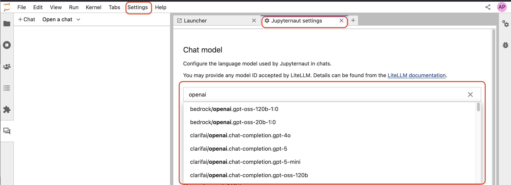
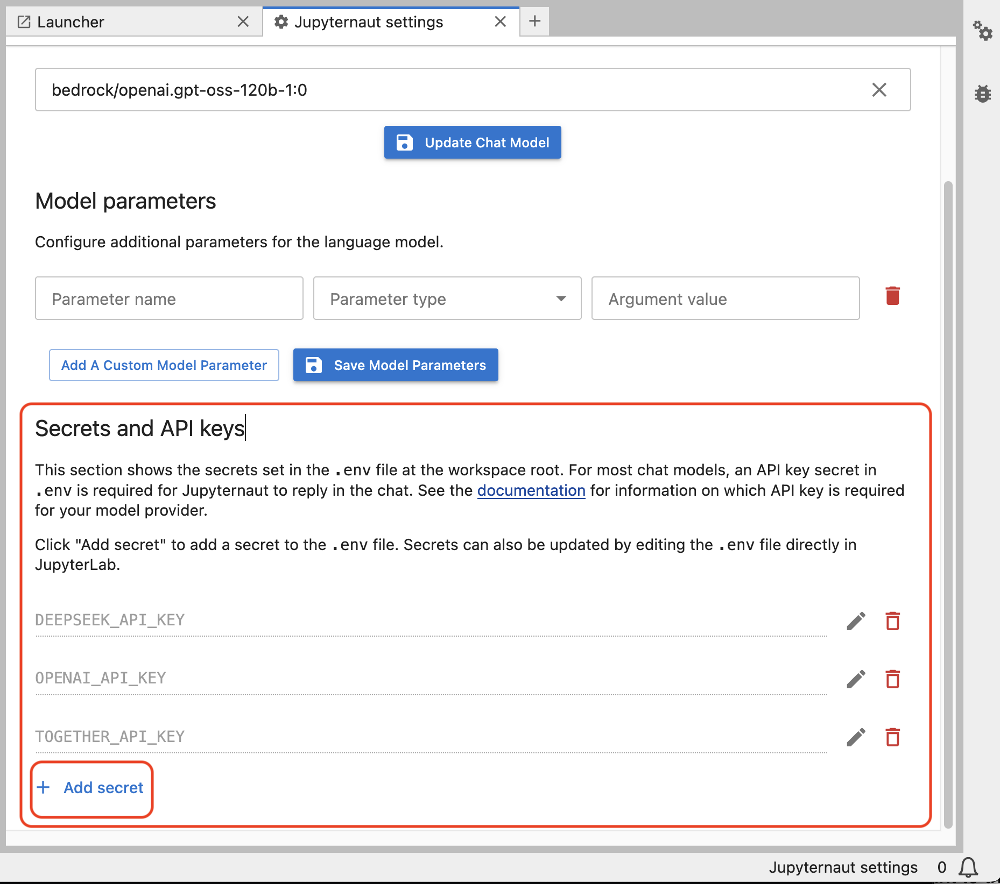
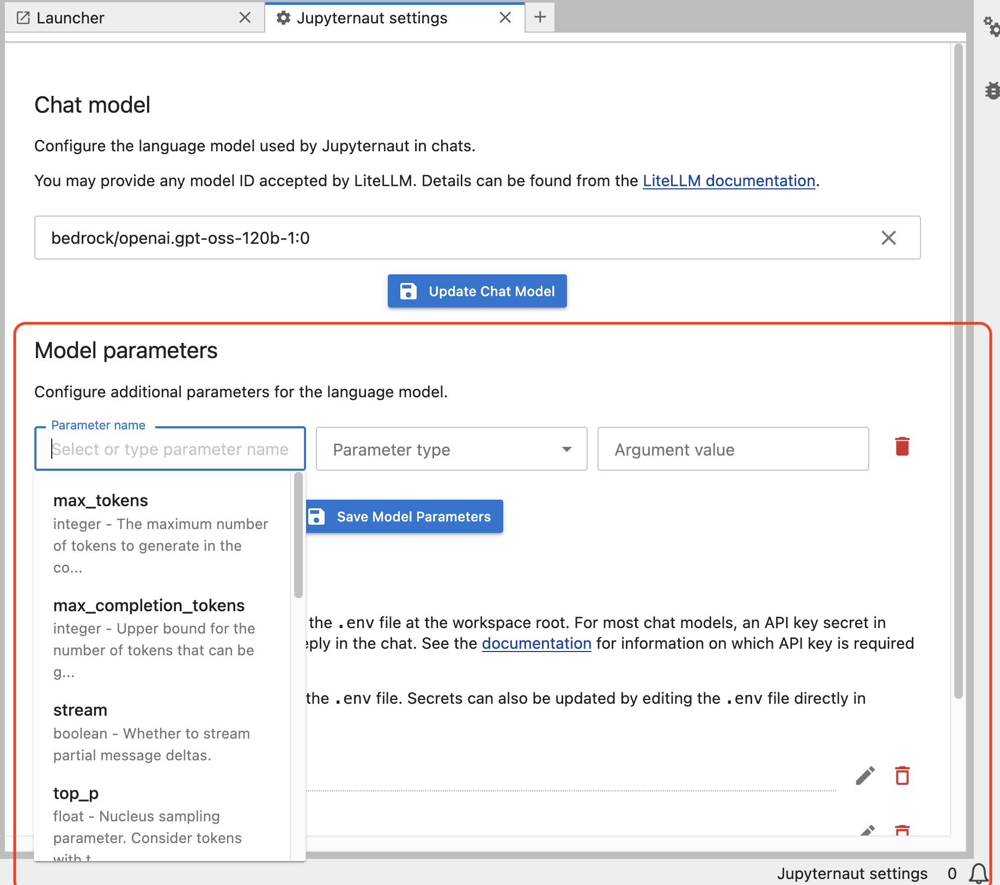
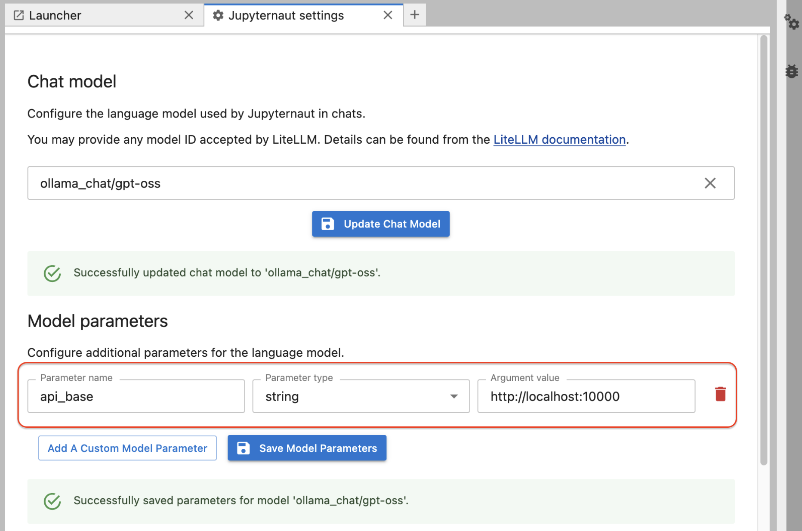

# Jupyternaut

Jupyternaut is a custom agent built for Jupyter AI.

It should be considered *experimental*. It can be installed optionally via:

```sh
pip install 'jupyter-ai[jupyternaut]'
```

or:

```sh
pip install jupyter-ai-jupyternaut
```

## Model selection

Jupyternaut supports a wide range of model providers and models. Access to the
various providers is provided through [LiteLLM](https://docs.litellm.ai/), which
provides universal access to over a thousand different LLMs. You can select the
model to be used in the chat interface from the `Settings` tab -> `Jupyternaut
Settings`, where you can see the models by typing in a search string.



The LiteLLM interface does not show _all_ available models and you can see the [full list of providers and models](https://docs.litellm.ai/docs/providers) online.

To use Jupyter AI with a particular provider, you must set its API key (or other credentials) in the Jupyternaut settings, as needed. The names of the API keys are available from the LiteLLM documentation for each provider.



In the same interface it is also possible to set model parameters. This is a new feature in v3.



Here are some examples of additional packages that may be installed as needed:

- To use the Bedrock models, you need access to the Bedrock service, and you will need to authenticate via [boto3](https://github.com/boto/boto3), which also needs to be installed, as mentioned previously. For more information, see the [Amazon Bedrock Homepage](https://aws.amazon.com/bedrock/).

- You need the `pillow` Python package to use Hugging Face Hub's text-to-image models.

- You can find a list of Hugging Face's models at [https://huggingface.co/models](https://huggingface.co/models).

- To use NVIDIA models, create a free account with the [NVIDIA NGC service](https://catalog.ngc.nvidia.com/), which hosts AI solution catalogs, containers, models, and more. Navigate to Catalog > [AI Foundation Models](https://catalog.ngc.nvidia.com/ai-foundation-models), and select a model with an API endpoint. Click "API" on the model's detail page, and click "Generate Key". Save this key, and set it as the environment variable `NVIDIA_API_KEY` to access any of the model endpoints.

- SageMaker endpoint names are created when you deploy a model. For more information, see
  ["Create your endpoint and deploy your model"](https://docs.aws.amazon.com/sagemaker/latest/dg/realtime-endpoints-deployment.html)
  in the SageMaker documentation. To use SageMaker's models, you will also need to be authenticated via [boto3](https://github.com/boto/boto3).

### Amazon Bedrock Usage

Jupyternaut enables use of language models hosted on [Amazon Bedrock](https://aws.amazon.com/bedrock/) on AWS. Ensure that you have authentication to use AWS using the `boto3` SDK with credentials stored in the `default` profile. Guidance on how to do this can be found in the [`boto3` documentation](https://boto3.amazonaws.com/v1/documentation/api/latest/guide/credentials.html).

For details on enabling model access in your AWS account, using cross-region inference, or invoking custom/provisioned models, please see our dedicated documentation page on [using Amazon Bedrock in Jupyter AI](bedrock.md).

### OpenRouter and OpenAI Interface Usage

Jupyternaut enables use of language models accessible through [OpenRouter](https://openrouter.ai)'s unified interface. Examples of models that may be accessed via OpenRouter are: [Deepseek](https://openrouter.ai/deepseek/deepseek-chat), [Qwen](https://openrouter.ai/qwen/), [Mistral](https://openrouter.ai/mistralai/), etc. OpenRouter enables usage of any model conforming to the OpenAI API. In the `Chat model` area in `Jupyternaut settings` choose `openrouter/` to see all the models from this provider.

Likewise, for many models, you may directly choose the OpenAI provider in Jupyter AI instead of OpenRouter in the same way. In the `Chat model` area in `Jupyternaut settings` choose `openai/` to see all the models from this provider.

### Ollama usage

To get started, follow the instructions on the [Ollama website](https://ollama.com/) to set up `ollama` and download the models locally. To select a model, enter the model name in the settings panel, for example `deepseek-coder-v2`. You can see all locally available models with `ollama list`.

For the Ollama models to be available to JupyterLab-AI, your Ollama server _must_ be running. You can check that this is the case by calling `ollama serve` at the terminal, and should see something like:

```
$ ollama serve
Error: listen tcp 127.0.0.1:11434: bind: address already in use
```

This indicates that Ollama is running on its default port number, 11434.

In some platforms (e.g. macOS or Windows), there may also be a graphical user interface or application that lets you start/stop the Ollama server from a menu.

By default, Ollama is served on `127.0.0.1:11434` (locally on port `11434`), so Jupyter AI expects this by default. If you wish to use a remote Ollama server with a different IP address or a local Ollama server on a different port number, you have to configure this in advance.

To configure this in Jupyternaut settings, set the `api_base` paremeter field in the Model parameters section to your Ollama server's custom IP address and port number:



To configure this in the magic commands, you should set the `OLLAMA_HOST` environment variable to the your Ollama server's custom IP address and port number (assuming you chose 10000) in a new code cell:

```
%load_ext jupyter_ai_magics
os.environ["OLLAMA_HOST"] = "http://localhost:10000"
```

After running that cell, the AI magic command can then be used like so:

```
%%ai ollama:llama3.2
What is a transformer?
```

### vLLM usage

`vLLM` is a fast and easy-to-use library for LLM inference and serving. The [vLLM website](https://docs.vllm.ai/en/latest/) explains installation and usage. To use `vLLM` in Jupyter AI, please see the dedicated documentation page on using [vLLM in Jupyter AI](vllm.md).

## Configuration

You can specify an allowlist, to only allow only a certain list of providers, or
a blocklist, to block some providers.

### Configuring default models and API keys

This configuration allows for setting a default language and embedding models, and their corresponding API keys.
These values are offered as a starting point for users, so they don't have to select the models and API keys, however,
the selections they make in the settings panel will take precedence over these values.

Specify default language model

```bash
jupyter lab --AiExtension.initial_language_model=bedrock/anthropic.claude-3-5-haiku-20241022-v1:0
```

<!-- Specify default embedding model

```bash
jupyter lab --AiExtension.default_embeddings_model=bedrock:amazon.titan-embed-text-v1
```

Specify default completions model

```bash
jupyter lab --AiExtension.default_completions_model=bedrock-chat:anthropic.claude-v2
``` -->

Specify default API keys

```bash
jupyter lab --AiExtension.default_api_keys={'OPENAI_API_KEY': 'sk-abcd'}
```

### Blocklisting providers

This configuration allows for blocking specific providers in the settings panel.
This list takes precedence over the allowlist in the next section.

```
jupyter lab --AiExtension.blocked_providers=openai
```

To block more than one provider in the block-list, repeat the runtime
configuration.

```
jupyter lab --AiExtension.blocked_providers=openai --AiExtension.blocked_providers=ai21
```

### Allowlisting providers

This configuration allows for filtering the list of providers in the settings
panel to only an allowlisted set of providers.

```
jupyter lab --AiExtension.allowed_providers=openai
```

To allow more than one provider in the allowlist, repeat the runtime
configuration.

```
jupyter lab --AiExtension.allowed_providers=openai --AiExtension.allowed_providers=ai21
```

### Chat memory size

This configuration allows for setting the number of chat exchanges the model
uses as context when generating a response.

One chat exchange corresponds to a user query message and its AI response, which counts as two messages.
k denotes one chat exchange, i.e., two messages.
The default value of k is 2, which corresponds to 4 messages.

For example, if we want the default memory to be 4 exchanges, then use the following command line invocation when starting Jupyter Lab:

```
jupyter lab --AiExtension.default_max_chat_history=4
```

### Model parameters

This configuration allows specifying arbitrary parameters that are unpacked and
passed to the provider class. This is useful for passing parameters such as
model tuning that affect the response generation by the model. This is also an
appropriate place to pass in custom attributes required by certain
providers/models.

The accepted value is a dictionary, with top level keys as the model id
(provider:model_id), and value should be any arbitrary dictionary which is
unpacked and passed as-is to the provider class.

#### Configuring as a startup option

In this sample, the `bedrock` provider will be created with the value for
`model_kwargs` when `bedrock/anthropic.claude-3-5-haiku-20241022-v1:0` model is selected.

```bash
jupyter lab --AiExtension.model_parameters bedrock/anthropic.claude-3-5-haiku-20241022-v1:0='{"model_kwargs":{"maxTokens":200}}'
```

Note the usage of single quotes surrounding the dictionary to escape the double
quotes. This is required in some shells. The above will result in the following
LLM class to be generated.

```python
BedrockProvider(model_kwargs={"maxTokens":200}, ...)
```

Here is another example, where `anthropic` provider will be created with the
values for `max_tokens` and `temperature`, when `bedrock/anthropic.claude-3-5-haiku-20241022-v1:0` model is selected.

```bash
jupyter lab --AiExtension.model_parameters bedrock/anthropic.claude-3-5-haiku-20241022-v1:0='{"max_tokens":1024,"temperature":0.9}'
```

The above will result in the following LLM class to be generated.

```python
AnthropicProvider(max_tokens=1024, temperature=0.9, ...)
```

To pass multiple sets of model parameters for multiple models in the
command-line, you can append them as additional arguments to
`--AiExtension.model_parameters`, as shown below.

```bash
jupyter lab \
--AiExtension.model_parameters bedrock/anthropic.claude-3-5-haiku-20241022-v1:0='{"model_kwargs":{"maxTokens":200}}' \
--AiExtension.model_parameters openai/gpt-4.1='{"max_tokens":1024,"temperature":0.9}'
```

However, for more complex configuration, we highly recommend that you specify
this in a dedicated configuration file. We will describe how to do so in the
following section.

#### Configuring as a config file

This configuration can also be specified in a config file in json format.

Here is an example for configuring the `bedrock` provider for `bedrock/anthropic.claude-3-5-haiku-20241022-v1:0`
model.

```json
{
  "AiExtension": {
    "model_parameters": {
      "bedrock/anthropic.claude-3-5-haiku-20241022-v1:0": {
        "model_kwargs": {
          "maxTokens": 200
        }
      }
    }
  }
}
```

There are several ways to specify JupyterLab to pick this config.

The first option is to save this config in a file and specifying the filepath at startup using the `--config` or `-c` option.

```bash
jupyter lab --config <config-file-path>
```

The second option is to drop it in a location that JupyterLab scans for configuration files.
The file should be named `jupyter_jupyter_ai_config.json` in this case. You can find these paths by running `jupyter --paths`
command, and picking one of the paths from the `config` section.

Here is an example of running the `jupyter --paths` command.

```bash
(jupyter-ai-lab4) ➜ jupyter --paths
config:
    /opt/anaconda3/envs/jupyter-ai-lab4/etc/jupyter
    /Users/3coins/.jupyter
    /Users/3coins/.local/etc/jupyter
    /usr/3coins/etc/jupyter
    /etc/jupyter
data:
    /opt/anaconda3/envs/jupyter-ai-lab4/share/jupyter
    /Users/3coins/Library/Jupyter
    /Users/3coins/.local/share/jupyter
    /usr/local/share/jupyter
    /usr/share/jupyter
runtime:
    /Users/3coins/Library/Jupyter/runtime
```
