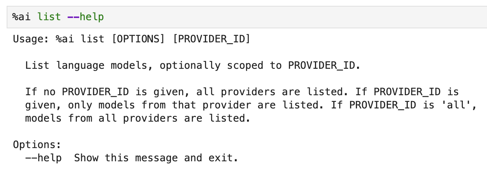
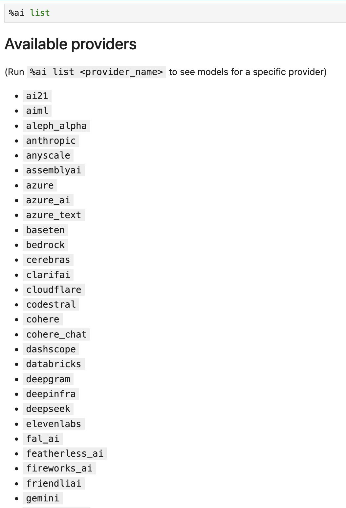
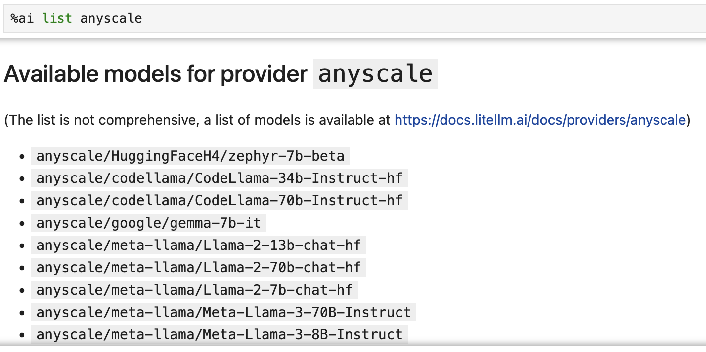
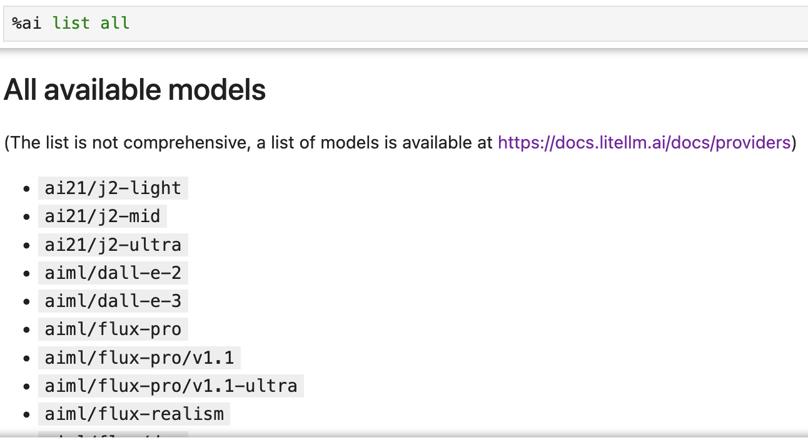
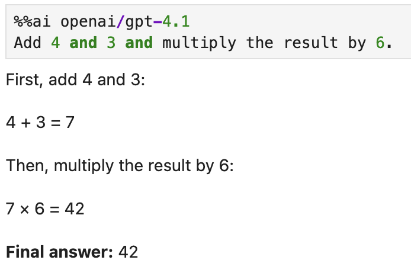
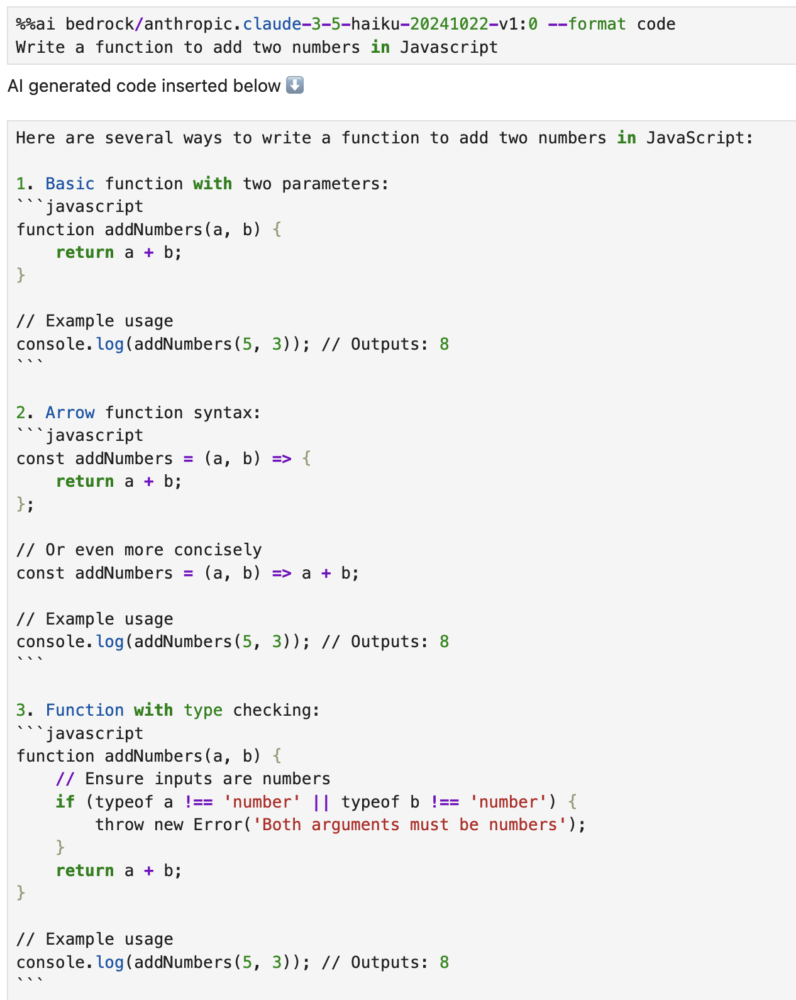
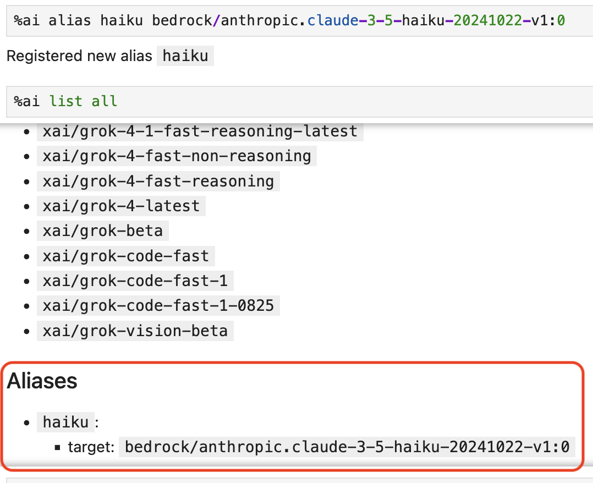
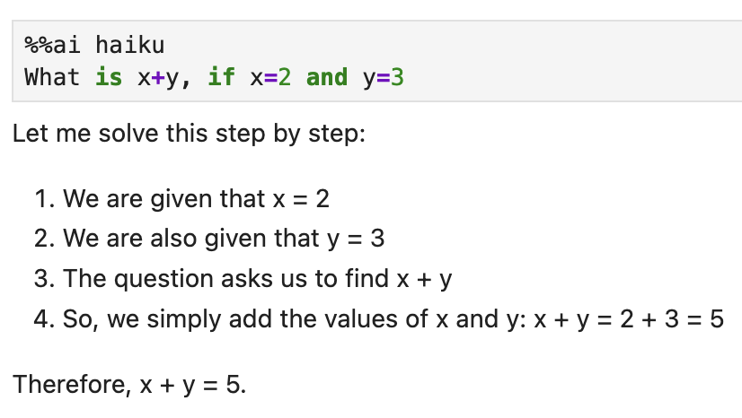
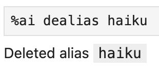

# Magic commands (optional)

Jupyter AI can also provide IPython magic commands for invoking a language model
directly in a notebook.

## Installation

Jupyter AI magic commands are now provided through the optional
`jupyter-ai-magic-commands` package. To use them, you will need to install this
into your environment.

```
pip install jupyter-ai-magic-commands
```

## Setup

Before you send your first prompt to an AI model, load the IPython extension by
running the following code in a notebook cell or IPython shell:

```
%load_ext jupyter_ai_magic_commands
```

This command should not produce any output.

:::{note}
If you are using remote kernels, such as in Amazon SageMaker Studio, the above
command will throw an error. You will need to install the package on your remote
kernel separately, even if you already have `jupyter_ai_magic_commands`
installed in your server's environment. In a notebook, run

```
%pip install jupyter_ai_magic_commands
```

and re-run `%load_ext jupyter_ai_magic_commands`.
:::

## Usage

Once the extension has loaded, you can run `%%ai` cell magic commands and
`%ai` line magic commands. Run `%%ai help` or `%ai help` for help with syntax.
You can also pass `--help` as an argument to any line magic command (for example,
`%ai list --help`) to learn about what the command does and how to use it.

### Listing available models

Jupyter AI also includes multiple subcommands, which may be invoked via the
`%ai` _line_ magic. Jupyter AI uses subcommands to provide additional utilities
in notebooks while keeping the same concise syntax for invoking a language model.

The `%ai list` subcommand prints a list of available providers and models. Some
providers explicitly define a list of supported models in their API. However,
other providers, like Hugging Face Hub, lack a well-defined list of available
models. In such cases, it's best to consult the provider's upstream
documentation. The [Hugging Face website](https://huggingface.co/) includes a
list of models, for example. To get help:



Optionally, you can specify a provider ID as a positional argument to `%ai list`
to get all models provided by one provider. For example, `%ai list openai` will
display only models provided by the `openai` provider.
To see all the available providers run (the top of the list is shown):

### Choosing a provider and model

The `%%ai` cell magic allows you to invoke a language model of your choice with
a given prompt. The model is identified with a **global model ID**, which is a string with the syntax `<provider-id>:<local-model-id>`, where `<provider-id>` is the ID of the provider and `<local-model-id>` is the ID of the model scoped to that provider.



To see all the models for a given provider:



And to list all available models:



### Invoking magics

The prompt begins on the second line of the cell. For example, to send a text prompt to the provider `bedrock` and the model ID `anthropic.claude-3-5-haiku-20241022-v1:0`, enter the following code into a cell and run it:

```
%%ai bedrock/anthropic.claude-3-5-haiku-20241022-v1:0
What is the capital of France?
```

The response is:

```text
The capital of France is Paris.
```

Another example using a different provider:



### Configuring a default model

To configure a default model you can use the IPython `%config` magic:

```python
%config AiMagics.initial_language_model = "anthropic:claude-v1.2"
```

Then subsequent magics can be invoked without typing in the model:

```
%%ai
Write a poem about C++.
```

You can configure the default model for all notebooks by specifying `c.AiMagics.initial_language_model` tratilet in `ipython_config.py`, for example:

```python
c.AiMagics.initial_language_model = "anthropic:claude-v1.2"
```

The location of `ipython_config.py` file is documented in [IPython configuration reference](https://ipython.readthedocs.io/en/stable/config/intro.html).

### Formatting the output

By default, Jupyter AI assumes that a model will output markdown, so the output of
an `%%ai` command will be formatted as markdown by default. You can override this
using the `-f` or `--format` argument to your magic command. Valid formats include:

- `code`
- `image` (for Hugging Face Hub's text-to-image models only)
- `markdown`
- `math`
- `html`
- `json`
- `text`

For example, to force the output of a command to be interpreted as HTML, you can run:

```
%%ai anthropic:claude-v1.2 -f html
Create a square using SVG with a black border and white fill.
```

The following cell will produce output in IPython's `Math` format, which in a web browser
will look like properly typeset equations.

```
%%ai chatgpt -f math
Generate the 2D heat equation in LaTeX surrounded by `$$`. Do not include an explanation.
```

This prompt will produce output as a code cell below the input cell.

:::{warning}
:name: run-code
**Please review any code that a generative AI model produces before you run it
or distribute it.**
The code that you get in response to a prompt may have negative side effects and may
include calls to nonexistent (hallucinated) APIs.
:::

```
%%ai chatgpt -f code
A function that computes the lowest common multiples of two integers, and
a function that runs 5 test cases of the lowest common multiple function
```

Another code example:



### Configuring context window

By default, two previous Human/AI message exchanges are included in the context of the new prompt.
You can change this using the IPython `%config` magic, for example:

```python
%config AiMagics.max_history = 4
```

Note that old messages are still kept locally in memory,
so they will be included in the context of the next prompt after raising the `max_history` value.

You can configure the value for all notebooks
by specifying `c.AiMagics.max_history` traitlet in `ipython_config.py`, for example:

```python
c.AiMagics.max_history = 4
```

### Clearing the chat history

You can run the `%ai reset` line magic command to clear the chat history. After you do this,
previous magic commands you've run will no longer be added as context in requests.

```
%ai reset
```

### Interpolating in prompts

Using curly brace syntax, you can include variables and other Python expressions in your
prompt. This lets you execute a prompt using code that the IPython kernel knows about,
but that is not in the current cell.

For example, we can set a variable in one notebook cell:

```python
poet = "Walt Whitman"
```

Then, we can use this same variable in an `%%ai` command in a later cell:

```
%%ai chatgpt
Write a poem in the style of {poet}
```

When this cell runs, `{poet}` is interpolated as `Walt Whitman`, or as whatever `poet`
is assigned to at that time.

You can use the special `In` and `Out` list with interpolation syntax to explain code
located elsewhere in a Jupyter notebook. For example, if you run the following code in
a cell, and its input is assigned to `In[11]`:

```python
for i in range(0, 5):
  print(i)
```

You can then refer to `In[11]` in an `%%ai` magic command, and it will be replaced
with the code in question:

```
%%ai cohere:command-xlarge-nightly
Please explain the code below:
--
{In[11]}
```

You can also refer to the cell's output using the special `Out` list, with the same index.

```
%%ai cohere:command-xlarge-nightly
Write code that would produce the following output:
--
{Out[11]}
```

Jupyter AI also adds the special `Err` list, which uses the same indexes as `In` and `Out`.
For example, if you run code in `In[3]` that produces an error, that error is captured in
`Err[3]` so that you can request an explanation using a prompt such as:

```
%%ai chatgpt
Explain the following Python error:
--
{Err[3]}
```

The AI model that you use will then attempt to explain the error. You could also write a
prompt that uses both `In` and `Err` to attempt to get an AI model to correct your code:

```
%%ai chatgpt --format code
The following Python code:
--
{In[3]}
--
produced the following Python error:
--
{Err[3]}
--
Write a new version of this code that does not produce that error.
```

As a shortcut for explaining and fixing errors, you can use the `%ai fix` command, which will explain the most recent error using the model of your choice.

```
%ai fix anthropic:claude-v1.2
```

### Creating and managing aliases

You can create an alias for a model using the `%ai alias` command. For example, the command:

```
%ai alias claude anthropic:claude-v1.2
```

will register the alias `claude` as pointing to the `anthropic` provider's `claude-v1.2` model. You can then use this alias as you would use any other model name:

```
%%ai claude
Write a poem about C++.
```

You can also define a custom LangChain chain:

```python
from langchain.chains import LLMChain
from langchain.prompts import PromptTemplate
from langchain.llms import OpenAI

llm = OpenAI(temperature=0.9)
prompt = PromptTemplate(
    input_variables=["product"],
    template="What is a good name for a company that makes {product}?",
)
chain = LLMChain(llm=llm, prompt=prompt)
```

… and then use `%ai alias` to give it a name:

```
%ai alias companyname chain
```

You can change an alias's target using the `%ai update` command:

```
%ai update claude anthropic:claude-instant-v1.0
```

You can delete an alias using the `%ai dealias` command:

```
%ai dealias claude
```

You can see a list of all aliases by running the `%ai list` command.

Aliases' names can contain ASCII letters (uppercase and lowercase), numbers, hyphens, underscores, and periods. They may not contain colons. They may also not override built-in commands — run `%ai help` for a list of these commands.

Aliases must refer to models or `LLMChain` objects; they cannot refer to other aliases.

To customize the aliases on startup you can set the `c.AiMagics.aliases` tratilet in `ipython_config.py`, for example:

```python
c.AiMagics.aliases = {
  "my_custom_alias": "my_provider:my_model"
}
```

The location of `ipython_config.py` file is documented in [IPython configuration reference](https://ipython.readthedocs.io/en/stable/config/intro.html).

Here are some examples of using aliases. You can shorten the magics in the first line of each cell by setting a much shorter alias as shown below:



Usage of the alias is shown here:



You can remove the alias above with the `dealias` command:


