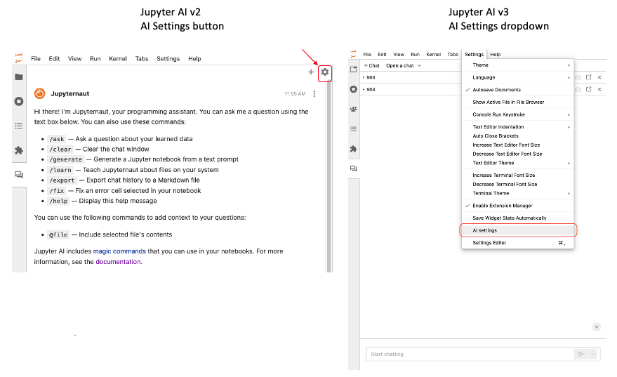
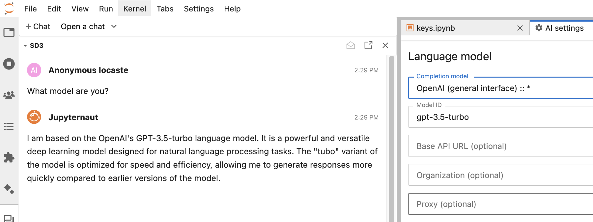
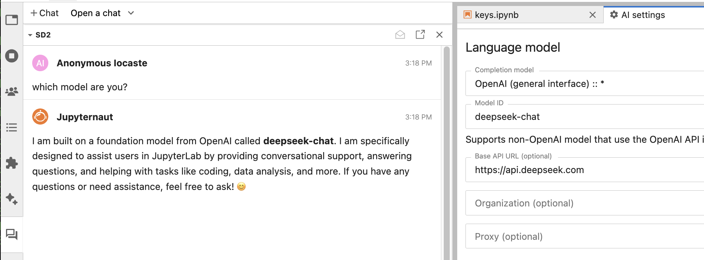
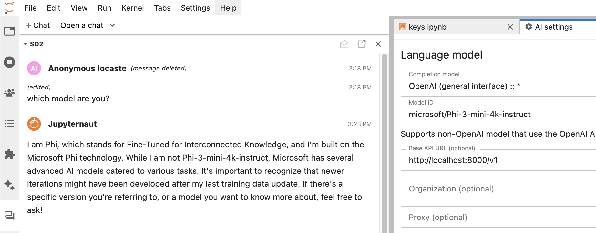

# Using OpenRouter or OpenAI Interfaces in Jupyter AI

[(Return to the Chat Interface page)](index.md#openrouter-usage)

For models that are compatible with the OpenAI library, Jupyter AI provides configuration via OpenRouter. By supporting the configuration of parameters such as the api_key, base_url, and model, various large model services compatible with the OpenAI library call methods can be used. For more details on OpenRouter as a unified interface for LLMs, see https://openrouter.ai/.

As an example, we walk through the steps needed to use models from [Deepseek](https://www.deepseek.com) via the OpenRouter provider. If you do not have `langchain-openai` installed, please install it and restart JupyterLab. This is necessary as it provides the SDK for accessing any OpenAI API.

First, navigate to the `AI Settings` pane via the AI settings button in `v2` or via the dropdown in `v3` of Jupyter AI, as shown below:

Second, select the `OpenRouter :: *` model provider in the Jupyter AI settings. If you don't see this, please verify that you have installed `langchain-openai` and that you are using `jupyter_ai>=2.24.0`. Be sure to restart JupyterLab after upgrading or installing either package.

Jupyter AI's settings page with the OpenRouter provider selected is shown below:

Type in the model name and the API base URL corresponding to the model you wish to use. For Deepseek, you should use `https://api.deepseek.com` as the API base URL, and use `deepseek-chat` as the local model ID.

If you are using OpenRouter for the first time it will also require entering the `OPENROUTER_API_KEY`. If you have used OpenRouter before with a different model provider, you will need to update the API key. After doing this, click "Save Changes" at the bottom to save your settings.

You should now be able to use Deepseek! An example of usage is shown next:

In a similar manner, models may also be invoked directly using the OpenAI provider interface in Jupyter AI. First, you can choose the OpenAI provider and then enter in the model ID, as shown on the OpenAI [models page](https://platform.openai.com/docs/models). An example is shown below:

DeepSeek models may be used via the same interface, if the base API url is provided:

For DeepSeek models, enter the DeepSeek API for the OpenAI API key.

Models deployed using vLLM may be used in a similar manner:

Usage of models using vLLM and their deployment is discussed [here](vllm.md).

For embedding models from OpenAI, you can generically choose them using the AI Settings interface as well:

[(Return to the Chat Interface page)](index.md#openrouter-usage)
