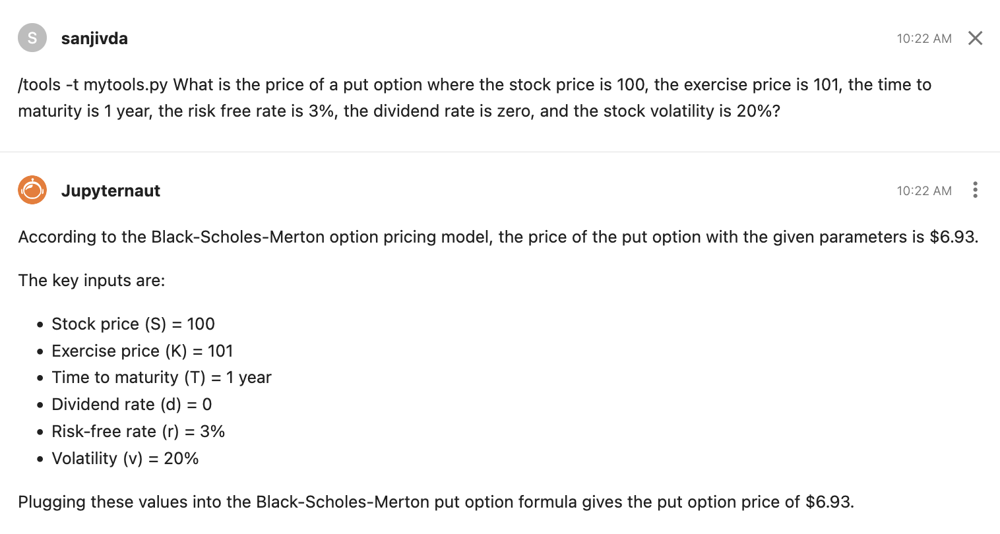

# Using your custom tools library in the chat interface

In many situations LLMs will handle complex mathematical formulas quite well and return correct answers, but this is often not the case. Even for textual repsonses, using custom functions can constrain responses to formats and content that is more accurate and acceptable.

Jupyter AI includes a slash command `/tools` that directs the LLM to use functions from a tools library that you provide. You can have multiple tool files stored in the subdirectory `.jupyter/jupyter-ai/tools/`.

You can use a single tool file from this subdirectory. In this case the usage of this slash command is as follows:

```
/tools -t <tools_file_name> <query>
```

For example, we may try using a tools file called `arithmetic.py`. Note that since the file has to be placed in `.jupyter/jupyter-ai/tools/`, only file name is needed in the command.

```
/tools -t arithmetic.py What is the sum of 1 and 2?
```

The contents of the example file `arithmetic.py` are very simple:

```
@tool
def multiply(first_number: float, second_number: float):
    """Multiplies two numbers together."""
    return first_number * second_number

@tool
def add(first_number: float, second_number: float):
    """Adds two numbers together."""
    return first_number + second_number
```

The result is shown below:


We provide another example of the tools file here, called `finance.py`, containing just three functions. Make sure to add the `@tool` decorator to each function and to import all packages that are required within each function. The functions below are common financial formulas that are widely in use and you may expect that an LLM would be trained on these. While this is accurate, we will see that the LLM is unable to accurately execute the math in these formulas.

```
@tool
def BlackMertonScholes_Call(S: float, # current stock price
                            K: float, # exercise price of the option
                            T: float, # option maturity in years
                            d: float, # annualized dividend rate
                            r: float, # annualized risk free interest rate
                            v: float, # stock volatility
                           ):
    """Black-Scholes-Merton option pricing model for call options"""
    from scipy.stats import norm
    import numpy as np
    d1 = (np.log(S/K) + (r-d+0.5*v**2)*T)/(v*np.sqrt(T))
    d2 = d1 - v*np.sqrt(T)
    call_option_price = S*np.exp(-d*T)*norm.cdf(d1) - K*np.exp(-r*T)*norm.cdf(d2)
    return call_option_price

@tool
def BlackMertonScholes_Put(S: float, # current stock price
                            K: float, # exercise price of the option
                            T: float, # option maturity in years
                            d: float, # annualized dividend rate
                            r: float, # annualized risk free interest rate
                            v: float, # stock volatility
                           ):
    """Black-Scholes-Merton option pricing model for put options"""
    from scipy.stats import norm
    import numpy as np
    d1 = (np.log(S/K) + (r-d+0.5*v**2)*T)/(v*np.sqrt(T))
    d2 = d1 - v*np.sqrt(T)
    put_option_price =  K*np.exp(-r*T)*norm.cdf(-d2) - S*np.exp(-d*T)*norm.cdf(-d1)
    return put_option_price

@tool
def calculate_monthly_payment(principal, annual_interest_rate, loan_term_years):
    """
    Calculate the monthly mortgage payment.
    Args:
        principal (float): The principal amount of the loan.
        annual_interest_rate (float): The annual interest rate as a decimal (e.g., 0.06 for 6%).
        loan_term_years (int): The loan term in years.
    Returns:
        float: The monthly mortgage payment.
    """
    import math
    # Convert annual interest rate to monthly interest rate
    monthly_interest_rate = annual_interest_rate / 12
    # Calculate the number of monthly payments
    num_payments = loan_term_years * 12
    # Calculate the monthly payment using the annuity formula
    monthly_payment = (principal * monthly_interest_rate) / (1 - math.pow(1 + monthly_interest_rate, -num_payments))
    return monthly_payment
```

Each function contains the `@tool` decorator and the required imports. Note also the comment string that describes what each tool does. This will help direct the LLM to relevant tool. Providing sufficient guiding comments in the function is helpful in the form of comment strings, variable annotations, and explicit argument comments, example of which are shown in the code above. For example, default values in comments will be used by the LLM if the user forgets to provide them (for example, see the explicit mention of a 6% interest rate in `calculate_monthly_payment` function above).

When the `/tools` command is used, Jupyter AI will bind the custom tools file to the LLM currently in use and build a `LangGraph` (https://langchain-ai.github.io/langgraph/). It will use this graph to respond to the query and use the appropriate tools, if available.

As an example, submit this query in the chat interface without using tools: "What is the price of a put option where the stock price is 100, the exercise price is 101, the time to maturity is 1 year, the risk free rate is 3%, the dividend rate is zero, and the stock volatility is 20%?" The correct answer to this query is $6.93. However, though the LLM returns the correct formula, it computes the answer incorrectly:


Next, use the `/tools` command with the same query to get the correct answer:



You can try the other tools in this example or build your own custom tools file to experiment with this feature.

If you do not want to use any specific tool file, that is, use all the tool files together, the command is simply:

```
/tools <query>
```

To list all the tool file names:

```
/tools -l
```

and the response is

```
The available tools files are: ['arithmetic.py', 'finance.py']
```
