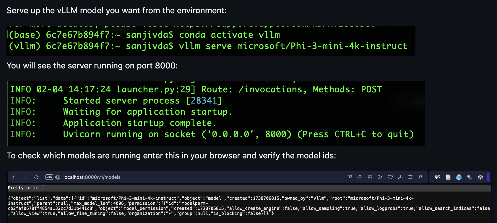
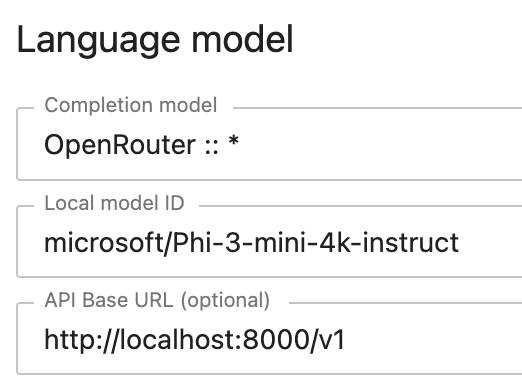
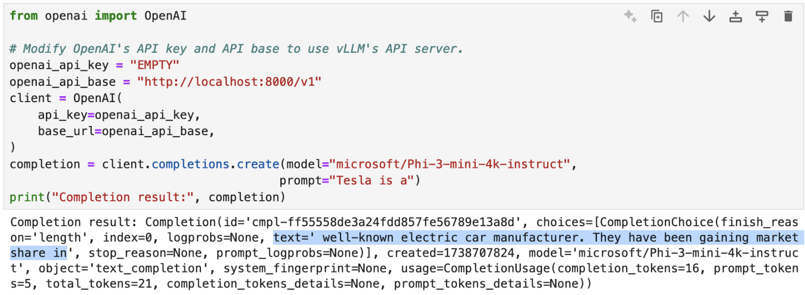
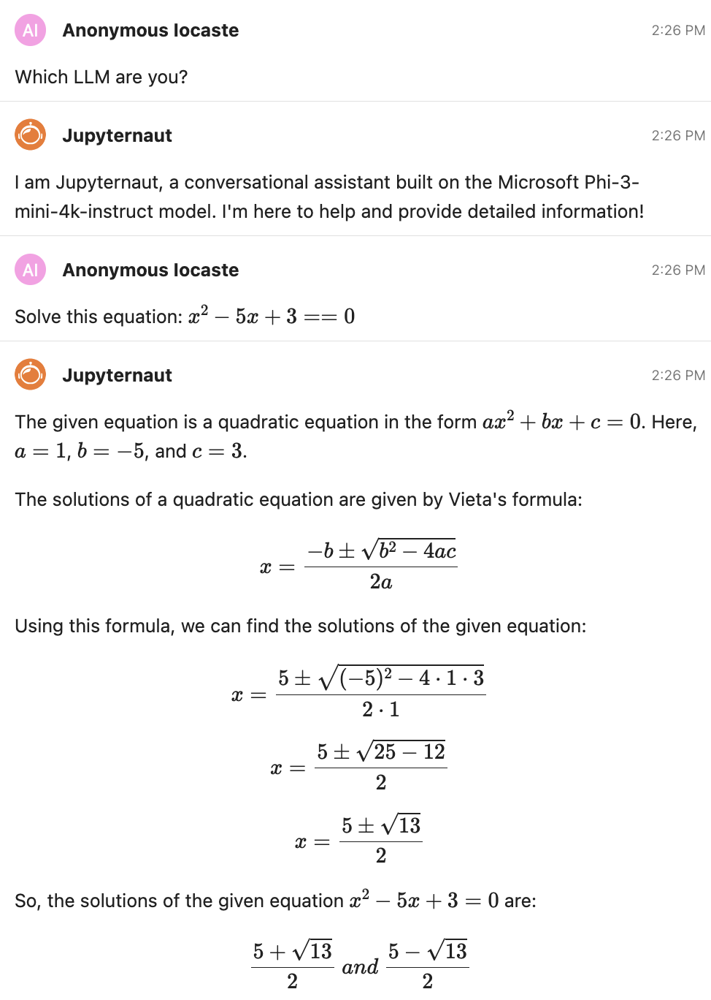

# Using vLLM in Jupyter AI

[(Return to the Chat Interface page)](index.md#vllm-usage)

`vLLM` is a fast and easy-to-use library for LLM inference and serving. The [vLLM website](https://docs.vllm.ai/en/latest/) explains installation and usage.

:::{note}
To use `vLLM` via `OpenRouter` as described below you will need to upgrade to `jupyter-ai >= 2.29.1`.
:::


Depending on your hardware set up you will install `vLLM` using these [instructions](https://docs.vllm.ai/en/latest/getting_started/installation/index.html). It is best to install it in a dedicated python environment.

Once it is installed you may start serving any model with the command:
```python
vllm serve <model_name>
```
As an example, the deployment of the `Phi-3-mini-4k-instruct` model is shown below, with checks to make sure it is up and running:



`vllm` serves up the model at the following URL: `http://<url>:8000/v1`

Start up Jupyter AI and update the AI Settings as follows (notice that we are using [OpenRouter](openrouter.md) as the provider, which is a unified interface for LLMs based on OpenAI's API interface):



Since vLLM may be addressed using OpenAI's API, you can test if the model is available using the API call as shown:



The model may be used in Jupyter AI's chat interface as shown in the example below:



[(Return to the Chat Interface page)](index.md#vllm-usage)
